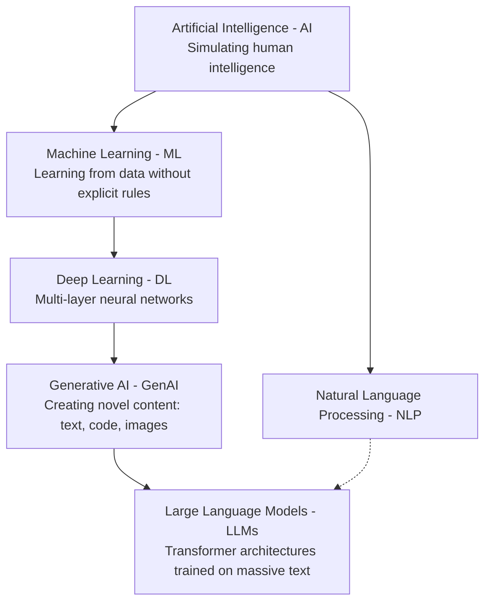

# AI vs ML vs DL vs GenAI vs LLMs — What's the Difference?

The landscape of Artificial Intelligence (AI) encompasses various nested subfields, techniques, and applications. Here is an architectural overview of how they fit together:

---

## 1. Artificial Intelligence (AI)

The broadest umbrella term, AI refers to the development of computational systems that perform tasks typically requiring human intelligence:

1. Reasoning and problem-solving
2. Knowledge representation and management
3. Planning and decision-making
4. Perception and sensing
5. Natural Language Processing (NLP)
6. Robotics and computer vision

---

## 2. Machine Learning (ML)

A subset of AI, ML develops algorithms and statistical models that learn patterns from data rather than relying on hardcoded procedural rules:

1. **Supervised learning:** Regression, classification (labeled datasets).
2. **Unsupervised learning:** Clustering, dimensionality reduction (unlabeled datasets).
3. **Reinforcement learning:** Agent optimization via reward signals and policy gradients.

---

## 3. Deep Learning (DL)

A subfield of ML based on artificial neural networks with multiple representation layers:

1. **Convolutional Neural Networks (CNNs):** Spatial pattern processing for computer vision.
2. **Recurrent Neural Networks (RNNs) / LSTMs:** Sequential processing for time-series data.
3. **Transformers:** Self-attention architectures that revolutionized language and multimodal modeling.

---

## 4. Generative AI (GenAI)

A subset of Deep Learning focused on **generating novel, synthetic data artifacts** rather than merely classifying or predicting values:

- Text and code generation (Transformers)
- Image and video generation (Diffusion models, GANs)
- Audio and speech synthesis

---

## 5. Large Language Models (LLMs)

A specific class of foundation models trained on massive text corpora using the Transformer architecture:

- Autoregressive next-token prediction
- Zero-shot and few-shot reasoning
- Instruction fine-tuning (RLHF / DPO) for aligned dialogue execution

---

## 6. Summary Taxonomy

- **AI** is the overarching field of intelligent machines.
- **ML** is learning patterns from data.
- **DL** is learning patterns using deep neural networks.
- **GenAI** is generating new content using deep generative models.
- **LLMs** are language-specialized generative foundation models.
