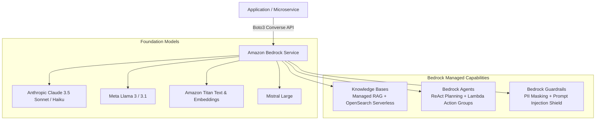

# Amazon Bedrock Architecture & Implementation

**Amazon Bedrock** is AWS's fully managed, serverless foundation model (FM) service. It provides access to leading generative AI models via a single unified API without managing GPU infrastructure, while ensuring customer training data is never used to train base models.



---

## 1. Supported Foundation Models & Selection Guide

| Model Family                | Provider   | Strengths                                                     | Best Fit                                                    |
| :-------------------------- | :--------- | :------------------------------------------------------------ | :---------------------------------------------------------- |
| **Claude 3.5 Sonnet**       | Anthropic  | Coding, complex reasoning, computer use, large context (200k) | High-complexity agentic workflows, architecture design      |
| **Claude 3 Haiku**          | Anthropic  | Blazing speed, extremely low token cost                       | High-throughput classification, routing, fast summarization |
| **Llama 3 / 3.1**           | Meta       | Open-weight foundation, cost-effective                        | General generation, enterprise task completion              |
| **Titan Text / Embeddings** | AWS        | Cost-optimized, deep AWS native compliance                    | Document embeddings for vector search                       |
| **Mistral Large**           | Mistral AI | Multilingual reasoning, code synthesis                        | European compliance, low latency                            |

---

## 2. Bedrock Knowledge Bases (Managed RAG)

Bedrock Knowledge Bases automates the entire Retrieval-Augmented Generation pipeline:

1. Connects to data sources in Amazon S3.
2. Automatically chunks documents (fixed, semantic, or hierarchical).
3. Converts text into vector embeddings using Amazon Titan or Cohere.
4. Indexes vectors into **Amazon OpenSearch Serverless**, Pinecone, or Amazon Aurora PostgreSQL (`pgvector`).
5. Exposes a single `RetrieveAndGenerate` API endpoint that queries the vector store, formats the context, and generates citations.

---

## 3. Bedrock Agents: Autonomous Tool Execution

Bedrock Agents implement the **ReAct (Reason + Act)** pattern natively:

- Uses OpenAPI 3.0 schemas to define tools.
- Invokes AWS Lambda functions (Action Groups) to interact with enterprise databases and APIs.
- Maintains multi-turn conversation memory automatically.

---

## 4. Bedrock Guardrails: Defense-in-Depth

Enterprise LLM deployments must be protected against toxicity and jailbreaks. Bedrock Guardrails sits between the user and the model:

- **Prompt Injection Filter:** Detects and blocks direct and indirect prompt injection attacks.
- **Sensitive Information Filters (PII):** Redacts SSNs, credit cards, or internal employee IDs from model responses using regex or AWS Comprehend.
- **Denied Topics:** Blocks discussions outside enterprise scope (e.g. competitors, legal advice).
- **Hallucination Detection:** Evaluates grounding scores against retrieved reference passages.

---

## 5. Implementation: The Bedrock Converse API (Python)

The **Converse API** (`converse` / `converse_stream`) provides a unified request/response schema across all models on Bedrock:

```python
import boto3
from botocore.exceptions import ClientError

client = boto3.client("bedrock-runtime", region_name="us-east-1")

MODEL_ID = "anthropic.claude-3-5-sonnet-20240620-v1:0"

messages = [
    {
        "role": "user",
        "content": [{"text": "Explain Kubernetes Pod Security Standards in 3 sentences."}]
    }
]

system_prompt = [{"text": "You are a senior cloud infrastructure security architect."}]

inference_config = {
    "temperature": 0.2,
    "maxTokens": 500,
    "topP": 0.9
}

try:
    response = client.converse(
        modelId=MODEL_ID,
        messages=messages,
        system=system_prompt,
        inferenceConfig=inference_config
    )
    output_text = response["output"]["message"]["content"][0]["text"]
    token_usage = response["usage"]
    print("Response:\n", output_text)
    print(f"\nTokens: In={token_usage['inputTokens']}, Out={token_usage['outputTokens']}")

except ClientError as err:
    print(f"Bedrock Error: {err.response['Error']['Message']}")
```
