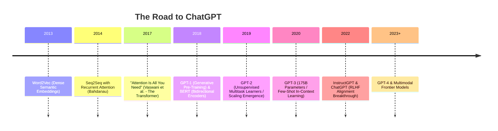
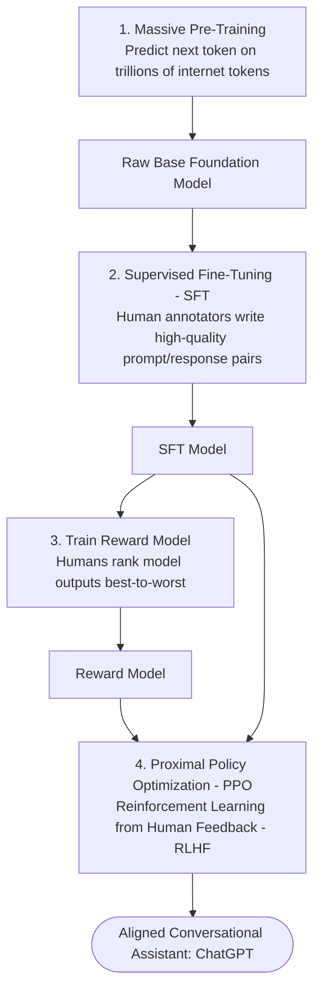

# The Road to ChatGPT — Architectural Evolution of Large Language Models

ChatGPT's release in November 2022 was not an overnight miracle; it was the culmination of two decades of research in natural language processing, transformer architectures, self-supervised learning, and human alignment techniques.

---

## 1. The Pre-Transformer Era (2013-2017)

- **Word2Vec & GloVe (2013-2014):** Represented words as dense mathematical vectors in $N$-dimensional space ($\text{Vector}(\text{"King"}) - \text{Vector}(\text{"Man"}) + \text{Vector}(\text{"Woman"}) \approx \text{Vector}(\text{"Queen"})$). However, word embeddings were static: "apple" in "apple pie" and "apple stock" had the identical vector representation.
- **RNNs & LSTMs (2014-2016):** Processed language sequentially word-by-word. Suffer from vanishing/exploding gradients over long text sequences and cannot be parallelized across GPUs.

---

## 2. The Transformer Revolution (2017)

Published by Google Brain / Research in 2017, **"Attention Is All You Need"** replaced recurrence entirely with **Self-Attention**:

- Computes mathematical affinity between every word in a sequence concurrently:
  $$\text{Attention}(Q, K, V) = \text{softmax}\left(\frac{QK^T}{\sqrt{d_k}}\right)V$$
- Enables massive parallel training on thousands of GPUs simultaneously.

---

## 3. The GPT Lineage (OpenAI)

1. **GPT-1 (2018 - 117M Parameters):** Proved that a decoder-only Transformer pre-trained on unlabeled text via autoregressive next-token prediction could be fine-tuned for downstream tasks with minimal labeled data.
2. **GPT-2 (2019 - 1.5B Parameters):** Demonstrated that scaling up model parameters and training dataset size enabled zero-shot task execution without task-specific fine-tuning.
3. **GPT-3 (2020 - 175B Parameters):** Unlocked **In-Context Learning (Few-Shot Prompting)**. The model did not need parameter updates; users could teach it new tasks simply by showing 3 examples inside the prompt window.

---

## 4. The Alignment Breakthrough: InstructGPT & RLHF (2022)

Raw base models like GPT-3 were powerful but unaligned: if prompted with _"Write an essay on photosynthesis"_, the model might reply by generating another question or continuing a list of exam topics because it was purely predicting internet text.

To turn GPT-3 into ChatGPT, OpenAI developed the **Three-Stage Alignment Pipeline**:

1. **Supervised Fine-Tuning (SFT):** Human contractors wrote 13,000 prompt-and-demonstration pairs showing how an assistant should answer helpfully.
2. **Reward Model (RM) Training:** The model generated several candidate answers; humans ranked them from best to worst. A reward neural network learned to predict the human preference score.
3. **PPO Reinforcement Learning:** The model was trained using Reinforcement Learning against the Reward Model, optimizing for **Helpfulness, Honesty, and Harmlessness (the 3 Hs)**.
