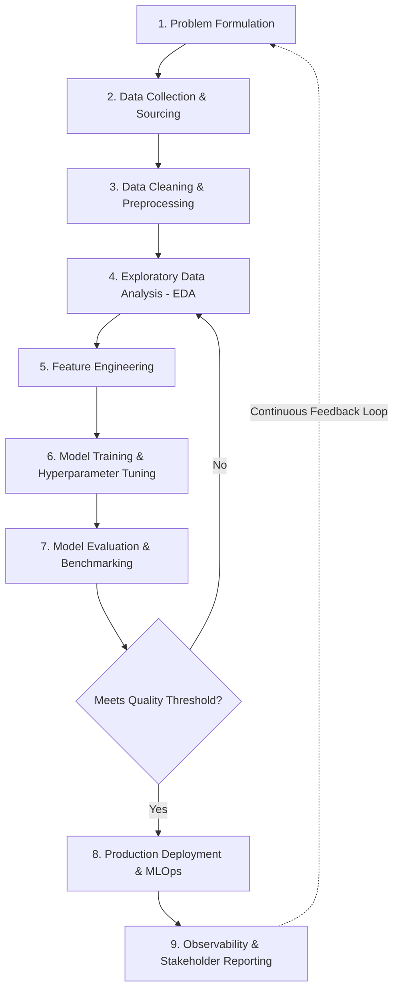

# The Data Science Lifecycle & CRISP-DM Process

The Data Science lifecycle is an iterative engineering process for extracting actionable business insights and training predictive models from raw data.

---

## The 9 Phases of the Process

### Phase 1: Problem Formulation

- Define the business objective or hypothesis.
- Identify key stakeholders, success metrics (ROI, conversion, latency), and regulatory constraints.
- Determine project feasibility and scope.

### Phase 2: Data Collection & Sourcing

- Ingest relevant datasets from databases, streaming event buses (Kafka), object stores (S3), and third-party APIs.
- Evaluate dataset licensing, provenance, and sampling bias.

### Phase 3: Data Cleaning & Preprocessing

- Handle missing values (imputation vs deletion), deduplication, and outlier detection.
- Data normalization, scaling, and categorical encoding (One-Hot, Ordinal).

### Phase 4: Exploratory Data Analysis (EDA)

- Analyze statistical distributions, variance, skewness, and inter-feature correlations using visualizations.
- Validate initial assumptions and identify potential confounding variables.

### Phase 5: Feature Engineering

- Construct domain-specific features to maximize model signal-to-noise ratio.
- Feature selection and dimensionality reduction (PCA, t-SNE) to prevent the curse of dimensionality.

### Phase 6: Model Development

- Select appropriate algorithmic families (tree-based XGBoost/LightGBM, neural networks, linear baselines).
- Automated hyperparameter optimization (Bayesian search, Optuna) using cross-validation folds.

### Phase 7: Model Evaluation

- Evaluate on unseen holdout test sets using domain metrics: Precision/Recall, ROC-AUC, F1-score, MAE/RMSE.
- Bias, fairness, and error slice analysis.

### Phase 8: Deployment & Maintenance (MLOps)

- Deploy artifacts via containerized microservices (Triton, KServe, vLLM).
- Continuous monitoring for covariate data drift and concept drift.

### Phase 9: Communication & Insights

- Deliver executive dashboards and actionable business recommendations.
