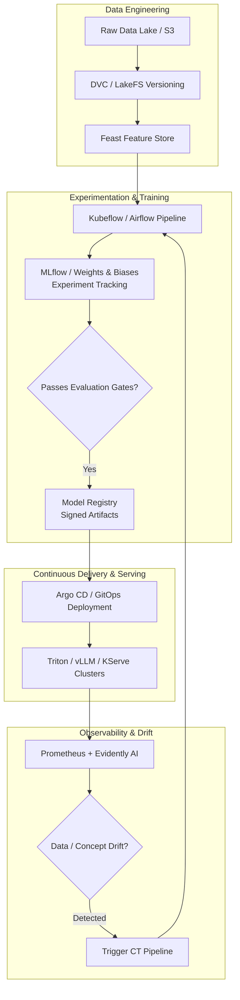

# MLOps Architecture & Production Lifecycle

**MLOps (Machine Learning Operations)** is the discipline of applying DevOps principles—continuous integration, continuous delivery, automated testing, version control, and infrastructure as code—to machine learning systems.

Machine learning systems differ fundamentally from traditional software: they are composed of **Code + Data + Model**, where changes to data can degrade system behavior even if the application code remains unchanged.

---

## 1. The 6 Pillars of the MLOps Pipeline

### 1. Data & Pipeline Versioning

- **DVC (Data Version Control) / LakeFS:** Version-controls multi-gigabyte datasets alongside git commit hashes without storing binary blobs in Git.
- Reproducibility: A model artifact must trace back to the exact code commit, training data hash, and hyperparameters that produced it.

### 2. Feature Stores (e.g., Feast, Tecton)

Solves **Training-Serving Skew** by providing a single feature definition for both:

- **Offline Store (Batch/Training):** BigQuery, Snowflake, or AWS S3 Parquet for high-throughput model training.
- **Online Store (Inference):** Redis or DynamoDB for sub-10ms feature retrieval during live production scoring.

### 3. Experiment Tracking & Model Registry (e.g., MLflow, W&B)

- Logs parameters, training loss curves, ROC-AUC metrics, and hardware utilization across runs.
- **Model Registry:** Manages the promotion lifecycle (`None` -> `Staging` -> `Production` -> `Archived`), cryptographic checksums, and model lineage metadata.

### 4. Continuous Training (CT) & Automated Pipelines

Unlike traditional CI/CD, MLOps introduces **Continuous Training (CT)**:

- Scheduled retraining (e.g. daily/weekly).
- Event-driven retraining triggered when feature drift or model performance metrics drop below predefined SLAs.

### 5. Production Serving Patterns

| Pattern                    | Technologies                | Latency Target   | Use Case                                       |
| :------------------------- | :-------------------------- | :--------------- | :--------------------------------------------- |
| **Real-Time Synchronous**  | vLLM, NVIDIA Triton, KServe | < 50ms           | Interactive chatbot, fraud detection           |
| **Asynchronous Streaming** | Kafka + Ray Serve           | < 500ms          | Video frame processing, social recommendations |
| **Batch Inference**        | Spark, Ray, AWS Batch       | Minutes to Hours | Nightly customer churn scoring                 |
| **Edge / Embedded**        | ONNX Runtime, TensorRT-LLM  | < 5ms            | Autonomous driving, on-device mobile vision    |

### 6. Model Monitoring & Drift Detection

Traditional monitoring tracks CPU, memory, and HTTP 500 rates. MLOps monitors **statistical data behavior**:

1. **Data Drift (Covariate Shift):** The distribution of input features $P(X)$ changes over time (e.g. inflation alters purchase prices). Detected via Kolmogorov-Smirnov (KS) tests or Population Stability Index (PSI).
2. **Concept Drift:** The relationship between inputs and targets $P(Y|X)$ changes (e.g. consumer purchasing patterns change after a macroeconomic shift).
3. **Evidently AI / Great Expectations:** Automated data quality assertions and drift dashboards.
