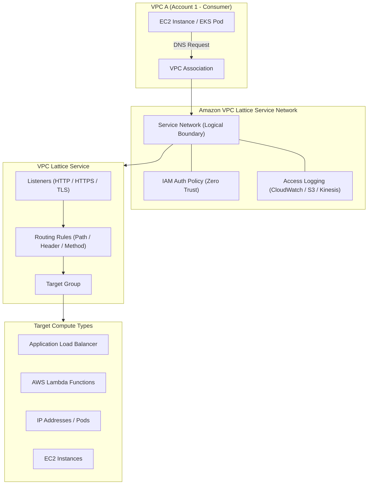

# Amazon VPC Lattice 🌐

Amazon VPC Lattice is a fully managed application networking service that connects, secures, and monitors service-to-service communication across VPCs, AWS accounts, and compute types (EC2, ECS, EKS, Lambda) without requiring sidecar proxies or complex VPC peering networks.

---

## 1. Architectural Mental Model



---

## 2. Core Building Blocks

| Component           | Responsibility                                                                                            |
| :------------------ | :-------------------------------------------------------------------------------------------------------- |
| **Service Network** | Logical namespace that groups services together. Associated with VPCs to grant network access.            |
| **Service**         | Independently deployable software component. Contains listeners, routing rules, and target groups.        |
| **Target Group**    | Collection of compute targets (EC2, IP addresses, Lambda, ALB) serving the workload.                      |
| **Auth Policy**     | Fine-grained IAM policy applied to the Service Network or Service to authorize requests (`sigv4`).        |
| **VPC Association** | Connects a VPC to a Service Network, automatically creating link-local routing without IP overlap issues. |

---

## 3. Key Advantages Over Traditional Mesh & Transit Gateway

1. **No Sidecars Required:** Unlike Istio, Linkerd, or AWS App Mesh (deprecated), Lattice is completely sidecarless, running directly on AWS Hyperplane data plane infrastructure.
2. **Handles Overlapping CIDRs:** Because routing occurs at Layer 7 using domain names rather than packet IP routing, consumer and provider VPCs can share identical CIDR blocks (e.g., `10.0.0.0/16`).
3. **Multi-Account & Cross-Organization Sharing:** Service Networks can be shared seamlessly across AWS Organizations using AWS Resource Access Manager (RAM).
4. **Native AWS SigV4 Authentication:** Enforces caller identity verification at the network edge using standard AWS IAM signatures on HTTP requests.

---

## 4. Production CLI Setup & Workflow

```bash
# 1. Create Service Network
aws vpc-lattice create-service-network \
  --name production-mesh \
  --auth-type AWS_IAM

# 2. Associate Consumer VPC with Service Network
aws vpc-lattice create-service-network-vpc-association \
  --service-network-identifier sn-0123456789abcdef0 \
  --vpc-identifier vpc-0a1b2c3d4e5f6g7h8

# 3. Create a Target Group (IP-based for container pods)
aws vpc-lattice create-target-group \
  --name order-service-tg \
  --type IP \
  --config '{"port": 8080, "protocol": "HTTP", "vpcIdentifier": "vpc-0a1b2c3d4e5f6g7h8"}'

# 4. Create Service and bind to Service Network
aws vpc-lattice create-service \
  --name order-service \
  --auth-type AWS_IAM

aws vpc-lattice create-service-network-service-association \
  --service-network-identifier sn-0123456789abcdef0 \
  --service-identifier svc-0123456789abcdef0
```

---

## 5. Kubernetes Integration: AWS Gateway API Controller

Kubernetes workloads consume VPC Lattice via the official **AWS Gateway API Controller**:

- `Gateway` resource creates the Lattice Service Network.
- `HTTPRoute` resources create Lattice Services, routing rules, and target groups mapping directly to Kubernetes Services and Pod IPs.

---

## Related Notes in Wiki

- [[Kubernetes/eks/networking/vpc-lattice/README|EKS VPC Lattice Gateway API Controller]]
- [[AWS/concepts/app-mesh-vs-vpc-lattice|App Mesh vs Amazon VPC Lattice]]
- [[AWS/networking/vpc/README|AWS VPC Fundamentals]]
- [[AWS/security/iam/README|AWS IAM Policies & SigV4]]

## Across the wiki

- [[Azure/networking/private-link/README|Azure Private Link, Private Endpoints, and Private DNS Architecture]] — private connectivity (Azure)
- [[GCP/networking/private-service-connect/README|GCP Private Service Connect (PSC)]] — private connectivity (GCP)
- [[Azure/networking/virtual-wan/README|Azure Virtual WAN (vWAN) Architecture & Global Transit Routing]] — private connectivity (Azure)
