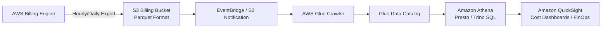

# AWS Cost and Usage Report (CUR)

The **AWS Cost and Usage Report (CUR)** is the single most comprehensive and granular source of billing data provided by AWS. It delivers hourly or daily line-item records covering every service, resource ID, usage type, and cost allocation tag across all accounts in an AWS Organization.

---

## 1. Architectural Pipeline



### Key Setup Best Practices:

1. **File Format:** Always select **Apache Parquet**. Parquet is columnar and compressed with Snappy, reducing Athena query scan volume and query costs by over 80% compared to GZIP CSV.
2. **Athena Integration:** Enable automated AWS Glue integration during CUR creation in the AWS Billing console.
3. **Partitioning:** Partition by `year`, `month`, and `account_id` to prevent full table scans when analyzing monthly spend.

---

## 2. Essential Athena Queries for FinOps

### Query 1: Top 10 Most Expensive Individual Resources

```sql
SELECT
    line_item_resource_id,
    product_product_name,
    SUM(line_item_unblended_cost) AS total_cost
FROM "cur_database"."cur_table"
WHERE year = '2026' AND month = '06'
GROUP BY line_item_resource_id, product_product_name
ORDER BY total_cost DESC
LIMIT 10;
```

### Query 2: Daily Spend by Cost Center Tag

```sql
SELECT
    DATE_TRUNC('day', line_item_usage_start_date) AS usage_date,
    resource_tags_user_cost_center,
    SUM(line_item_unblended_cost) AS cost
FROM "cur_database"."cur_table"
WHERE year = '2026' AND month = '06'
GROUP BY 1, 2
ORDER BY 1 ASC;
```

---

## 3. Showback vs Chargeback Models

- **Showback:** Reports costs to engineering teams and department managers to foster financial accountability without transferring real budget funds.
- **Chargeback:** Automatically invoices or transfers internal corporate budget allocations based on verified tag utilization and shared resource allocation rules.
