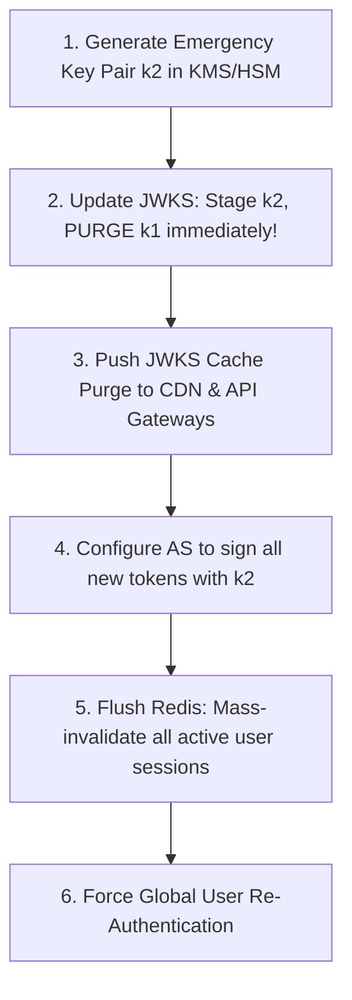

# Capstone C.2 — Identity Incident Tabletop: 3 Realistic Scenarios

> **Goal:** Pressure-test your identity architecture, operational runbooks, and team readiness by running three structured tabletop exercises simulating catastrophic identity incidents.

> **Prerequisites:** Stages 0 through 6 and [[01-keycloak-lab|Capstone C.1]].

---

## Table of Contents

1. [How to Run an Identity Tabletop Exercise](#1-how-to-run-an-identity-tabletop-exercise)
2. [Scenario 1: High-Privilege Refresh Token Theft & Session Replay](#2-scenario-1-high-privilege-refresh-token-theft--session-replay)
3. [Scenario 2: IdP Private Signing Key Committed to Public GitHub](#3-scenario-2-idp-private-signing-key-committed-to-public-github)
4. [Scenario 3: Global IdP DNS / Database Outage with Cascading Failure](#4-scenario-3-global-idp-dns--database-outage-with-cascading-failure)
5. [Evaluation Rubric & Team Scoring](#5-evaluation-rubric--team-scoring)
6. [Post-Mortem Incident Template](#6-post-mortem-incident-template)
7. [The Identity Master Certification Checklist](#7-the-identity-master-certification-checklist)

---

## 1. How to Run an Identity Tabletop Exercise

An incident tabletop is a 90-minute operational simulation where engineering, security, and operations teams work through realistic disaster scenarios:

- **Facilitator:** Introduces time-stamped "injects" (new discoveries, alerts, or escalating problems).
- **Incident Commander (IC):** Coordinates technical triage, delegates containment tasks, and leads decision-making.
- **Rules of Engagement:** Participants cannot invent magical tools; all actions must map to real scripts, APIs, or documented runbooks.

---

## 2. Scenario 1: High-Privilege Refresh Token Theft & Session Replay

### Context

A senior DevOps engineer with production cluster access downloads a compromised VS Code extension on their development machine.

### The Timeline of Injects:

- **T+00m (Alert):** SIEM fires critical alert `OAuth Refresh Token Reuse Anomaly`:
  ```
  User: devops-lead@company.com
  IP 1: 198.51.100.22 (US-East / legitimate engineer home)
  IP 2: 185.220.101.5 (Tor Exit Node / Romania)
  Event: Rotated Refresh Token presented twice within 4 seconds!
  ```
- **T+10m (Discovery):** AWS CloudTrail detects an administrative API call from IP 2 creating a new IAM user `backup-admin`.
- **T+20m (Complication):** The engineer is currently offline on a flight.

### Response & Containment Protocol:

1. **Immediate Revocation:** The on-call engineer executes the cascading revocation script:
   ```bash
   # Revoke all active sessions and refresh token families for user
   curl -X POST https://auth.company.com/admin/realms/enterprise/users/{user_id}/logout
   ```
2. **Session Eviction:** Broadcast session termination across Redis and invalidate user API keys:
   ```bash
   redis-cli SET "user:revoked_before:{user_id}" $(date +%s)
   ```
3. **IAM Quarantine:** Delete the rogue `backup-admin` IAM user and invalidate all temporary STS credentials associated with the user's role.
4. **Credential Reset:** Flag user account in directory as `requires_password_change=true` and revoke all registered WebAuthn/Passkey devices until re-attestation.

---

## 3. Scenario 2: IdP Private Signing Key Committed to Public GitHub

### Context

An engineer debugging a local JWT verification issue accidentally commits `private-key.pem` to a public open-source repository.

### The Timeline of Injects:

- **T+00m (Detection):** GitGuardian / Secret scanning bot sends an alert: RSA private key matching `kid: "prod-auth-2026-k1"` detected on GitHub.
- **T+05m (Risk Assessment):** Anyone with this private key can forge valid JWTs for any user, any tenant, and any administrative role with any expiration date. All internal microservices blindly trust tokens signed with this key!

### Emergency Containment Runbook:



1. **Purge `kid: prod-auth-2026-k1` from JWKS:** Do not wait for graceful rotation! When `k1` is removed from `jwks.json`, API gateways will immediately fail signature verification on all attacker-minted tokens.
2. **JWKS Cache Bust:** Send cache purge API call to Cloudflare/CloudFront:
   ```bash
   curl -X POST "https://api.cloudflare.com/client/v4/zones/{zone}/purge_cache" \
     -d '{"files":["https://auth.company.com/.well-known/jwks.json"]}'
   ```
3. **Mass Invalidation:** Because legitimate users' tokens were also signed by `k1`, all active user sessions will be logged out. Publish a status page update explaining an emergency credential rotation.
4. **Audit Historical Tokens:** Query SIEM logs for any token verified with `kid: prod-auth-2026-k1` containing anomalous subject IDs or scopes.

---

## 4. Scenario 3: Global IdP DNS / Database Outage with Cascading Failure

### Context

A misconfigured BGP update or distributed database deadlock takes the primary Identity Provider completely offline during peak traffic.

### The Timeline of Injects:

- **T+00m:** Keycloak cluster returns HTTP 500 / timeouts.
- **T+05m (Cascading Thundering Herd):** Downstream microservices attempting to verify incoming tokens by querying `/introspect` or refreshing JWKS crash, consuming all worker threads.
- **T+15m:** Total internal network saturation.

### Failover & Graceful Degradation Strategy:

1. **Activate Circuit Breakers:** API Gateways must immediately stop calling `/introspect` or fetching JWKS from origin.
2. **Stateless Fallback:** Configure gateways to verify tokens using their existing locally cached JWKS. As long as incoming JWTs have unexpired `exp` timestamps, continue serving requests!
3. **Route 53 DNS Failover:** Divert interactive login traffic to the secondary disaster recovery region.
4. **Read-Only Mode:** If user sessions cannot be refreshed, degrade user experience to read-only browsing while displaying a banner: _"Authentication services are undergoing maintenance."_

---

## 5. Evaluation Rubric & Team Scoring

| Capability               | Novice (1 pt)                         | Proficient (3 pts)                  | Master (5 pts)                                   |
| :----------------------- | :------------------------------------ | :---------------------------------- | :----------------------------------------------- |
| **Detection Speed**      | Discovered by user complaint (> 1 hr) | Detected by SIEM within 15 min      | Automated alert & triage in < 3 min              |
| **Containment Action**   | Restarted servers blindly             | Manually killed individual sessions | Automated script executed revocation & key purge |
| **Blast Radius Control** | Took down unrelated services          | Affected all users for hours        | Affected only compromised tenant/token family    |
| **Communication**        | Silence during incident               | Ad-hoc Slack messages               | Clear status page updates and post-mortem SLA    |

---

## 6. Post-Mortem Incident Template

```markdown
# Identity Security Post-Mortem: [Incident Title]

**Date:** YYYY-MM-DD  
**Severity:** SEV-1 / SEV-0  
**Incident Commander:** [Name]

## 1. Executive Summary

[Brief description of what failed, root cause, and business impact]

## 2. Impact Metrics

- User Accounts Compromised: [N]
- Production Downtime: [X minutes]
- Tokens Revoked: [N]

## 3. Timeline of Events (UTC)

- HH:MM - Root cause triggered
- HH:MM - SIEM alert fired
- HH:MM - Incident Commander mobilized
- HH:MM - Containment script executed
- HH:MM - System restored to normal operations

## 4. Root Cause Analysis (5 Whys)

1. Why did ... happen? Because ...
2. Why? ...

## 5. Action Items & Preventive Measures

- [ ] Implement Refresh Token Rotation with reuse detection (Owner, Due Date)
- [ ] Migrate signing keys to AWS KMS HSM (Owner, Due Date)
- [ ] Configure automated JWKS cache purge webhook (Owner, Due Date)
```

---

## 7. The Identity Master Certification Checklist

Congratulations! By completing Stages 0 through 6 and the Capstone exercises, you have mastered:

- [x] **Stage 0:** Cryptographic primitives (HMAC, RSA, ECC, TLS, Base64URL).
- [x] **Stage 1:** JWT anatomy, validation rules, algorithms, and JOSE family.
- [x] **Stage 2:** OAuth 2.0 grants, PKCE, token lifecycles, introspection, and OAuth 2.1.
- [x] **Stage 3:** OpenID Connect, ID Tokens, claims, discovery, and distributed logout.
- [x] **Stage 4:** Enterprise SSO, SAML 2.0, SCIM 2.0, multi-tenant B2B, and trust frameworks.
- [x] **Stage 5:** Top 12 auth attacks, token storage, zero-downtime key rotation, and SIEM detection.
- [x] **Stage 6:** Multi-region active/active HA, edge auth caching, SPIFFE workload identity, and emerging standards (DPoP, PAR, FAPI 2.0).
- [x] **Capstone:** Reproducible Keycloak lab and production incident response tabletops.

## Across the wiki

- [[Security/incident-response/README|Incident Response]] — incident response (Security)
- [[DevOps/sre/on-call|On-Call]] — incident response (DevOps)
- [[Kubernetes/concepts/L08-operations/03-common-failure-modes|Common Failure Modes & Triage]] — incident response (Kubernetes)
- [[Security/incident-response/postmortem/README|Postmortem]] — incident response (Security)
