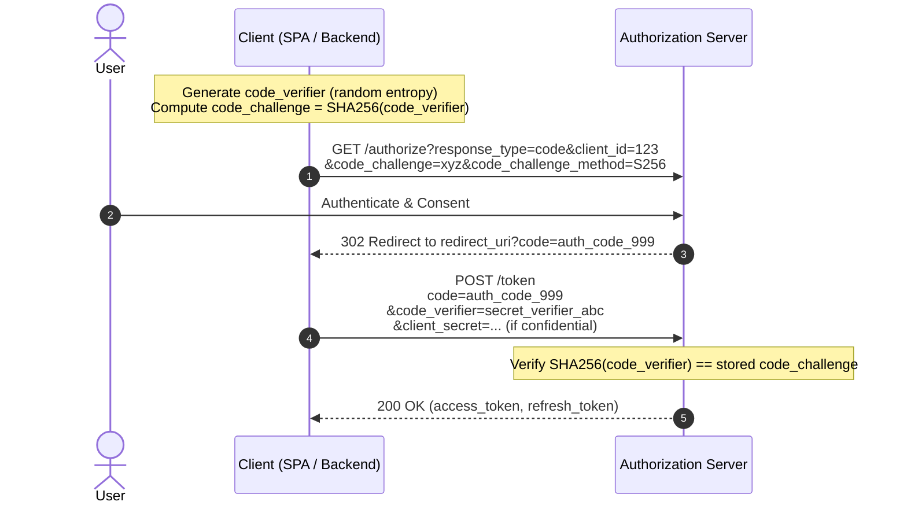
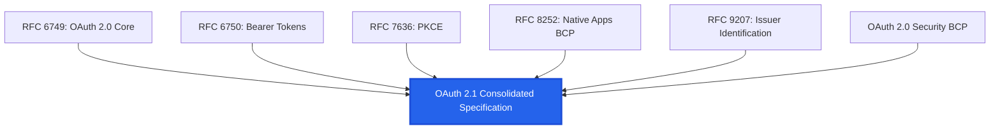

# 2.6 — OAuth 2.1: The Definitive Consolidation

> **Goal:** Master OAuth 2.1 (draft-ietf-oauth-v2-1), understand why the original OAuth 2.0 RFC 6749 allowed dangerous patterns, know every breaking change and security mandate, and execute a zero-downtime migration from OAuth 2.0 to OAuth 2.1.

> **Prerequisites:** [[01-oauth-fundamentals|Stage 2.1]] through [[05-introspection-revocation|Stage 2.5]]. You must understand authorization code, PKCE, grant types, and token lifecycles.

---

## Table of Contents

1. [Why OAuth 2.1 Exists](#1-why-oauth-21-exists)
2. [The Core Differences: OAuth 2.0 vs OAuth 2.1](#2-the-core-differences-oauth-20-vs-oauth-21)
3. [The Two Deprecated Grants (and Why They Died)](#3-the-two-deprecated-grants-and-why-they-died)
4. [Mandatory PKCE for All Clients](#4-mandatory-pkce-for-all-clients)
5. [Exact Redirect URI Matching](#5-exact-redirect-uri-matching)
6. [Bearer Token Transport Hardening](#6-bearer-token-transport-hardening)
7. [Refresh Token Restrictions for Public Clients](#7-refresh-token-restrictions-for-public-clients)
8. [The OAuth 2.1 RFC Family Tree](#8-the-oauth-21-rfc-family-tree)
9. [Migration Playbook: Upgrading to OAuth 2.1](#9-migration-playbook-upgrading-to-oauth-21)
10. [Exercises & Verification](#10-exercises--verification)
11. [Next Step](#11-next-step)

---

## 1. Why OAuth 2.1 Exists

When RFC 6749 was published in 2012, the web was different:

- Single-page applications (SPAs) were nascent and could not store client secrets or perform backend redirects easily.
- Mobile operating systems had primitive inter-app communication, leading developers to use embedded web views.
- Security best practices were spread across dozens of subsequent RFCs, BCPs (Best Current Practices), and errata.

Over 12+ years, attackers exploited ambiguous edges: authorization code interception, token leakage via URL referer headers, access token theft via implicit responses, and phishing via embedded browsers.

**OAuth 2.1 does not invent new concepts.** Instead, it consolidates:

- **RFC 6749** (OAuth 2.0 Core)
- **RFC 6750** (Bearer Token Usage)
- **RFC 7636** (Proof Key for Code Exchange - PKCE)
- **RFC 8252** (OAuth 2.0 for Native Apps - AppAuth BCP)
- **RFC 9207** (OAuth 2.0 Authorization Server Issuer Identification)
- **OAuth 2.0 Security Best Current Practice (BCP)**

OAuth 2.1 strips away dangerous legacy patterns and makes proven security practices mandatory.

---

## 2. The Core Differences: OAuth 2.0 vs OAuth 2.1

| Dimension                           | OAuth 2.0 (RFC 6749 - 2012)                            | OAuth 2.1 (draft-ietf-oauth-v2-1)                                  | Security Rationale                                                                            |
| :---------------------------------- | :----------------------------------------------------- | :----------------------------------------------------------------- | :-------------------------------------------------------------------------------------------- |
| **Implicit Grant**                  | Standard flow for browser apps (`response_type=token`) | **REMOVED**                                                        | Access tokens leaked via URL fragments, browser history, and Referer headers.                 |
| **Password Grant (ROPC)**           | Allowed for legacy trusted applications                | **REMOVED**                                                        | Bypasses MFA, anti-phishing, SSO, and teaches users to enter passwords into third-party apps. |
| **PKCE**                            | Optional extension (RFC 7636)                          | **MANDATORY for all clients** (public & confidential)              | Prevents authorization code interception attacks across native apps and CSRF injection.       |
| **Redirect URI Matching**           | Subdomain wildcards and prefix matching allowed        | **Exact string matching REQUIRED**                                 | Path traversal and open redirects in callback handlers enabled token theft.                   |
| **Bearer in URI Query**             | Permitted (`?access_token=...`)                        | **FORBIDDEN** (only Authorization header or POST body)             | Query parameters get logged in access logs, proxy caches, and Referer headers.                |
| **Refresh Tokens (Public Clients)** | Permitted without constraints                          | **Sender-constrained OR rotated with reuse detection**             | Stolen refresh tokens from browser/mobile clients could be used indefinitely.                 |
| **Issuer Identification**           | Optional                                               | **Mandatory `iss` parameter** in authorization response (RFC 9207) | Prevents IdP mix-up attacks in multi-IdP environments.                                        |

---

## 3. The Two Deprecated Grants (and Why They Died)

### 1. Death of the Implicit Grant (`response_type=token`)

In the Implicit Flow, the Authorization Server directly returned the access token in the URI fragment (`#access_token=...`) of the redirect:

```http
HTTP/1.1 302 Found
Location: https://spa.example.com/callback#access_token=2YotnFZFEjr1zCsicMWpAA&token_type=bearer
```

**Fatal Flaws:**

1. **URI Fragment Exposure:** Tokens sat in the browser address bar, web history, and could be extracted by rogue scripts running on the origin.
2. **Referer Header Leakage:** If the callback page loaded external assets (images, analytics, fonts), the entire URL fragment or callback path could leak via HTTP `Referer`.
3. **No Sender Authentication:** No code exchange took place, eliminating the opportunity to bind the token cryptographically to the client.

**OAuth 2.1 Replacement:** Authorization Code Grant + PKCE.

### 2. Death of Resource Owner Password Credentials (ROPC)

In ROPC, the client collected the user's plain-text username and password and POSTed them directly to `/token`:

```http
POST /oauth/token HTTP/1.1
grant_type=password&username=alice&password=SuperSecretPassword123!
```

**Fatal Flaws:**

1. **Password Anti-Pattern:** Breaks the core OAuth promise ("never share user credentials with third-party clients").
2. **MFA Incompatibility:** Cannot easily support FIDO2/WebAuthn, Passkeys, push notifications, or modern risk-based adaptive authentication.
3. **No Delegated Scopes:** The client has full access to the user's account rather than scoped, consented permissions.

**OAuth 2.1 Replacement:** Authorization Code Flow (delegated login) or Client Credentials (service-to-service).

---

## 4. Mandatory PKCE for All Clients

Under RFC 6749, confidential clients (backends holding a `client_secret`) rarely used PKCE, assuming their `client_secret` was sufficient.

OAuth 2.1 mandates PKCE (`code_challenge` and `code_verifier`) for **ALL** clients:



### Why Confidential Clients Must Also Use PKCE

Even with a `client_secret`, confidential clients are vulnerable to **Authorization Code Injection / CSRF**:

- An attacker intercepts or generates a valid code for their own account and injects it into a victim's session callback.
- Because the confidential client signs the `/token` request with its valid secret, the victim's session is bound to the attacker's resources.
- PKCE prevents this because the attacker cannot provide the client session's matching `code_verifier`.

---

## 5. Exact Redirect URI Matching

OAuth 2.0 allowed wildcard or prefix matching for `redirect_uri`. For example, registering `https://example.com/oauth/` allowed:

- `https://example.com/oauth/callback`
- `https://example.com/oauth/../../open-redirect`

Attackers chained open redirects on the host domain to steal authorization codes.

### OAuth 2.1 Strict Rules:

- The AS **MUST** perform an exact byte-for-byte string comparison between the registered URI and the request parameter.
- No wildcard paths or wildcard subdomains allowed.
- Path traversal (`/../`) is prohibited.
- For native apps on loopback (`http://127.0.0.1` or `http://[::1]`), dynamic port assignment is allowed, but the host and scheme must match strictly.

---

## 6. Bearer Token Transport Hardening

RFC 6750 permitted passing bearer tokens in three ways:

1. `Authorization: Bearer <token>` header (Standard)
2. `access_token=<token>` in HTTP Form-Encoded Body
3. `?access_token=<token>` in URI Query Parameters

### The OAuth 2.1 Rule:

**Passing tokens via URI query strings is explicitly forbidden.**

```http
-- FORBIDDEN IN OAUTH 2.1 --
GET /api/v1/userinfo?access_token=eyJhbGci... HTTP/1.1
Host: api.example.com

-- REQUIRED IN OAUTH 2.1 --
GET /api/v1/userinfo HTTP/1.1
Host: api.example.com
Authorization: Bearer eyJhbGci...
```

**Why?** Query strings appear in:

- Web server access logs (`/var/log/nginx/access.log`)
- CDN and load balancer debug logs
- Browser browsing history
- HTTP `Referer` headers when clicking external hyperlinks

---

## 7. Refresh Token Restrictions for Public Clients

Public clients (SPAs, single-page frameworks, iOS/Android apps) cannot keep a `client_secret` confidential. If a public client obtains a long-lived refresh token, that token can be stolen via local storage extraction, jailbroken devices, or memory inspection.

### OAuth 2.1 Mandate:

An Authorization Server issuing refresh tokens to public clients **MUST** implement at least one of the following:

1. **Refresh Token Rotation with Reuse Detection:**
   - Every time a refresh token is used, a new refresh token is issued and the old one is invalidated.
   - If the old refresh token is presented again (indicating that either the client or an attacker replayed it), **all** active tokens in that grant chain are revoked immediately.
2. **Sender-Constrained Tokens:**
   - The refresh token is bound to a cryptographic key held by the client (DPoP or mTLS). A stolen token string is useless without the private key.

---

## 8. The OAuth 2.1 RFC Family Tree



---

## 9. Migration Playbook: Upgrading to OAuth 2.1

Follow this four-phase strategy to achieve OAuth 2.1 compliance in an existing enterprise architecture:

### Phase 1: Audit & Telemetry

- Log all `/authorize` requests: identify any clients using `response_type=token` (implicit) or omitting `code_challenge` (PKCE).
- Log all `/token` requests: flag clients using `grant_type=password`.
- Audit Resource Server logs: ensure no clients pass `?access_token=` in the URL query string.

### Phase 2: Client Modernization

- Upgrade SPA clients from implicit flow to Authorization Code + PKCE using the Backend-for-Frontend (BFF) pattern or in-memory token management.
- Deprecate ROPC: migrate CLI tools and legacy integrations to Device Authorization Grant (RFC 8628) or Client Credentials.

### Phase 3: AS Enforcement

- Enforce `code_challenge` requirement globally at the AS. Reject authorization requests lacking PKCE with `invalid_request`.
- Restrict registered redirect URIs to strict, exact matching strings.
- Enable automatic Refresh Token Rotation with reuse detection for all public clients.

### Phase 4: Deprecation & Lockout

- Remove `grant_type=password` and `response_type=token` endpoints from the Authorization Server configuration.
- Reject requests containing Bearer tokens in query parameters at the API Gateway.

---

## 10. Exercises & Verification

1. **Strict Redirect Matching Test:** Attempt to pass `https://app.example.com/callback/` (with a trailing slash) to an AS registered for `https://app.example.com/callback`. Verify that OAuth 2.1 rejects the request.
2. **PKCE Enforcement on Confidential Clients:** Configure a backend server client. Initiate an authorization code grant without sending `code_challenge`. Confirm that the AS terminates with an error.
3. **Simulate Token Replay Attack:** Take a rotated refresh token, issue a refresh call twice with the same token string, and confirm that both the attacker and legitimate sessions are invalidated.

---

## 11. Next Step

With OAuth 2.0 and OAuth 2.1 mastered, we move to the next layer of the stack. OAuth provides _delegated authorization_. To solve _user authentication_ and federated identity, we enter **Stage 3: OpenID Connect (OIDC)**.

→ [[../stage3/01-oidc-fundamentals|Stage 3.1 — OpenID Connect (OIDC) Fundamentals]]
