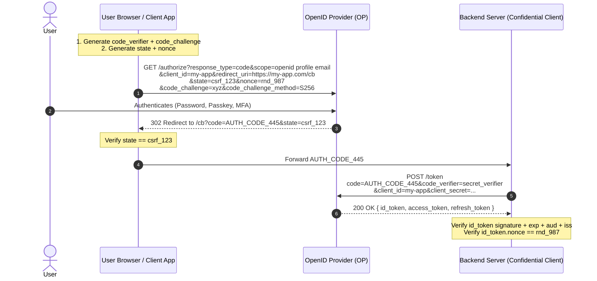
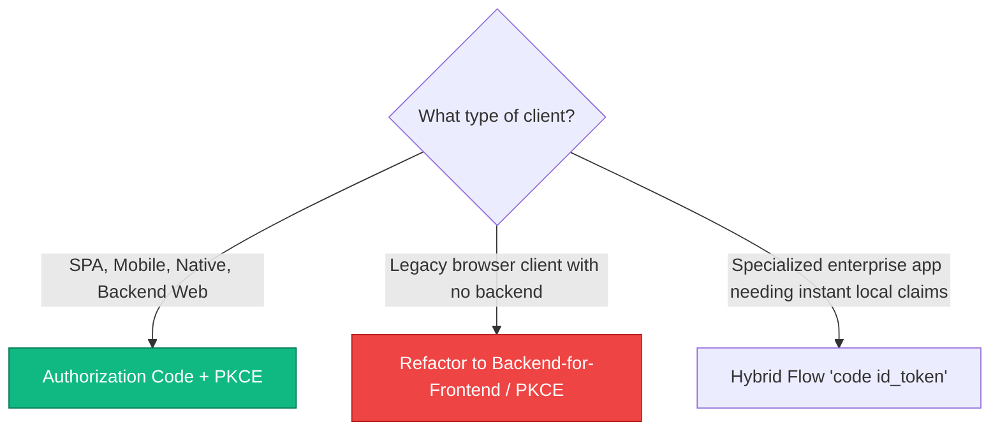

# 3.2 — OIDC Flows: Authorization Code, Hybrid, and Implicit

> **Goal:** Understand every OpenID Connect flow, know exactly when and why each `response_type` is chosen, master the cryptographic bindings of `state` and `nonce`, and control authentication UX via `prompt` and `max_age`.

> **Prerequisites:** [[01-oidc-fundamentals|Stage 3.1]] and [[../stage2/02-auth-code-pkce|Stage 2.2]] (Authorization Code + PKCE).

---

## Table of Contents

1. [The Spectrum of OIDC Flows](#1-the-spectrum-of-oidc-flows)
2. [Flow 1: Authorization Code + PKCE (The Canonical Flow)](#2-flow-1-authorization-code--pkce-the-canonical-flow)
3. [Flow 2: The Hybrid Flow (`code id_token`, `code token`)](#3-flow-2-the-hybrid-flow-code-id_token-code-token)
4. [Flow 3: The Implicit Flow (Deprecated)](#4-flow-3-the-implicit-flow-deprecated)
5. [The Critical Guardrails: `state` vs `nonce`](#5-the-critical-guardrails-state-vs-nonce)
6. [Response Modes: `query`, `fragment`, and `form_post`](#6-response-modes-query-fragment-and-form_post)
7. [Advanced OIDC Request Parameters: `prompt`, `max_age`, `acr_values`](#7-advanced-oidc-request-parameters-prompt-max_age-acr_values)
8. [Decision Tree: Picking the Right Flow](#8-decision-tree-picking-the-right-flow)
9. [Exercises & Verification](#9-exercises--verification)
10. [Next Step](#10-next-step)

---

## 1. The Spectrum of OIDC Flows

OpenID Connect specifies three main flows based on the `response_type` parameter passed to the authorization endpoint:

| Flow Name                        | `response_type`                                            | Tokens from Authorization Endpoint        | Tokens from Token Endpoint                  | Recommended Use Cases                                                         |
| :------------------------------- | :--------------------------------------------------------- | :---------------------------------------- | :------------------------------------------ | :---------------------------------------------------------------------------- |
| **Authorization Code (+ PKCE)**  | `code`                                                     | None (only `code`)                        | `id_token`, `access_token`, `refresh_token` | **Standard for ALL modern apps** (Web, SPA, Mobile)                           |
| **Hybrid Flow**                  | `code id_token`<br/>`code token`<br/>`code id_token token` | `id_token` and/or `access_token` + `code` | `id_token`, `access_token`, `refresh_token` | Specialized native/enterprise clients needing immediate identity verification |
| **Implicit Flow** _(Deprecated)_ | `id_token`<br/>`id_token token`                            | `id_token` and/or `access_token`          | None (Token endpoint is never called)       | **DO NOT USE** (Security risks)                                               |

---

## 2. Flow 1: Authorization Code + PKCE (The Canonical Flow)

The Authorization Code flow with PKCE is the gold standard for all OIDC applications today.



---

## 3. Flow 2: The Hybrid Flow (`code id_token`, `code token`)

The Hybrid Flow was introduced to solve a specific challenge in web and native architectures: the client wanted an **immediate, cryptographically signed assertion of the user's identity** in the browser front-channel, while reserving the backend token exchange for long-lived access and refresh tokens.

### Common Hybrid Combinations:

1. `response_type=code id_token`: Front-channel receives authorization code + signed ID token. The frontend can instantly render the user's avatar, name, and profile before waiting for backend token exchange.
2. `response_type=code id_token token`: Front-channel receives code, ID token, and access token.

### Security Mitigations in Hybrid Flow: `c_hash` and `at_hash`

If an attacker manipulates the authorization code or access token in transit, how does the client know?
The ID token generated in a hybrid flow includes cryptographic hash claims:

- **`c_hash` (Code Hash):** Base64URL-encoded left half of the SHA-256 hash of the authorization code.
- **`at_hash` (Access Token Hash):** Base64URL-encoded left half of the SHA-256 hash of the access token.

```python
import hashlib, base64

def verify_c_hash(auth_code: str, c_hash_from_id_token: str):
    digest = hashlib.sha256(auth_code.encode("utf-8")).digest()
    left_half = digest[:len(digest)//2]
    expected_c_hash = base64.urlsafe_b64encode(left_half).rstrip(b"=").decode("utf-8")
    assert expected_c_hash == c_hash_from_id_token, "Authorization code was tampered with!"
```

---

## 4. Flow 3: The Implicit Flow (Deprecated)

In the Implicit Flow (`response_type=id_token token`), tokens were delivered directly to the browser via the URL fragment hash (`#id_token=...`).

### Why it is Deprecated in Modern Architecture:

- Vulnerable to token leakage via browser history, Referer headers, and malicious browser extensions.
- No Refresh Tokens: SPAs had to use hidden `<iframe>` polling (silent authentication), which modern browsers break by blocking third-party tracking cookies.
- **Verdict:** Replaced completely by Authorization Code + PKCE.

---

## 5. The Critical Guardrails: `state` vs `nonce`

Developers frequently confuse `state` and `nonce`. They protect against completely different attack vectors:

| Parameter   | Primary Threat Mitigated                | Where it is validated                               | How it works                                                                                                                                                                                                             |
| :---------- | :-------------------------------------- | :-------------------------------------------------- | :----------------------------------------------------------------------------------------------------------------------------------------------------------------------------------------------------------------------- |
| **`state`** | **Cross-Site Request Forgery (CSRF)**   | By the Client, upon receiving the redirect callback | Random high-entropy token stored in the user's browser cookie/session. When the OP redirects back with `?state=...`, the client checks if the returned value matches the cookie.                                         |
| **`nonce`** | **ID Token Replay & Injection Attacks** | Inside the verified ID Token claims                 | Random value generated by the client and sent to `/authorize`. The OP embeds it directly into the signed ID Token payload (`"nonce": "xyz"`). Client confirms the token was created specifically for this login request. |

```
Request:  GET /authorize?state=SEC_STATE_1&nonce=NONCE_AABB
Callback: GET /callback?code=123&state=SEC_STATE_1  <-- Verify state here!
Token:    ID Token contains {"nonce": "NONCE_AABB"} <-- Verify nonce inside JWT!
```

---

## 6. Response Modes: `query`, `fragment`, and `form_post`

The OAuth 2.0 / OIDC Multiple Response Type Encoding specification defines the `response_mode` parameter, controlling _how_ authorization parameters are returned to the client:

### 1. `response_mode=query` (Default for Auth Code)

Parameters are returned in the URI query string:

```http
HTTP/1.1 302 Found
Location: https://client.example.com/callback?code=XYZ&state=ABC
```

### 2. `response_mode=fragment` (Default for Implicit/Hybrid)

Parameters are returned after the hash fragment `#`:

```http
HTTP/1.1 302 Found
Location: https://client.example.com/callback#id_token=JWT...&state=ABC
```

_(The browser does not send fragment data to the web server over HTTP)._

### 3. `response_mode=form_post` (High Security / Enterprise)

Instead of a 302 redirect, the OP serves an HTML page containing an auto-submitting POST form:

```html
<body onload="document.forms[0].submit()">
  <form method="post" action="https://client.example.com/callback">
    <input type="hidden" name="code" value="XYZ" />
    <input type="hidden" name="state" value="ABC" />
  </form>
</body>
```

**Why use `form_post`?**

- Parameters never appear in the browser URL bar or browser history.
- Parameters never leak into HTTP `Referer` headers when loading assets.
- Widely used by Microsoft Azure AD / Entra ID and Apple Sign In.

---

## 7. Advanced OIDC Request Parameters: `prompt`, `max_age`, `acr_values`

OIDC provides rich control over the authentication user experience:

### `prompt`

Specifies whether the OP should interact with the user:

- `prompt=none`: The OP **MUST NOT** display any UI. If the user is already authenticated via SSO cookie, it returns tokens silently. If the user is not authenticated or needs consent, it returns an error `error=login_required`.
- `prompt=login`: The OP **MUST** force the user to re-enter their credentials, even if an active session exists (used for step-up security before financial transactions).
- `prompt=consent`: The OP must re-prompt for user consent.
- `prompt=select_account`: Prompts the user to pick which account to log in with (Google account chooser).

### `max_age`

Specifies allowable elapsed time (in seconds) since the last active user authentication:

```http
GET /authorize?...&max_age=300
```

If the user logged in 10 minutes ago (600s), the OP forces re-authentication before issuing a new ID token. The resulting ID token will contain `auth_time` matching the fresh login.

### `acr_values` (Authentication Context Class Reference)

Requests specific assurance levels or authentication methods (e.g., hardware MFA):

```http
GET /authorize?...&acr_values=urn:mace:incommon:iap:silver
```

---

## 8. Decision Tree: Picking the Right Flow



---

## 9. Exercises & Verification

1. **Verify `c_hash` Calculation:** Write a short script that generates a SHA-256 hash of an authorization code, takes the left 128 bits, base64url encodes it, and compares it against `c_hash` from a hybrid ID token.
2. **Form Post Simulation:** Configure an OIDC client with `response_mode=form_post` and intercept the HTTP POST payload at your `/callback` handler using Wireshark or browser devtools.
3. **Step-Up Drill:** Send an authorization request with `prompt=login` and verify that the OP ignores existing browser session cookies.

---

## 10. Next Step

Now that you know how OIDC flows execute, we explore the core identity payload: standard claims, custom attributes, and the non-negotiable security rules around the `sub` (Subject) claim.

→ [[03-claims-and-sub|Stage 3.3 — Claims & sub Discipline: Designing Resilient Identity Schemas]]
