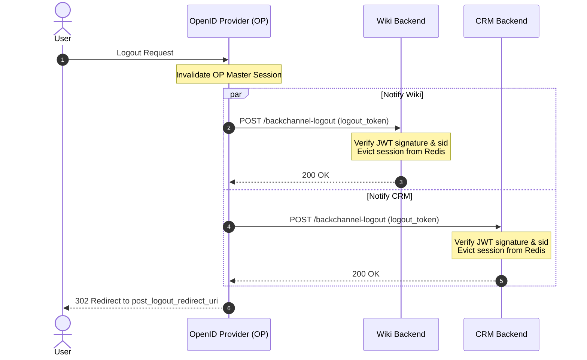

# 3.5 — Session Management & Logout: Front-Channel, Back-Channel, and RP-Initiated

> **Goal:** Master the four OIDC logout mechanisms, understand why distributed logout is notoriously difficult across modern browsers, and implement Back-Channel Logout to guarantee real-time session termination across all applications.

> **Prerequisites:** [[01-oidc-fundamentals|Stage 3.1]] through [[04-discovery-registration|Stage 3.4]].

---

## Table of Contents

1. [The Distributed Logout Dilemma](#1-the-distributed-logout-dilemma)
2. [The 4 OIDC Logout Specifications](#2-the-4-oidc-logout-specifications)
3. [Specification 1: RP-Initiated Logout 1.0](#3-specification-1-rp-initiated-logout-10)
4. [Specification 2: Front-Channel Logout 1.0](#4-specification-2-front-channel-logout-10)
5. [Specification 3: Back-Channel Logout 1.0 (The Enterprise Standard)](#5-specification-3-back-channel-logout-10-the-enterprise-standard)
6. [Specification 4: OIDC Session Management (Legacy iframe Polling)](#6-specification-4-oidc-session-management-legacy-iframe-polling)
7. [Comparative Matrix: Which Logout Pattern to Use?](#7-comparative-matrix-which-logout-pattern-to-use)
8. [Production Implementation: FastAPI Back-Channel Logout Receiver](#8-production-implementation-fastapi-back-channel-logout-receiver)
9. [Common Pitfalls & Failure Modes](#9-common-pitfalls--failure-modes)
10. [Exercises & Verification](#10-exercises--verification)
11. [Next Step](#11-next-step)

---

## 1. The Distributed Logout Dilemma

In a single monolithic web application, logout is trivial: delete the session record in your database and clear the `Set-Cookie` header.

In a federated SSO environment, things are complicated:

```
                  ┌──────────────────────┐
                  │ OpenID Provider (OP) │ (Session Cookie: auth.company.com)
                  └──────────┬───────────┘
                             │
            ┌────────────────┴────────────────┐
            │                                 │
     ┌──────▼───────┐                  ┌──────▼───────┐
     │ App A (Wiki) │                  │ App B (CRM)  │
     │ Cookie: wiki │                  │ Cookie: crm  │
     └──────────────┘                  └──────────────┘
```

If the user clicks **"Log Out"** inside App A:

- If App A only deletes its own cookie, the user is still logged into App B, and their SSO session at the OP is still alive. If they click "Log in" on App A again, they are immediately signed back in without entering a password.
- If App A logs the user out of the OP, how does App B know that the user's session was terminated?

OpenID Connect standardizes four distinct protocols to solve this coordination problem.

---

## 2. The 4 OIDC Logout Specifications

```
1. RP-Initiated Logout:
   Client redirects browser -> OP /logout -> OP kills session -> redirects back to Client

2. Front-Channel Logout:
   OP renders an HTML page containing hidden <iframe> elements pointing to each RP's /logout URL

3. Back-Channel Logout:
   OP sends direct HTTP POST requests (server-to-server) to each RP with a signed logout_token

4. Session Management:
   RP loads a hidden OP iframe and uses HTML5 window.postMessage() to poll for session state changes
```

---

## 3. Specification 1: RP-Initiated Logout 1.0

When a user clicks "Logout" in a client application, the client redirects the browser to the OP's `end_session_endpoint`.

### The Logout Request:

```http
GET /protocol/openid-connect/logout?
  id_token_hint=eyJhbGciOiJSUzI1Ni...
  &post_logout_redirect_uri=https%3A%2F%2Fwiki.example.com%2Flogged-out
  &state=logout_csrf_998
  &client_id=wiki-client HTTP/1.1
Host: auth.company.com
```

### Parameters:

- `id_token_hint` _(Recommended)_: The previously issued ID token. Proves to the OP which user and session is requesting logout (prevents attackers from logging users out maliciously via image tags).
- `post_logout_redirect_uri`: Where the OP should send the user after clearing the OP session. Must be pre-registered with the OP to prevent open redirect vulnerabilities.
- `state`: Preserves client state across the logout redirect.

---

## 4. Specification 2: Front-Channel Logout 1.0

How does the OP notify _other_ Relying Parties that the user logged out?

In **Front-Channel Logout**, when the OP logs the user out, it serves an HTML page containing hidden iframes for each application the user visited during that session:

```html
<!DOCTYPE html>
<html>
  <body>
    <h1>Logging you out of all services...</h1>
    <iframe
      src="https://wiki.example.com/frontchannel-logout?iss=https://auth.company.com&sid=sess_123"
    ></iframe>
    <iframe
      src="https://crm.example.com/frontchannel-logout?iss=https://auth.company.com&sid=sess_123"
    ></iframe>
  </body>
</html>
```

### The Fatal Flaw of Front-Channel Logout:

Modern browsers (Safari ITP, Chrome Privacy Sandbox, Firefox ETP) **block third-party cookies by default**.  
When `https://auth.company.com` renders an iframe pointing to `https://crm.example.com/frontchannel-logout`, the browser **refuses to attach CRM session cookies** to that iframe request. The CRM app cannot identify which user session to invalidate.

**Verdict:** Front-Channel Logout is unreliable in modern web browsers.

---

## 5. Specification 3: Back-Channel Logout 1.0 (The Enterprise Standard)

**Back-Channel Logout** completely bypasses the browser. The OP communicates directly with Relying Party backends via secure server-to-server HTTP POST requests.



### The `logout_token` Specification

The OP delivers a signed JWT named `logout_token`:

```json
// Decoded Header
{
  "alg": "RS256",
  "typ": "JWT",
  "kid": "k-2026-auth"
}

// Decoded Payload
{
  "iss": "https://auth.company.com/",
  "sub": "usr_998822",
  "aud": "wiki-client",
  "iat": 1781347000,
  "jti": "logout-evt-883a",
  "sid": "sess_018f2d5e_7320",
  "events": {
    "http://schemas.openid.net/event/backchannel-logout": {}
  }
}
```

### Strict `logout_token` Rules:

1. It **MUST NOT** contain a `nonce` claim (distinguishes it from an ID token).
2. It **MUST** contain the `events` claim with the backchannel-logout schema URI.
3. It **MUST** contain either `sub` (user identifier) or `sid` (session identifier), or both.

---

## 6. Specification 4: OIDC Session Management (Legacy iframe Polling)

Legacy specification where the client embeds a hidden iframe loading the OP's `check_session_iframe`. Using the HTML5 `postMessage` API, the client polls the OP iframe every few seconds to check if the session cookie changed.

**Verdict:** Broken by modern browser cookie partitioning and third-party storage deprecation.

---

## 7. Comparative Matrix: Which Logout Pattern to Use?

| Dimension                     | RP-Initiated               | Front-Channel                        | Back-Channel                             |
| :---------------------------- | :------------------------- | :----------------------------------- | :--------------------------------------- |
| **Communication Channel**     | Browser Redirect           | Browser `<iframe>`                   | Server-to-Server Direct POST             |
| **Browser Cookie Dependency** | Relies on OP cookie        | Relies on 3rd-party cookies (Broken) | **Zero browser cookie dependency**       |
| **Reliability**               | High for single app        | Low (blocked by modern browsers)     | **Highest (guaranteed delivery)**        |
| **Network Requirement**       | Public internet / TLS      | Public internet / TLS                | RP endpoint must be reachable by OP      |
| **Client Requirement**        | Standard redirect handling | Hidden iframe endpoint               | Backend server capable of receiving POST |

---

## 8. Production Implementation: FastAPI Back-Channel Logout Receiver

```python
import jwt
from jwt import PyJWKClient
from fastapi import APIRouter, Form, HTTPException, Response, status
import redis.asyncio as redis

router = APIRouter()
r = redis.Redis(host="localhost", port=6379, decode_responses=True)

JWKS_URL = "https://auth.company.com/.well-known/jwks.json"
EXPECTED_ISSUER = "https://auth.company.com/"
CLIENT_ID = "wiki-client"

jwks_client = PyJWKClient(JWKS_URL)

@router.post("/backchannel-logout")
async def handle_backchannel_logout(logout_token: str = Form(...)):
    try:
        signing_key = jwks_client.get_signing_key_from_jwt(logout_token)
        claims = jwt.decode(
            logout_token,
            signing_key.key,
            algorithms=["RS256", "ES256"],
            audience=CLIENT_ID,
            issuer=EXPECTED_ISSUER,
            options={"require": ["iss", "aud", "iat", "jti", "events"]}
        )
    except Exception as e:
        raise HTTPException(
            status_code=status.HTTP_400_BAD_REQUEST,
            detail=f"Invalid logout_token: {str(e)}"
        )

    # 1. Enforce No Nonce
    if "nonce" in claims:
        raise HTTPException(
            status_code=status.HTTP_400_BAD_REQUEST,
            detail="logout_token must not contain a nonce"
        )

    # 2. Enforce events claim
    events = claims.get("events", {})
    if "http://schemas.openid.net/event/backchannel-logout" not in events:
        raise HTTPException(
            status_code=status.HTTP_400_BAD_REQUEST,
            detail="Missing backchannel-logout event"
        )

    # 3. Invalidate Session by sid or sub
    sid = claims.get("sid")
    sub = claims.get("sub")

    if sid:
        # Invalidate specific session ID
        await r.delete(f"session:{sid}")
        await r.set(f"revoked_sid:{sid}", "1", ex=86400)
    elif sub:
        # Invalidate all sessions for this subject
        await r.set(f"revoked_user_before:{sub}", int(claims["iat"]), ex=86400)

    # Must return HTTP 200 with Cache-Control: no-store
    return Response(
        status_code=status.HTTP_200_OK,
        headers={"Cache-Control": "no-store", "Pragma": "no-cache"}
    )
```

---

## 9. Common Pitfalls & Failure Modes

1. **Firewall / NAT Isolation:** If the RP backend runs inside a private VPC with no public inbound ingress, the OP cannot deliver the Back-Channel HTTP POST.  
   _Mitigation:_ Use an API Gateway with an authenticated webhook route, or use message brokers (Kafka/SQS) for internal event distribution.
2. **Missing `post_logout_redirect_uri` Validation:** If the OP blindly redirects to any URL in `post_logout_redirect_uri`, attackers can use the OP as an open redirect proxy.
3. **Ghost Sessions:** Failing to invalidate refresh tokens at the API gateway when receiving a logout token allows mobile apps to continue refreshing sessions.

---

## 10. Exercises & Verification

1. **Test IdP Session Eviction:** Trigger an RP-Initiated logout, then immediately attempt to access a protected route without credentials. Verify you are prompted for full login.
2. **Send Malformed Logout Token:** Submit a `logout_token` containing a `"nonce": "dummy"` claim to your receiver. Verify that your server rejects it with HTTP 400.
3. **Simulate Third-Party Cookie Block:** Load a front-channel logout iframe in Safari or Chrome with third-party cookies disabled. Observe whether cookies are dropped.

---

## 11. Next Step

We have now concluded Stage 3 (OpenID Connect). Next, we enter **Stage 4: Federation, SSO, SAML 2.0, and B2B Identity Architectures**, where we connect enterprise organizations, handle legacy SAML assertions, and synchronize directory trees via SCIM.

→ [[../stage4/01-sso-patterns|Stage 4.1 — SSO Patterns: SP-Initiated vs IdP-Initiated, JIT, and Federation]]
