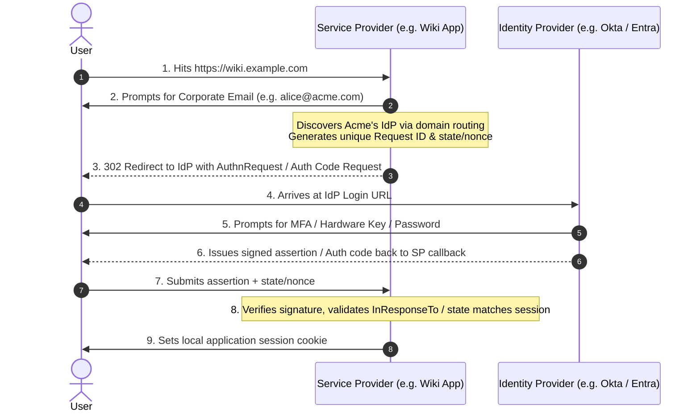
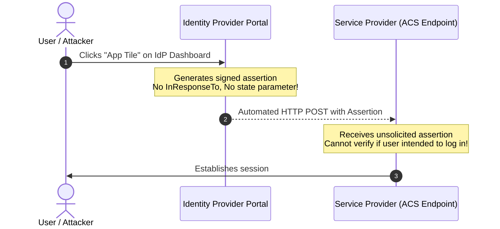

# 4.1 — SSO Patterns: SP-Initiated, IdP-Initiated, and Federation Architectures

> **Goal:** Design enterprise Single Sign-On (SSO) architectures, master the differences and security implications of SP-Initiated vs IdP-Initiated flows, and understand why Just-In-Time (JIT) provisioning requires SCIM to be safe.

> **Prerequisites:** [[../stage2/README|Stage 2]] (OAuth 2.0) and [[../stage3/README|Stage 3]] (OpenID Connect).

---

## Table of Contents

1. [The Enterprise Single Sign-On Imperative](#1-the-enterprise-single-sign-on-imperative)
2. [Pattern 1: Service Provider (SP)-Initiated SSO](#2-pattern-1-service-provider-sp-initiated-sso)
3. [Pattern 2: Identity Provider (IdP)-Initiated SSO (and Why It Is Dangerous)](#3-pattern-2-identity-provider-idp-initiated-sso-and-why-it-is-dangerous)
4. [Just-In-Time (JIT) Provisioning Mechanics](#4-just-in-time-jit-provisioning-mechanics)
5. [The Great JIT Blindspot: The Deprovisioning Problem](#5-the-great-jit-blindspot-the-deprovisioning-problem)
6. [Session Lifetimes Across Federated Boundaries](#6-session-lifetimes-across-federated-boundaries)
7. [Step-Up Authentication & Context Propagation (`amr` & `acr`)](#7-step-up-authentication--context-propagation-amr--acr)
8. [Decision Framework: SSO Integration Strategy](#8-decision-framework-sso-integration-strategy)
9. [Exercises & Verification](#9-exercises--verification)
10. [Next Step](#10-next-step)

---

## 1. The Enterprise Single Sign-On Imperative

In an enterprise organization, an employee accesses dozens of SaaS applications: Jira, Salesforce, GitHub, Slack, Datadog, internal wikis, and cloud consoles.

Without SSO:

- Users maintain 50 different passwords, inevitably reusing weak credentials.
- IT cannot enforce Multi-Factor Authentication (MFA) or conditional access globally.
- Offboarding is a nightmare: an IT admin must manually log into 50 admin consoles to deactivate an ex-employee's account.

With Federated Single Sign-On:

- The user authenticates **once** at the corporate Identity Provider (IdP: Okta, Microsoft Entra ID, Ping, Keycloak).
- All SaaS applications (Service Providers / Relying Parties) trust cryptographic assertions issued by that central IdP.

---

## 2. Pattern 1: Service Provider (SP)-Initiated SSO

SP-Initiated SSO is the gold standard for all modern web and SaaS architectures. The user starts at the application they want to use.



### Why SP-Initiated SSO is Secure:

- **State & InResponseTo Binding:** The SP initiates the conversation, recording a high-entropy state in the browser session. When the assertion returns, the SP verifies that it explicitly matches the pending request, preventing Cross-Site Request Forgery (CSRF).

---

## 3. Pattern 2: Identity Provider (IdP)-Initiated SSO (and Why It Is Dangerous)

In IdP-Initiated SSO, the user logs into their corporate portal (e.g. Okta Dashboard) and clicks a tile labeled "Wiki App".

The IdP generates a signed assertion and submits it via an automated browser POST directly to the SP's Assertion Consumer Service (ACS) endpoint **without the SP ever having asked for it** (an "unsolicited response").



### Why Security Architects Ban IdP-Initiated SSO:

1. **CSRF Vulnerability:** Because the SP receives an assertion without a prior request, it cannot validate an `InResponseTo` attribute or `state` parameter. An attacker can initiate an IdP-initiated login for their own account, capture the signed response, and trick a victim into submitting it, binding the victim's browser to the attacker's account.
2. **Stolen State Replay:** An assertion intercepted in transit can be replayed against any user's browser without the SP knowing who initiated the request.
3. **No OIDC Equivalent:** OpenID Connect does not natively support IdP-initiated login because the protocol requires dynamic client interaction (`code` exchange, `nonce`, `state`).

> [!WARNING]
> If your application must support IdP-Initiated SAML for legacy enterprise customers, you must mitigate CSRF by issuing an immediate synthetic SP-initiated redirect before establishing an authenticated session.

---

## 4. Just-In-Time (JIT) Provisioning Mechanics

When an enterprise customer integrates SSO, how does a user account get created inside the Service Provider's database?

In **Just-In-Time (JIT) Provisioning**:

1. An employee authenticates via SSO for the very first time.
2. The SP parses the incoming assertion / ID token (`sub`, `email`, `given_name`, `roles`).
3. The SP queries its database: `SELECT * FROM users WHERE sso_sub = ?`.
4. If no user exists, the SP creates a new user record on-the-fly, assigns default roles based on SAML/OIDC group attributes, and logs the user in.

```python
def handle_sso_callback(assertion_claims: dict):
    sub = assertion_claims["sub"]
    email = assertion_claims["email"]
    groups = assertion_claims.get("groups", [])

    user = db.find_user_by_sso_sub(sub)
    if not user:
        # Just-In-Time User Creation
        user = db.create_user(
            sso_sub=sub,
            email=email,
            name=assertion_claims.get("name"),
            roles=map_groups_to_roles(groups)
        )
    else:
        # Attribute Sync on subsequent logins
        user.update_profile(
            email=email,
            roles=map_groups_to_roles(groups)
        )
    return create_app_session(user)
```

---

## 5. The Great JIT Blindspot: The Deprovisioning Problem

While JIT provisioning makes user onboarding effortless, it possesses a **critical architectural flaw regarding offboarding**.

```
Day 1:  Employee hired -> Logs into App via SSO -> JIT creates user record in App.
Day 90: Employee fired -> IT deletes user from Okta IdP.
```

**What happens to the user record inside the SaaS App?**

- **Nothing.** The app has no idea the user was fired until the user tries to log in again.
- If the user had created persistent API keys, webhook integrations, background scheduled jobs, or personal access tokens (PATs), **those credentials remain active indefinitely!**
- If the SaaS app supports username/password or secondary login methods alongside SSO, the ex-employee can bypass SSO entirely and log in.

> [!IMPORTANT]
> **JIT is only an onboarding mechanism. It is NOT a lifecycle management solution.**  
> True enterprise security requires **SCIM 2.0 (System for Cross-domain Identity Management)** to handle real-time automated deprovisioning when employees depart.

---

## 6. Session Lifetimes Across Federated Boundaries

Federated systems operate two decoupled session boundaries:

```
┌───────────────────────────────────────────────────────────┐
│              Identity Provider Session (IdP)              │
│  - Controlled by corporate IT (e.g. 8-hour workday TTL)   │
│  - Tied to corporate device trust and MFA status          │
└─────────────────────────────┬─────────────────────────────┘
                              │ Issues Token / Assertion
┌─────────────────────────────▼─────────────────────────────┐
│             Service Provider Session (SP / App)           │
│  - Controlled by application (e.g. 30-day "Remember Me")  │
│  - Stored in local Redis / database / cookie              │
└───────────────────────────────────────────────────────────┘
```

### The Synchronization Problem:

- If the corporate IdP session expires after 8 hours, the SP application session might still remain valid for 30 days unless configured to validate session validity with the IdP periodically.
- **Enterprise Best Practice:** Set SP session lifetimes to match or be slightly shorter than the IdP session lifetime, or use Back-Channel Logout to tear down SP sessions when an IdP session terminates.

---

## 7. Step-Up Authentication & Context Propagation (`amr` & `acr`)

When a user attempts a high-risk operation inside an application (such as transferring $100,000 or updating production DNS), the application may require proof that the user authenticated with hardware MFA rather than just a password.

### Claims for Step-Up Verification:

- **`acr` (Authentication Context Class Reference):** Specifies the level of assurance (e.g., `gold`, `nist-800-63-3-aal3`).
- **`amr` (Authentication Methods References):** An array detailing exactly how the user authenticated:

  ```json
  {
    "acr": "https://refeds.org/profile/mfa",
    "amr": ["pwd", "hwk", "mfa"]
  }
  ```

  - `pwd`: Username & Password
  - `hwk`: Hardware Key (FIDO2 / YubiKey)
  - `otp`: One-Time Password (TOTP)
  - `mfa`: Multi-Factor Authentication completed

If the incoming token lacks `hwk`, the SP redirects back to the IdP with `acr_values` requesting step-up authentication.

---

## 8. Decision Framework: SSO Integration Strategy

```
Are you supporting consumer or enterprise users?
  ├── Consumer (B2C) ─────> OpenID Connect (Social Login: Google, Apple, GitHub)
  └── Enterprise (B2B)
        ├── Modern SaaS ───> OIDC + Back-Channel Logout + SCIM 2.0
        └── Legacy Corp ───> SAML 2.0 (SP-Initiated) + SCIM 2.0
                             (Avoid IdP-Initiated SAML whenever possible)
```

---

## 9. Exercises & Verification

1. **Audit Unsolicited Assertions:** Check whether your application accepts SAML responses without a matching `InResponseTo` ID. If it does, configure it to reject unsolicited assertions.
2. **Test JIT Attribute Updates:** Change a user's display name and groups in your IdP. Log in via SSO and verify that your application updates local database attributes on the next authentication.
3. **Simulate Orphaned Account Risk:** Create an API token for a JIT-provisioned user. Deactivate the user in the IdP. Test whether the API token remains functional in the SP.

---

## 10. Next Step

While OIDC is dominant in modern greenfield apps, **SAML 2.0** remains the bedrock of Fortune 500 enterprises, government agencies, and healthcare institutions. We dive deep into XML signatures, SAML assertions, and metadata federation next.

→ [[02-saml-deep-dive|Stage 4.2 — SAML 2.0 Deep Dive: Assertions, XMLDSig, and OIDC Interoperability]]
