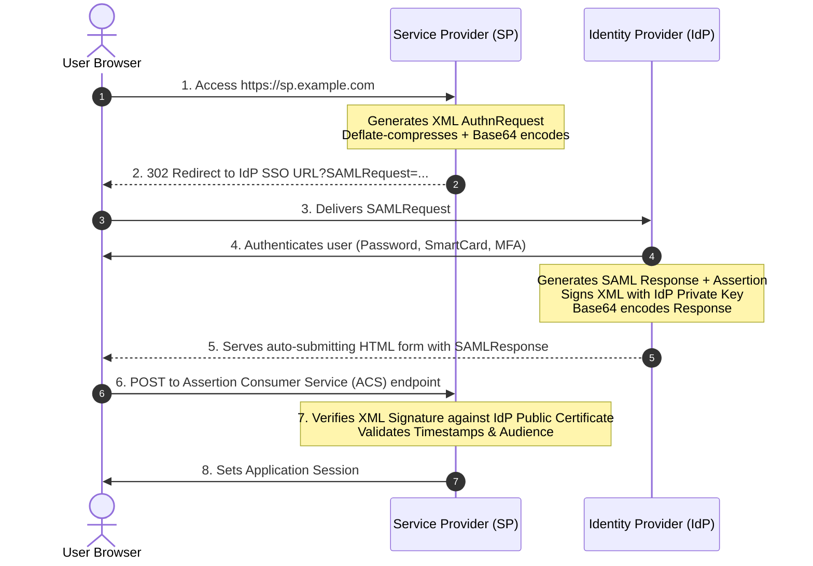
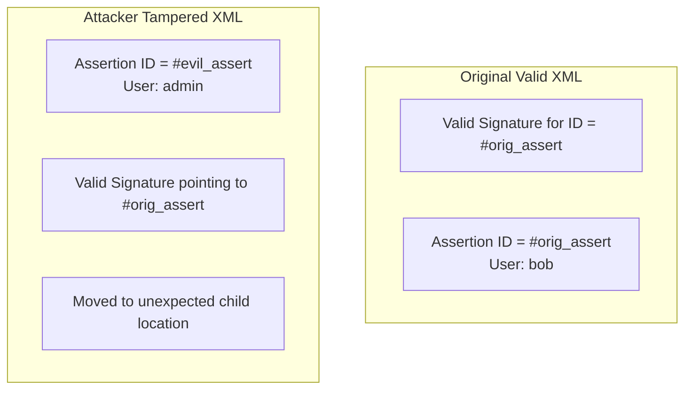

# 4.2 — SAML 2.0 Deep Dive: Assertions, XMLDSig, and OIDC Interoperability

> **Goal:** Master the Security Assertion Markup Language (SAML 2.0), dissect XML assertions and digital signatures down to the raw tags, understand historical vulnerabilities like XML Signature Wrapping (XSW), and build a SAML-to-OIDC identity bridge.

> **Prerequisites:** [[01-sso-patterns|Stage 4.1]] and [[../stage0/02-encoding-signing-verification|Stage 0.2]] (Signatures and verification).

---

## Table of Contents

1. [Why SAML 2.0 Refuses to Die](#1-why-saml-20-refuses-to-die)
2. [SAML 2.0 Architecture & Message Exchange](#2-saml-20-architecture--message-exchange)
3. [Dissecting the `AuthnRequest`](#3-dissecting-the-authnrequest)
4. [Dissecting the SAML `Response` & `Assertion`](#4-dissecting-the-saml-response--assertion)
5. [The Complexity of XMLDSig & Canonicalization (C14N)](#5-the-complexity-of-xmldsig--canonicalization-c14n)
6. [Catastrophic SAML Vulnerabilities: XML Signature Wrapping (XSW)](#6-catastrophic-saml-vulnerabilities-xml-signature-wrapping-xsw)
7. [SAML Metadata (`metadata.xml`)](#7-saml-metadata-metadataxml)
8. [The Modern Pattern: Bridging SAML to OIDC via Identity Brokering](#8-the-modern-pattern-bridging-saml-to-oidc-via-identity-brokering)
9. [Exercises & Verification](#9-exercises--verification)
10. [Next Step](#10-next-step)

---

## 1. Why SAML 2.0 Refuses to Die

Published by OASIS in 2005, **SAML 2.0** is over two decades old. Yet, every Fortune 500 company, healthcare system, defense contractor, and university runs on it.

Why?

- **Enterprise Longevity:** Active Directory Federation Services (ADFS), Shibboleth, and legacy identity fabrics were built on SAML before OAuth or OIDC existed.
- **Contractual Mandates:** Enterprise procurement requirements often explicitly mandate SAML 2.0 compliance for vendor qualification.
- **Rich Attribute Statements:** SAML assertions support complex hierarchical enterprise metadata in a standardized XML structure.

Rather than fighting SAML, modern architects learn how it works and encapsulate it behind an **Identity Broker**.

---

## 2. SAML 2.0 Architecture & Message Exchange



---

## 3. Dissecting the `AuthnRequest`

The SP sends an `AuthnRequest` to request authentication:

```xml
<samlp:AuthnRequest
    xmlns:samlp="urn:oasis:names:tc:SAML:2.0:protocol"
    xmlns:saml="urn:oasis:names:tc:SAML:2.0:assertion"
    ID="_a1b2c3d4-e5f6-7890-abcd-ef0123456789"
    Version="2.0"
    IssueInstant="2026-06-13T10:00:00Z"
    Destination="https://idp.example.com/sso"
    ProtocolBinding="urn:oasis:names:tc:SAML:2.0:bindings:HTTP-POST"
    AssertionConsumerServiceURL="https://sp.example.com/saml/acs">

    <saml:Issuer>https://sp.example.com/saml/metadata</saml:Issuer>
    <samlp:NameIDPolicy
        Format="urn:oasis:names:tc:SAML:1.1:nameid-format:unspecified"
        AllowCreate="true"/>
</samlp:AuthnRequest>
```

- `ID`: High-entropy unique request ID. The SP remembers this to match against `InResponseTo` in the return response.
- `AssertionConsumerServiceURL` (ACS): The URL where the IdP must post the assertion.
- `Issuer`: The Entity ID of the Service Provider.

---

## 4. Dissecting the SAML `Response` & `Assertion`

The IdP returns a `samlp:Response` containing one or more `saml:Assertion` blocks:

```xml
<samlp:Response
    xmlns:samlp="urn:oasis:names:tc:SAML:2.0:protocol"
    xmlns:saml="urn:oasis:names:tc:SAML:2.0:assertion"
    ID="_resp_99887766"
    InResponseTo="_a1b2c3d4-e5f6-7890-abcd-ef0123456789"
    Version="2.0"
    IssueInstant="2026-06-13T10:00:05Z"
    Destination="https://sp.example.com/saml/acs">

    <saml:Issuer>https://idp.example.com/metadata</saml:Issuer>
    <samlp:Status>
        <samlp:StatusCode Value="urn:oasis:names:tc:SAML:2.0:status:Success"/>
    </samlp:Status>

    <saml:Assertion
        ID="_assert_11223344"
        IssueInstant="2026-06-13T10:00:05Z"
        Version="2.0">

        <saml:Issuer>https://idp.example.com/metadata</saml:Issuer>

        <!-- XMLDSig Signature Block -->
        <ds:Signature xmlns:ds="http://www.w3.org/2000/09/xmldsig#">
            ...
        </ds:Signature>

        <!-- Subject: Who was authenticated -->
        <saml:Subject>
            <saml:NameID Format="urn:oasis:names:tc:SAML:1.1:nameid-format:emailAddress">
                darshan@enterprise.com
            </saml:NameID>
            <saml:SubjectConfirmation Method="urn:oasis:names:tc:SAML:2.0:cm:bearer">
                <saml:SubjectConfirmationData
                    InResponseTo="_a1b2c3d4-e5f6-7890-abcd-ef0123456789"
                    Recipient="https://sp.example.com/saml/acs"
                    NotOnOrAfter="2026-06-13T10:05:05Z"/>
            </saml:SubjectConfirmation>
        </saml:Subject>

        <!-- Conditions: Validity window and Audience -->
        <saml:Conditions NotBefore="2026-06-13T09:59:55Z" NotOnOrAfter="2026-06-13T10:05:05Z">
            <saml:AudienceRestriction>
                <saml:Audience>https://sp.example.com/saml/metadata</saml:Audience>
            </saml:AudienceRestriction>
        </saml:Conditions>

        <!-- Attributes: Groups, Roles, Department -->
        <saml:AttributeStatement>
            <saml:Attribute Name="department">
                <saml:AttributeValue>Infrastructure Security</saml:AttributeValue>
            </saml:Attribute>
            <saml:Attribute Name="groups">
                <saml:AttributeValue>CloudAdmins</saml:AttributeValue>
                <saml:AttributeValue>SecurityEngineers</saml:AttributeValue>
            </saml:Attribute>
        </saml:AttributeStatement>
    </saml:Assertion>
</samlp:Response>
```

---

## 5. The Complexity of XMLDSig & Canonicalization (C14N)

Unlike JSON Web Signatures (JWS) which sign compact Base64URL strings, **XML Digital Signatures (XMLDSig)** sign arbitrary XML nodes.

Because XML allows insignificant whitespace, attribute reordering, and namespace prefixes, signing raw XML bytes fails. To solve this, XML must be **Canonicalized (C14N)** before hashing:

```
Raw XML -> Canonicalization Algorithm (e.g. Exclusive C14N) -> SHA-256 Digest -> RSA Sign
```

This complexity makes XMLDSig parsing fragile and historically prone to critical parser vulnerabilities.

---

## 6. Catastrophic SAML Vulnerabilities: XML Signature Wrapping (XSW)

In an **XML Signature Wrapping (XSW)** attack, an attacker intercepts a valid signed SAML Response issued for a low-privilege user, duplicates the Assertion node, and injects an unauthenticated administrator identity.



### Why XSW Happens:

1. The SP's cryptographic verification library finds the node with `ID="#orig_assert"`, calculates its hash, and confirms the signature is 100% valid!
2. BUT the SP's business logic extracts user attributes by simply running `xml.xpath("//saml:Assertion/saml:Subject/saml:NameID")[0]`!
3. The XPath query extracts the _first_ assertion (which contains `admin`), while the signature verified the _second_ assertion (which contained `bob`).

### Defense:

- Use hardened SAML parsing libraries (e.g., `xmlsec`, `opensaml`) that strictly link the verified DOM element to the extracted claims.
- Never write ad-hoc XPath queries to read SAML assertions.

---

## 7. SAML Metadata (`metadata.xml`)

SAML uses XML metadata documents to exchange trust keys and endpoints out of band:

```xml
<md:EntityDescriptor xmlns:md="urn:oasis:names:tc:SAML:2.0:metadata"
    entityID="https://sp.example.com/saml/metadata">
    <md:SPSSODescriptor protocolSupportEnumeration="urn:oasis:names:tc:SAML:2.0:protocol">
        <md:KeyDescriptor use="signing">
            <ds:KeyInfo xmlns:ds="http://www.w3.org/2000/09/xmldsig#">
                <ds:X509Data>
                    <ds:X509Certificate>MIIBIjANBgkqhkiG9w0BAQEFAAOCAQ8AMIIBCgKCAQEA...</ds:X509Certificate>
                </ds:X509Data>
            </ds:KeyInfo>
        </md:KeyDescriptor>
        <md:AssertionConsumerService
            Binding="urn:oasis:names:tc:SAML:2.0:bindings:HTTP-POST"
            Location="https://sp.example.com/saml/acs"
            index="1"
            isDefault="true"/>
    </md:SPSSODescriptor>
</md:EntityDescriptor>
```

---

## 8. The Modern Pattern: Bridging SAML to OIDC via Identity Brokering

**Do not write custom SAML parsing logic into every backend microservice.**

Instead, use an **Identity Broker** (such as Keycloak, Okta, or AWS Cognito) as an intermediary:

```mermaid
graph LR
    SPA[Modern SPA / App] <-->|OIDC (Code + PKCE)| Broker[Identity Broker<br/>Keycloak / Okta]
    Broker <-->|SAML 2.0 Protocol| CorpIdP[Enterprise Corp SAML IdP<br/>ADFS / Shibboleth / Ping]

    style Broker fill:#2563eb,stroke:#1d4ed8,color:#fff
```

1. The client application speaks pure OpenID Connect (Auth Code + PKCE, JSON, JWT).
2. The Identity Broker translates OIDC requests into SAML `AuthnRequest` XML.
3. The Enterprise IdP responds to the Broker with SAML XML assertions.
4. The Broker securely verifies XMLDSig, normalizes user claims, and issues a standard OIDC ID Token and Access Token to the client app.

---

## 9. Exercises & Verification

1. **Decode a SAMLRequest:** Take a raw URL parameter `?SAMLRequest=...`, URL-decode it, Base64-decode it, inflate with `zlib`, and inspect the resulting XML.
2. **Inspect SAML Response:** Use the "SAML-tracer" browser extension to capture a live SAML login and verify `InResponseTo`, `NotOnOrAfter`, and `Audience`.
3. **Verify Broker Translation:** Configure Keycloak with an upstream SAML Identity Provider and verify that client apps receive standard OIDC JWTs.

---

## 10. Next Step

SSO solves authentication, but how do enterprise IT departments automatically add, modify, and delete users in downstream SaaS databases in real-time? We investigate **SCIM 2.0** next.

→ [[03-scim-provisioning|Stage 4.3 — SCIM 2.0: Automated User Provisioning & Deprovisioning]]
