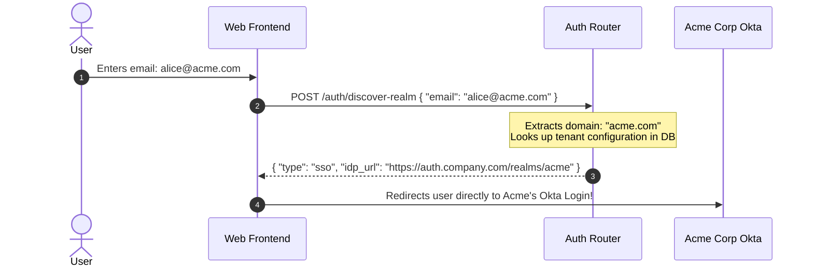
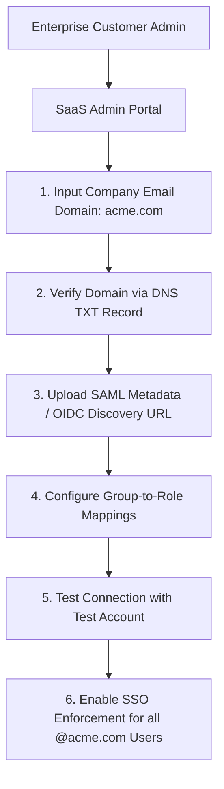

# 4.4 — Multi-Tenant Identity Architecture: B2B vs B2C Patterns

> **Goal:** Architect multi-tenant identity systems that can scale from individual consumer accounts to complex enterprise customers who demand their own SAML/OIDC federation, custom password policies, and strict tenant isolation.

> **Prerequisites:** [[01-sso-patterns|Stage 4.1]] through [[03-scim-provisioning|Stage 4.3]].

---

## Table of Contents

1. [The Divergence: B2C vs B2B Identity Models](#1-the-divergence-b2c-vs-b2b-identity-models)
2. [The Three Tenancy Architectures](#2-the-three-tenancy-architectures)
3. [Domain-Based IdP Discovery & Home Realm Discovery (HRD)](#3-domain-based-idp-discovery--home-realm-discovery-hrd)
4. [Bring Your Own Identity Provider (BYO-IdP) Architecture](#4-bring-your-own-identity-provider-byo-idp-architecture)
5. [Tenant Isolation in Tokens & API Gateways](#5-tenant-isolation-in-tokens--api-gateways)
6. [Role & Permission Modeling Across Tenants](#6-role--permission-modeling-across-tenants)
7. [Enterprise Self-Service Federation Onboarding](#7-enterprise-self-service-federation-onboarding)
8. [Code: Tenant Resolution & Claim Injection Middleware](#8-code-tenant-resolution--claim-injection-middleware)
9. [Exercises & Verification](#9-exercises--verification)
10. [Next Step](#10-next-step)

---

## 1. The Divergence: B2C vs B2B Identity Models

Identity requirements radically diverge between consumer and business applications:

| Dimension                 | B2C (Business-to-Consumer)                                     | B2B (Business-to-Business)                                     |
| :------------------------ | :------------------------------------------------------------- | :------------------------------------------------------------- |
| **User Scale**            | Millions of individual accounts                                | Hundreds of organizations, thousands of users per org          |
| **Authentication Source** | Social login (Google, Apple, GitHub), Passkeys, Email/Password | Corporate SAML 2.0 / OIDC IdPs (Okta, Entra ID, Ping)          |
| **User Onboarding**       | Instant self-service signup                                    | Admin invite, Domain-restricted auto-join, or SCIM             |
| **Tenancy Boundary**      | Weak or non-existent (User owns their own profile)             | **Strict** (User actions are scoped to an Organization/Tenant) |
| **Access Control**        | Simple roles (`free_user`, `subscriber`)                       | Complex hierarchical RBAC, custom roles, permissions           |
| **Compliance Mandates**   | GDPR, CCPA, COPPA                                              | SOC 2 Type II, ISO 27001, HIPAA, Data Residency                |

---

## 2. The Three Tenancy Architectures

When designing your identity fabric, you must choose how tenants are represented in your IdP:

```
Pattern 1: Pool-per-Tenant (Siloed)
┌──────────────┐   ┌──────────────┐   ┌──────────────┐
│ Tenant A IdP │   │ Tenant B IdP │   │ Tenant C IdP │
└──────────────┘   └──────────────┘   └──────────────┘

Pattern 2: Shared Pool with Tenant Claims (Pooled)
┌────────────────────────────────────────────────────┐
│ Central Identity Pool (All users in one directory) │
│ Claims: { "tenant_id": "tenant_123" }              │
└────────────────────────────────────────────────────┘

Pattern 3: Identity-of-Identities Broker (Federated Hub)
                   ┌──────────────┐
                   │ Central IdP  │ (Your Auth Gateway)
                   └──────┬───────┘
          ┌───────────────┼───────────────┐
          │               │               │
   ┌──────▼──────┐ ┌──────▼──────┐ ┌──────▼──────┐
   │ Okta Acme   │ │ Entra Corp  │ │ Google B2C  │
   └─────────────┘ └─────────────┘ └─────────────┘
```

### 1. Pool-per-Tenant (Keycloak Realm-per-Org / Cognito UserPool-per-Org)

- **Pros:** Total cryptographic and database isolation. Tenant A's signing keys and configuration never touch Tenant B.
- **Cons:** Operational nightmare at scale. Deploying, migrating, and monitoring 10,000 distinct user pools hits cloud API limits.

### 2. Shared Pool with Tenant Claims (Discriminator Model)

- **Pros:** Highly scalable, zero per-tenant operational overhead. Simple user lookups.
- **Cons:** Weak isolation. A bug in your API gateway or SQL query (`WHERE tenant_id = ?`) can leak data across organizations.

### 3. Identity-of-Identities Broker (The Modern Enterprise Choice)

- A single master IdP handles application authentication.
- For each enterprise customer, the master IdP registers an external Identity Provider federation mapping to the customer's corporate IdP.

---

## 3. Domain-Based IdP Discovery & Home Realm Discovery (HRD)

In a multi-tenant enterprise app, how do you know which corporate IdP a user should be redirected to?



### Fallback Strategies:

- **Subdomain Routing:** `https://acme.cloudnative.wiki` routes directly to Acme's realm.
- **Organization Slug:** Prompts user: "Enter your organization name" before redirecting.

---

## 4. Bring Your Own Identity Provider (BYO-IdP) Architecture

Enterprise customers expect to "Bring Your Own IdP" (BYO-IdP). This requires your auth system to support:

1. **Self-Service Federation Portal:** Enterprise IT admins upload their SAML `metadata.xml` or enter OIDC Discovery URLs without opening a support ticket.
2. **Domain Verification:** Prove the customer owns `acme.com` (via a DNS TXT record check) before allowing them to route `@acme.com` logins.
3. **Attribute Mapping Rules:** Allow the customer to map custom corporate claims (`memberOf`, `title`) to application roles.

---

## 5. Tenant Isolation in Tokens & API Gateways

In a multi-tenant system, every JWT issued to the client must bind the user to their active tenant context:

```json
{
  "iss": "https://auth.cloudnative.wiki/",
  "sub": "usr_992288",
  "aud": "https://api.cloudnative.wiki/",
  "exp": 1781350400,
  "https://cloudnative.wiki/tenant": {
    "id": "org_acme_corp",
    "slug": "acme",
    "roles": ["org_admin", "editor"]
  }
}
```

### Enforcement at the API Gateway:

The API gateway extracts `org_id` from the verified token and:

1. Injects `X-Tenant-ID: org_acme_corp` into upstream microservice requests.
2. Enforces PostgreSQL **Row-Level Security (RLS)** by executing:
   ```sql
   SET LOCAL app.current_tenant = 'org_acme_corp';
   ```
   Ensuring queries can never read records outside the tenant boundary.

---

## 6. Role & Permission Modeling Across Tenants

### Tenant-Scoped Role-Based Access Control (RBAC):

A user might be an `Admin` in Workspace A, but only a `Viewer` in Workspace B. Roles must **always** be scoped to the tenant identifier:

```
(User ID, Tenant ID, Role) -> (usr_123, org_acme, Admin)
(User ID, Tenant ID, Role) -> (usr_123, org_beta, Viewer)
```

### Relationship-Based Access Control (ReBAC):

For complex authorization (e.g. Google Drive folder inheritance), modern multi-tenant architectures use ReBAC models (Zanzibar / OpenFGA / Oso) rather than packing deeply nested permissions into JWT claims.

---

## 7. Enterprise Self-Service Federation Onboarding



---

## 8. Code: Tenant Resolution & Claim Injection Middleware

```python
from fastapi import Request, HTTPException, status

async def tenant_isolation_middleware(request: Request, call_next):
    # Skip unauthenticated / public routes
    if request.url.path.startswith("/public") or request.url.path.startswith("/auth"):
        return await call_next(request)

    claims = getattr(request.state, "jwt_claims", None)
    if not claims:
        raise HTTPException(status_code=status.HTTP_401_UNAUTHORIZED, detail="Missing auth context")

    tenant_context = claims.get("https://cloudnative.wiki/tenant")
    if not tenant_context or not tenant_context.get("id"):
        raise HTTPException(status_code=status.HTTP_403_FORBIDDEN, detail="No active tenant context in token")

    tenant_id = tenant_context["id"]

    # Prevent URL parameter spoofing:
    # If the route contains /tenants/{tenant_id}/..., verify it matches the token claim!
    path_tenant_id = request.path_params.get("tenant_id")
    if path_tenant_id and path_tenant_id != tenant_id:
        raise HTTPException(
            status_code=status.HTTP_403_FORBIDDEN,
            detail="Cross-tenant access violation: URL tenant does not match token claim"
        )

    # Attach tenant to request state for downstream DB queries
    request.state.tenant_id = tenant_id
    response = await call_next(request)
    return response
```

---

## 9. Exercises & Verification

1. **Verify Cross-Tenant Isolation:** Send an API request with a valid JWT for Tenant A targeting `/api/tenants/tenant_b/invoices`. Confirm that the gateway returns HTTP 403 Forbidden.
2. **Domain Discovery Test:** Write a function that tests domain extraction from email addresses, handling subdomains (`user@us.acme.com`) and edge cases (`user@gmail.com` -> redirect to B2C login).
3. **Simulate Domain Takeover:** Explain what would happen if a tenant could register `gmail.com` as their corporate SSO domain. How does DNS verification prevent this?

---

## 10. Next Step

Now that multi-tenant architecture patterns are established, which Identity Provider platform should you deploy? We evaluate AWS Cognito, Microsoft Entra ID, Auth0, Okta, Keycloak, and WorkOS next.

→ [[05-idp-vendor-comparison|Stage 4.5 — IdP Vendor Comparison: Cognito, Entra, Auth0, Okta, Keycloak, and WorkOS]]
