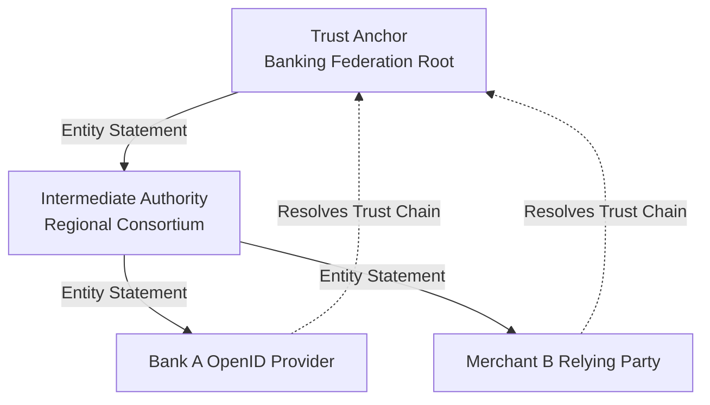

# 4.6 — B2B Federation & Trust Frameworks: OpenID Federation 1.0

> **Goal:** Move beyond manual, bilateral point-to-point SSO integrations. Master multi-lateral trust networks and OpenID Federation 1.0, enabling hundreds of partner organizations to federate dynamically using hierarchical cryptographic trust.

> **Prerequisites:** [[01-sso-patterns|Stage 4.1]] through [[05-idp-vendor-comparison|Stage 4.5]].

---

## Table of Contents

1. [The Scaling Limit of Bilateral Federation](#1-the-scaling-limit-of-bilateral-federation)
2. [What is a Trust Framework?](#2-what-is-a-trust-framework)
3. [Multi-Lateral Federation in Action: eduGAIN & InCommon](#3-multi-lateral-federation-in-action-edugain--incommon)
4. [OpenID Federation 1.0 Architecture](#4-openid-federation-10-architecture)
5. [Entity Statements: The Currency of Trust](#5-entity-statements-the-currency-of-trust)
6. [Trust Chain Resolution & Cryptographic Verification](#6-trust-chain-resolution--cryptographic-verification)
7. [Metadata Policies & Policy Enforcement](#7-metadata-policies--policy-enforcement)
8. [Production Trust Chain Validation in Python](#8-production-trust-chain-validation-in-python)
9. [Exercises & Verification](#9-exercises--verification)
10. [Next Step](#10-next-step)

---

## 1. The Scaling Limit of Bilateral Federation

In bilateral federation, every connection is negotiated manually between two parties:

$$N \text{ Organizations} \implies \frac{N(N - 1)}{2} \text{ Bilateral Connections}$$

If 500 banks or universities want to share research tools or cross-authorize employees, establishing $124,750$ distinct SAML/OIDC metadata exchanges and key rotation processes is mathematically and operationally unmanageable.

```
Bilateral Mesh (Unscalable):           Multi-Lateral Trust Framework:
       Org A ─── Org B                             Org A       Org B
      /  │   ╳   │  \                                \        /
  Org C ─┼───────┼─ Org D                             Trust Anchor
      \  │   ╳   │  /                                /        \
       Org E ─── Org F                             Org C       Org D
```

---

## 2. What is a Trust Framework?

A **Trust Framework** is a legal, operational, and technical governance contract:

1. **Legal Governance:** Participants sign a Master Services Agreement agreeing to background checks, credential issuance policies, and liability frameworks.
2. **Technical Standard:** A central **Trust Anchor** publishes authoritative lists or cryptographic certificates verifying who is an active member in good standing.
3. **Automated Admission:** Any member can immediately authenticate users from any other member without prior mutual bilateral configuration.

---

## 3. Multi-Lateral Federation in Action: eduGAIN & InCommon

For decades, the higher education and research sectors ran multi-lateral federation using **SAML Aggregates**:

- **InCommon (US)** and **eduGAIN (Global)** aggregate SAML metadata from over 5,000 universities and research laboratories into a massive, digitally signed XML document (often exceeding 100MB).
- Every university downloads and verifies the aggregate hourly. If a university is in the signed aggregate, it is automatically trusted.

However, distributing 100MB XML blobs to mobile apps and cloud microservices does not scale. This drove the creation of **OpenID Federation 1.0**.

---

## 4. OpenID Federation 1.0 Architecture

OpenID Federation 1.0 translates multi-lateral trust into the JSON/JWT era:

- Every organization runs an **Entity** (Relying Party, OpenID Provider, or Intermediate Authority).
- Entities publish self-signed **Entity Configuration** documents at `/.well-known/openid-federation`.
- A **Trust Anchor** (the root of trust, e.g., an industry consortium or government agency) issues signed **Entity Statements** attesting to subordinate organizations.



---

## 5. Entity Statements: The Currency of Trust

An **Entity Statement** is a signed JWT issued by a superior entity about a subordinate entity.

### Example: Trust Anchor Statement about Bank A OP

```json
// Decoded Payload of Entity Statement
{
  "iss": "https://trust-anchor.bankfed.org",
  "sub": "https://auth.bank-a.com",
  "iat": 1781346800,
  "exp": 1781433200,
  "jwks": {
    "keys": [
      {
        "kty": "RSA",
        "kid": "bank-a-2026",
        "n": "u18f2... ",
        "e": "AQAB"
      }
    ]
  },
  "metadata_policy": {
    "openid_provider": {
      "id_token_signing_alg_values_supported": {
        "subset_of": ["RS256", "ES256", "EdDSA"]
      },
      "token_endpoint_auth_methods_supported": {
        "superset_of": ["private_key_jwt"]
      }
    }
  }
}
```

---

## 6. Trust Chain Resolution & Cryptographic Verification

When Merchant B receives an authentication request from an unknown OP (`https://auth.bank-a.com`), Merchant B does not reject it. Instead, it builds a **Trust Chain**:

```
Step 1: Fetch https://auth.bank-a.com/.well-known/openid-federation (Self-signed)
Step 2: Note the authority_hints: ["https://regional.bankfed.org"]
Step 3: Fetch Entity Statement from https://regional.bankfed.org/fetch?sub=https://auth.bank-a.com
Step 4: Note regional authority_hints: ["https://trust-anchor.bankfed.org"]
Step 5: Fetch Entity Statement from Trust Anchor for regional authority
Step 6: Verify root of chain matches Merchant B's hardcoded Trust Anchor Public Key!
```

If all signatures verify and timestamps are unexpired, trust is established dynamically in under 200ms.

---

## 7. Metadata Policies & Policy Enforcement

Trust Anchors do not just vouch for identity; they enforce security standards using **Metadata Policies**:

- Can mandate that all member IdPs use `private_key_jwt` or mTLS instead of static client secrets.
- Can restrict allowed cryptographic algorithms (e.g. banning `HS256` or `none`).
- Can restrict claims and scopes allowed in the federation.

---

## 8. Production Trust Chain Validation in Python

```python
import jwt
from typing import List

TRUST_ANCHOR_ISSUER = "https://trust-anchor.bankfed.org"
TRUST_ANCHOR_PUBLIC_KEY = """-----BEGIN PUBLIC KEY-----
MIIBIjANBgkqhkiG9w0BAQEFAAOCAQ8AMIIBCgKCAQEA...
-----END PUBLIC KEY-----"""

def verify_trust_chain(trust_chain_jwts: List[str]) -> bool:
    """
    trust_chain_jwts: Array of Entity Statement JWTs starting from the target entity
    up to the Trust Anchor statement.
    """
    # 1. The top statement must be issued by the Trust Anchor
    root_jwt = trust_chain_jwts[-1]
    root_claims = jwt.decode(
        root_jwt,
        TRUST_ANCHOR_PUBLIC_KEY,
        algorithms=["RS256", "ES256"],
        issuer=TRUST_ANCHOR_ISSUER,
        options={"verify_exp": True}
    )

    current_key = root_claims["jwks"]["keys"][0]

    # 2. Iterate backwards down the chain verifying subordinate statements
    for statement_jwt in reversed(trust_chain_jwts[:-1]):
        subordinate_claims = jwt.decode(
            statement_jwt,
            jwt.algorithms.RSAAlgorithm.from_jwk(current_key),
            algorithms=["RS256", "ES256"],
            options={"verify_exp": True}
        )
        current_key = subordinate_claims["jwks"]["keys"][0]

    return True
```

---

## 9. Exercises & Verification

1. **Inspect an OpenID Federation Document:** Query a known test federation or local Keycloak instance supporting OpenID Federation at `/.well-known/openid-federation`.
2. **Simulate Broken Chain:** Tamper with a middle statement in a trust chain array and verify that signature checking halts execution before any identity claims are consumed.
3. **Evaluate Trust Anchor Risk:** What happens if a Trust Anchor's private key is compromised? Document the blast radius across subordinate organizations.

---

## 10. Next Step

We have now concluded Stage 4 (Federation, SSO, SAML, and B2B). Next, we enter **Stage 5: Security, Attacks, Hardening**, where we dissect the top 12 authentication vulnerabilities and build SIEM detection rules.

→ [[../stage5/01-top-12-attacks|Stage 5.1 — The Top 12 OAuth/OIDC/JWT Attacks: Exploit Mechanics & Defense]]
