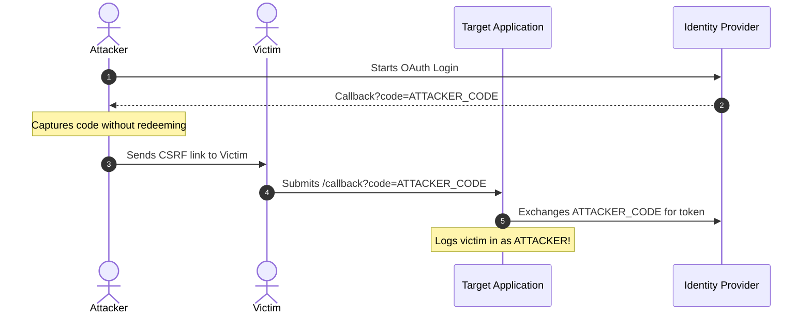

# 5.1 — The Top 12 OAuth/OIDC/JWT Attacks: Exploit Mechanics & Defense

> **Goal:** Master the offensive mechanics of the 12 most common authentication attacks, audit your systems against each vector, and implement defense-in-depth mitigations before attackers exploit them in production.

> **Prerequisites:** Stages 1 through 4 complete.

---

## Table of Contents

1. [Attack 1: CSRF on the Authorization Callback](#attack-1-csrf-on-the-authorization-callback)
2. [Attack 2: Algorithm Confusion (RS256 vs HS256 & `alg=none`)](#attack-2-algorithm-confusion-rs256-vs-hs256--algnone)
3. [Attack 3: The Confused Deputy Attack (Audience Hijacking)](#attack-3-the-confused-deputy-attack-audience-hijacking)
4. [Attack 4: PKCE Downgrade & Code Interception](#attack-4-pkce-downgrade--code-interception)
5. [Attack 5: IdP Mix-Up Attack (RFC 9207)](#attack-5-idp-mix-up-attack-rfc-9207)
6. [Attack 6: Open Redirect via Lax Redirect URI Validation](#attack-6-open-redirect-via-lax-redirect-uri-validation)
7. [Attack 7: Token Leakage via Referer Headers & Logs](#attack-7-token-leakage-via-referer-headers--logs)
8. [Attack 8: Stolen Refresh Token Replay](#attack-8-stolen-refresh-token-replay)
9. [Attack 9: IDOR via Predictable or Mutable `sub`](#attack-9-idor-via-predictable-or-mutable-sub)
10. [Attack 10: Scope Escalation & Privilege Creep](#attack-10-scope-escalation--privilege-creep)
11. [Attack 11: JWT Header Injection (`kid` / `jku` Poisoning)](#attack-11-jwt-header-injection-kid--jku-poisoning)
12. [Attack 12: Session Fixation on the Auth Boundary](#attack-12-session-fixation-on-the-auth-boundary)
13. [The Master Security Audit Checklist](#the-master-security-audit-checklist)
14. [Exercises & Verification](#exercises--verification)
15. [Next Step](#next-step)

---

## Attack 1: CSRF on the Authorization Callback

### Root Cause

The client application fails to generate, store, and validate a cryptographically secure `state` parameter when initiating an authorization flow.

### Exploitation Mechanism

1. Attacker initiates an authorization code flow with the IdP for their own account.
2. When the IdP redirects back to the attacker's browser with `https://app.com/callback?code=ATTACKER_CODE`, the attacker intercepts the request and stops it before the code is consumed.
3. Attacker crafts a phishing link or hidden image pointing to `https://app.com/callback?code=ATTACKER_CODE` and tricks a victim into clicking it.
4. The victim's browser sends the request with their own session cookies. The victim's application backend redeems `ATTACKER_CODE` and binds the victim's session to the **attacker's identity**.
5. When the victim enters credit card details or creates private documents, they are uploaded directly into the attacker's account.



### Defense

Generate a cryptographically random `state` (at least 128 bits of entropy), store it in an `HttpOnly`, `SameSite=Lax` encrypted session cookie, and reject any callback where the returned state parameter does not match the cookie.

---

## Attack 2: Algorithm Confusion (RS256 vs HS256 & `alg=none`)

### Root Cause

A JWT verification library dynamically uses the algorithm specified in the unverified JWT header (`alg`) to decide which verification algorithm to execute.

### Exploitation Mechanism

1. The server signs tokens using asymmetric **RS256** (RSA private key to sign, public key to verify).
2. The attacker downloads the server's public key (e.g. from `/.well-known/jwks.json` or PEM file).
3. The attacker creates a forged token, sets `"alg": "HS256"`, and sets claims to `{"sub": "admin"}`.
4. The attacker signs the forged token using the **server's RSA public key string as the HMAC secret key**!
5. When the server verifies the token:
   - It reads `"alg": "HS256"`.
   - It calls its verification function: `verify(token, public_key)`.
   - The HMAC library treats the public key string as a shared secret! Since both the attacker and the server used the public key string as the HMAC secret, the signature check succeeds!

### Defense

**Never trust the `alg` header from the token.** Explicitly whitelist allowed algorithms in your verification options:

```python
# SECURE: Explicit algorithm whitelist enforced
jwt.decode(token, public_key, algorithms=["RS256"])
```

---

## Attack 3: The Confused Deputy Attack (Audience Hijacking)

### Root Cause

Resource Server (RS) A accepts a valid JWT without verifying that the `aud` (Audience) claim explicitly names RS A.

### Exploitation Mechanism

1. Client requests a token for a low-security service (e.g. `aud: https://chat.company.com`).
2. The user passes this valid token to the high-security billing API (`https://billing.company.com/transfer`).
3. If the billing API only checks signature validity and expiration, it accepts the token and performs the transfer, even though the token was never authorized for the billing service.

### Defense

Always enforce strict audience verification:

```python
jwt.decode(token, key, algorithms=["RS256"], audience="https://billing.company.com")
```

---

## Attack 4: PKCE Downgrade & Code Interception

### Root Cause

An Authorization Server supports PKCE for public clients, but allows requests without `code_challenge` for backwards compatibility.

### Exploitation Mechanism

1. A malicious native application on mobile registers the same custom URI scheme as the legitimate app (`com.bank.app://oauth`).
2. When the user authorizes the legitimate app, the attacker's app intercepts the redirect and captures the `code`.
3. If the AS does not require PKCE, the attacker redeems the code directly at `/token`.

### Defense

Enforce PKCE globally across the Authorization Server. If an authorization request omits `code_challenge` or uses insecure `code_challenge_method=plain`, reject with `invalid_request`.

---

## Attack 5: IdP Mix-Up Attack (RFC 9207)

### Root Cause

A client supports multiple Identity Providers (e.g., Google and a Malicious IdP), but uses the same redirect URI callback for both without binding the callback to the specific IdP.

### Exploitation Mechanism

1. User clicks "Log in with Google".
2. Attacker intercepts and modifies the client request to redirect the user to `evil-idp.com`.
3. Evil IdP authenticates the user and redirects back to the client's callback with an authorization code.
4. The client, believing this code came from Google, sends the code along with its Google `client_secret` to Google's token endpoint, leaking credentials or codes.

### Defense

Implement **RFC 9207**: The Authorization Server must return an `iss` parameter in the authorization response (`/callback?code=...&iss=https://accounts.google.com`), and the client must verify that `iss` matches the IdP that was originally contacted.

---

## Attack 6: Open Redirect via Lax Redirect URI Validation

### Root Cause

The AS allows wildcard subdomains, partial paths, or regex matches for `redirect_uri` (e.g., `https://example.com/*`).

### Exploitation Mechanism

Attacker targets an open redirect vulnerability on the host:

```
https://auth.example.com/authorize?client_id=123
  &redirect_uri=https://example.com/logout?redirect_to=https://evil.com
```

The AS validates that `redirect_uri` starts with `https://example.com/`, redirects to the logout endpoint with the authorization code, and the logout endpoint bounces the code straight to `evil.com`.

### Defense

Enforce **OAuth 2.1 strict exact string matching**: No wildcards, no path traversal, byte-for-byte exact equality.

---

## Attack 7: Token Leakage via Referer Headers & Logs

### Root Cause

Access tokens passed in URL query parameters (`?access_token=...`) or stored in browser `localStorage`.

### Exploitation Mechanism

1. Client makes request: `GET /dashboard?access_token=secret_token_123`.
2. The dashboard loads a third-party script, stylesheet, or external link (`<a href="https://analytics.com">`).
3. The browser automatically sends the full URL, including `?access_token=...`, in the HTTP `Referer` header to the third party.
4. Token is logged in reverse proxy logs, browser history, and web analytics databases.

### Defense

- Ban tokens in query parameters (OAuth 2.1 mandate).
- Send tokens exclusively in `Authorization: Bearer` headers.
- Set `Referrer-Policy: strict-origin-when-cross-origin` on all responses.

---

## Attack 8: Stolen Refresh Token Replay

### Root Cause

Refresh tokens are long-lived, static strings issued without rotation or sender-constraining.

### Exploitation Mechanism

1. Attacker steals a refresh token from local storage, memory, or backup database.
2. Attacker uses the refresh token to continuously generate fresh access tokens for months, undetected by the legitimate user or security operations.

### Defense

Implement **Refresh Token Rotation with Automatic Reuse Detection**:

- Every refresh exchange issues a new refresh token and burns the previous one.
- If an old token is presented a second time, **all tokens in that family are immediately revoked**.

---

## Attack 9: IDOR via Predictable or Mutable `sub`

### Root Cause

Using sequential integers (`1001`, `1002`) or mutable usernames for the `sub` claim.

### Exploitation Mechanism

1. Attacker notes their token has `"sub": "1002"`.
2. Attacker finds an API accepting `X-User-Id` or modifies internal parameters to probe `1001`.
3. If an IdP recycles a deleted username (`john`), a new user inheriting that username gains access to the previous user's orphaned documents.

### Defense

Use globally unique, random, immutable UUIDv4/UUIDv7 identifiers for `sub`.

---

## Attack 10: Scope Escalation & Privilege Creep

### Root Cause

The Resource Server checks whether a token exists, but fails to check if the token includes the specific `scope` required for the endpoint.

### Exploitation Mechanism

Client requests scope `read:profile`. The API endpoint `/api/admin/delete-database` checks `if request.user:` but does not verify `scope: admin`. The request succeeds.

### Defense

Enforce fine-grained scope authorization at the API route handler or policy agent:

```python
if "admin:delete" not in token.get("scope", "").split():
    raise HTTPException(status_code=403, detail="Insufficient token scope")
```

---

## Attack 11: JWT Header Injection (`kid` / `jku` Poisoning)

### Root Cause

The verification server reads the `kid` (Key ID) or `jku` (JWKS URL) header parameter from an untrusted JWT and uses it directly in SQL queries, filesystem lookups, or remote HTTP requests without sanitization.

### Exploitation Mechanism

1. **SQL Injection via `kid`:** Server runs `SELECT key FROM keys WHERE id = '` + `header.kid` + `'`. Attacker sets `"kid": "xxxx' UNION SELECT 'my_hmac_key' --"`.
2. **Directory Traversal via `kid`:** Server runs `open("/etc/keys/" + header.kid)`. Attacker sets `"kid": "../../dev/null"`, causing the server to verify against an empty key string.
3. **`jku` SSRF:** Attacker sets `"jku": "https://attacker.com/jwks.json"`. Server fetches the attacker's public keys and validates the attacker's forged signature.

### Defense

- Whitelist known `kid` values or match strictly against cached local JWKS sets.
- Never construct SQL queries or file paths using `kid`.
- Never fetch remote `jku` URLs specified dynamically in incoming tokens.

---

## Attack 12: Session Fixation on the Auth Boundary

### Root Cause

The application preserves an unauthenticated pre-login session ID after the user completes authentication.

### Exploitation Mechanism

1. Attacker visits `https://app.com`, obtains a guest session cookie `session_id=attacker_session`.
2. Attacker sends a link to the victim: `https://app.com/login?session=attacker_session`.
3. Victim logs in successfully. The server associates `attacker_session` with the victim's account.
4. Attacker now uses `session_id=attacker_session` in their own browser and has full authenticated access.

### Defense

**Always regenerate session IDs upon login and logout:**

```python
# Upon successful authentication:
request.session.regenerate() # Destroys old session ID, issues fresh cryptographic ID
```

---

## The Master Security Audit Checklist

| Check # | Vulnerability    | Verification Method                             | Status |
| :------ | :--------------- | :---------------------------------------------- | :----- |
| **01**  | Callback CSRF    | Verify `state` is verified on `/callback`       | `[ ]`  |
| **02**  | Alg Confusion    | Verify `algorithms=["RS256"]` explicitly set    | `[ ]`  |
| **03**  | Confused Deputy  | Verify `aud` claim matches Resource Server ID   | `[ ]`  |
| **04**  | PKCE Downgrade   | Verify AS rejects missing `code_challenge`      | `[ ]`  |
| **05**  | Mix-up Attack    | Verify RFC 9207 `iss` check on callback         | `[ ]`  |
| **06**  | Open Redirect    | Verify exact string matching on `redirect_uri`  | `[ ]`  |
| **07**  | Query Leakage    | Verify no `?access_token=` in URLs or logs      | `[ ]`  |
| **08**  | Refresh Theft    | Verify Refresh Token Rotation + Reuse Detection | `[ ]`  |
| **09**  | Predictable Sub  | Verify `sub` is UUID/opaque and immutable       | `[ ]`  |
| **10**  | Scope Escalation | Verify route-level scope enforcement            | `[ ]`  |
| **11**  | Header Poisoning | Verify `kid` is sanitized and `jku` ignored     | `[ ]`  |
| **12**  | Session Fixation | Verify session ID regenerated on login          | `[ ]`  |

---

## Exercises & Verification

1. **Simulate Alg Confusion:** In a lab environment, take an RS256 token, re-encode it with HS256 using the server's public key as secret. Confirm your server's verification logic rejects it.
2. **Execute State Tampering:** Modify the `state` query parameter on an OAuth callback and verify that authentication immediately aborts with an HTTP 400/403.
3. **Audit Token Transport:** Inspect your access logs across your reverse proxies (nginx/ALB) and ensure zero access tokens or client secrets appear in URLs.

---

## Next Step

Understanding attacks is only half the battle. Next, we examine where tokens must and must not live: **Token Storage & Side-Channel Leaks**.

→ [[02-token-storage|Stage 5.2 — Token Storage & Side-Channel Leaks: Browser, Mobile, and BFF Architectures]]
