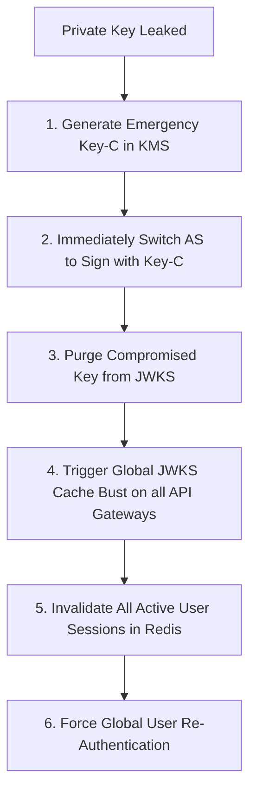

# 5.3 — Cryptographic Hardening & Zero-Downtime Key Rotation

> **Goal:** Modernize your cryptographic algorithms, design and execute zero-downtime JWKS key rotation drills, and execute an emergency key compromise playbook without taking down your entire production fleet.

> **Prerequisites:** [[../stage0/02-encoding-signing-verification|Stage 0.2]] and [[../stage1/02-algorithms|Stage 1.2]].

---

## Table of Contents

1. [Algorithm Selection & Modernization](#1-algorithm-selection--modernization)
2. [RS256 vs ES256 vs EdDSA Benchmark](#2-rs256-vs-es256-vs-eddsa-benchmark)
3. [The JWKS Key Lifecycle Architecture](#3-the-jwks-key-lifecycle-architecture)
4. [The Three-Phase Zero-Downtime Key Rotation Runbook](#4-the-three-phase-zero-downtime-key-rotation-runbook)
5. [Emergency Playbook: Private Key Compromise](#5-emergency-playbook-private-key-compromise)
6. [Hardware Security Modules (HSM) & Cloud KMS Integration](#6-hardware-security-modules-hsm--cloud-kms-integration)
7. [Automated Rotation Pipeline in Python](#7-automated-rotation-pipeline-in-python)
8. [Exercises & Verification](#8-exercises--verification)
9. [Next Step](#9-next-step)

---

## 1. Algorithm Selection & Modernization

For over a decade, **RS256 (RSA with SHA-256)** has been the default signing algorithm in OAuth and OIDC. However, RSA requires 2048-bit or 4096-bit keys, which produce large signatures and place significant CPU burden on verification servers.

Modern identity architectures are migrating to **Elliptic Curve Cryptography (ECC)**:

- **ES256 (ECDSA using P-256 and SHA-256):** Standardized across all modern cloud providers, browsers, and mobile devices. 256-bit keys deliver equivalent cryptographic strength to 3072-bit RSA with a fraction of the computational and payload footprint.
- **EdDSA (Ed25519 - RFC 8037):** High-speed, constant-time Edwards-curve signature algorithm immune to side-channel timing attacks and implementation pitfalls.

---

## 2. RS256 vs ES256 vs EdDSA Benchmark

| Metric                      | RS256 (2048-bit)         | ES256 (P-256)               | EdDSA (Ed25519)             |
| :-------------------------- | :----------------------- | :-------------------------- | :-------------------------- |
| **Public Key Size**         | ~270 bytes (JWK)         | ~140 bytes (JWK)            | **~100 bytes (JWK)**        |
| **Signature Size**          | 256 bytes                | 64 bytes                    | **64 bytes**                |
| **Signing Speed**           | Moderate (~2,000 ops/s)  | Fast (~15,000 ops/s)        | **Fastest (~35,000 ops/s)** |
| **Verification Speed**      | Fast (~25,000 ops/s)     | Moderate (~8,000 ops/s)     | **Fastest (~40,000 ops/s)** |
| **Side-Channel Resilience** | Fragile (Timing attacks) | Fragile (Nonce reuse fatal) | **Immune (Deterministic)**  |
| **Industry Adoption**       | Universal (100%)         | High (95%)                  | Growing (75%)               |

---

## 3. The JWKS Key Lifecycle Architecture

At any given point in time, an Authorization Server's `jwks.json` document should contain multiple keys representing different stages of the key lifecycle:

```mermaid
stateDiagram-v2
    [*] --> Staged: Key generated, published to JWKS
    Staged --> Active: Promotion to active signing key
    Active --> Retiring: New key promoted; old key verifies existing tokens
    Retiring --> Destroyed: All tokens issued under old key have expired
    Destroyed --> [*]
```



- **Staged Key:** Public key is published to `/.well-known/jwks.json`, but the AS does not use it to sign tokens yet. This allows downstream caching clients (API Gateways, Resource Servers) to refresh their key caches.
- **Active Key:** The single key used by the AS to sign newly minted access and ID tokens.
- **Retiring Key:** No longer signs new tokens, but its public key remains in `jwks.json` to verify existing unexpired tokens.
- **Destroyed Key:** Private key permanently deleted from KMS/HSM; public key purged from JWKS.

---

## 4. The Three-Phase Zero-Downtime Key Rotation Runbook

To rotate signing keys without dropping a single production API request, follow this three-phase timeline:

```
Timeline:
Day 0: Publish Key B to JWKS (Phase 1: Stage)
Day 2: Promote Key B to Active Signer (Phase 2: Promote)
Day 3: Remove Key A from JWKS (Phase 3: Retire)
```

### Phase 1: Stage Key B (Day 0)

1. Generate new asymmetric key pair `Key-B` in KMS/Vault.
2. Add `Key-B`'s public key to `/.well-known/jwks.json` alongside `Key-A`.
3. Keep `Key-A` as the active signing key.
4. **Wait 48 hours:** Guarantees all downstream API gateways and microservices have refreshed their JWKS cache.

### Phase 2: Promote Key B (Day 2)

1. Configure Authorization Server to sign all new tokens using `Key-B` (with `kid: "Key-B"` in the JWT header).
2. Both `Key-A` and `Key-B` remain published in `jwks.json`.
3. Downstream services immediately verify `Key-B` tokens using their updated cache. Old `Key-A` tokens in flight continue to verify seamlessly.

### Phase 3: Retire Key A (Day 3)

1. Calculate the maximum token lifespan in your system:
   $$\text{Retirement Delay} = \text{Max Access Token Lifespan} + \text{Clock Skew}$$
   _(If max token `exp` is 1 hour, wait at least 2 hours after Phase 2)._
2. Remove `Key-A` from `jwks.json`.
3. Permanently destroy `Key-A`'s private key.

---

## 5. Emergency Playbook: Private Key Compromise

If a private signing key is accidentally committed to GitHub or leaked in server logs, the standard 3-phase rotation is **too slow**. You must execute the **Emergency Key Compromise Runbook**:



1. **Containment:** Immediately purge the compromised public key from `jwks.json`. Downstream resource servers will instantly fail signature checks on any attacker-forged tokens carrying the compromised `kid`.
2. **Global Session Eviction:** Invalidate all active refresh tokens and Redis session records.
3. **Audit:** Query SIEM logs for all tokens verified with the compromised `kid` over the incident window to identify malicious actions.

---

## 6. Hardware Security Modules (HSM) & Cloud KMS Integration

Never store raw private keys in environment variables, configuration files, or database tables.

Use Cloud Key Management Services:

- **AWS KMS:** Create an asymmetric signing key pair (`ECC_NIST_P256` or `RSA_2048`). The private key **never leaves the HSM boundary**. The AS calls `kms.sign(Message, KeyId)` to sign tokens.
- **GCP Cloud KMS / Azure Key Vault:** Asymmetric HSM-backed keys with automatic rotation schedules.

---

## 7. Automated Rotation Pipeline in Python

```python
import json
from jwcrypto import jwk

class KeyLifecycleManager:
    def __init__(self):
        self.keys = {} # kid -> jwk.JWK
        self.active_kid = None

    def generate_new_key(self, kid: str):
        # Generate ES256 key pair
        key = jwk.JWK.generate(kty="EC", crv="P-256", kid=kid)
        self.keys[kid] = key
        return key

    def stage_key(self, kid: str):
        self.generate_new_key(kid)

    def promote_to_active(self, kid: str):
        if kid not in self.keys:
            raise ValueError(f"Key {kid} does not exist in keystore")
        self.active_kid = kid

    def retire_key(self, kid: str):
        if kid == self.active_kid:
            raise ValueError("Cannot retire the currently active signing key")
        if kid in self.keys:
            del self.keys[kid]

    def export_public_jwks(self) -> dict:
        """Publishes all unretired public keys to /.well-known/jwks.json"""
        public_keys = []
        for key in self.keys.values():
            pub_dict = json.loads(key.export_public())
            pub_dict["use"] = "sig"
            pub_dict["alg"] = "ES256"
            public_keys.append(pub_dict)
        return {"keys": public_keys}
```

---

## 8. Exercises & Verification

1. **Verify Staged Key Rotation:** Write a test that simulates an API Gateway verifying tokens before, during, and after a key rotation. Confirm zero verification errors occur during the transition.
2. **Benchmark ES256 vs RS256:** Run 5,000 token signing operations with RS256 (2048-bit) and ES256. Compare CPU usage and token size.
3. **Simulate Key Compromise:** Manually delete a `kid` from your JWKS document and verify that your Resource Server immediately rejects any token signed with that `kid` with HTTP 401.

---

## 9. Next Step

Robust cryptography must be coupled with observability. Next, we build the security monitoring pipeline: **Audit, Logging, and SIEM Detection Rules**.

→ [[04-audit-logging-siem|Stage 5.4 — Audit, Logging, and SIEM Detection for Identity]]
