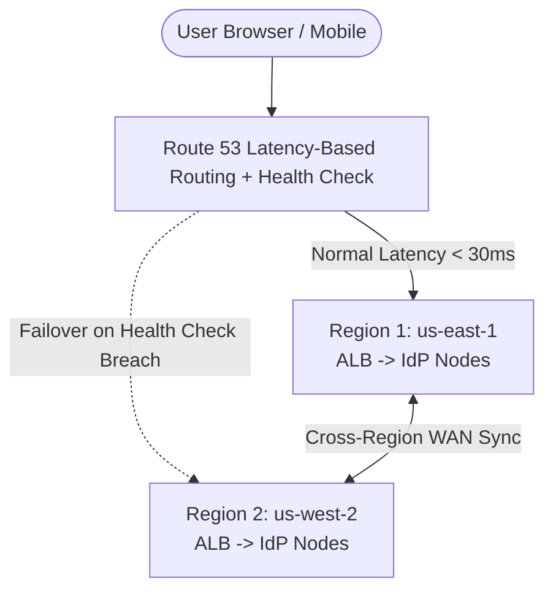
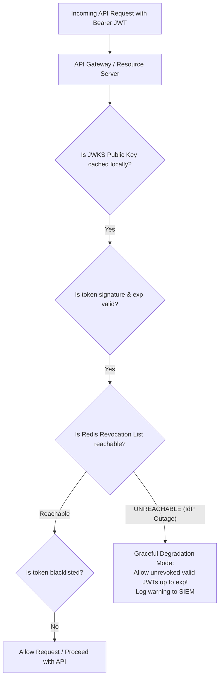

# 6.1 — HA Identity: Multi-Region Active/Active & Disaster Recovery

> **Goal:** Design identity infrastructure that survives the total loss of an AWS/cloud region with zero downtime, zero data loss, and zero user-visible authentication disruptions.

> **Prerequisites:** Stages 1 through 5 complete.

---

## Table of Contents

1. [Identity is Tier-0 Infrastructure](#1-identity-is-tier-0-infrastructure)
2. [Active/Passive vs Active/Active Topologies](#2-activepassive-vs-activeactive-topologies)
3. [The Stateful Hurdle: Cross-Region Session Replication](#3-the-stateful-hurdle-cross-region-session-replication)
4. [JWKS Replication & Edge Key Distribution](#4-jwks-replication--edge-key-distribution)
5. [Traffic Steering: Route 53, Anycast, and Health Checks](#5-traffic-steering-route-53-anycast-and-health-checks)
6. [RTO & RPO Targets for Identity](#6-rto--rpo-targets-for-identity)
7. [The Stateless Graceful Degradation Pattern](#7-the-stateless-graceful-degradation-pattern)
8. [Disaster Recovery Tabletop Drill Runbook](#8-disaster-recovery-tabletop-drill-runbook)
9. [Exercises & Verification](#9-exercises--verification)
10. [Next Step](#10-next-step)

---

## 1. Identity is Tier-0 Infrastructure

If your payment gateway fails, customers cannot checkout, but they can still browse products. If your search service fails, users fall back to categories.

**If your Identity Provider fails, your entire business ceases to exist.**

- Customers cannot log in to your web portal or mobile apps.
- Internal engineers cannot access AWS, GitHub, or Kubernetes consoles.
- Automated CI/CD deployment pipelines cannot authenticate.
- Microservices cannot exchange workload credentials.

Identity must be designed to withstand severe infrastructure catastrophes.

---

## 2. Active/Passive vs Active/Active Topologies

```
Topology A: Active / Passive (Cold / Warm Standby)
  Region us-east-1 (Active) ──────Async Replication─────> Region us-west-2 (Standby)
  Traffic: 100%                                             Traffic: 0%
  Failure mode: Manual / automated DNS failover takes 5-15 minutes.
  Risk: Split-brain during failover; async replication lag causes lost sessions.

Topology B: Active / Active (Multi-Region)
  Region us-east-1 (Active) <─────Multi-Master Sync─────> Region us-west-2 (Active)
  Traffic: 50%                                              Traffic: 50%
  Failure mode: Instant automated traffic drain; zero downtime.
  Challenge: Complex distributed database clustering and conflict resolution.
```

---

## 3. The Stateful Hurdle: Cross-Region Session Replication

Authentication systems store three distinct types of data with different consistency requirements:

| Data Type                        | Mutability                   | Consistency Model                      | Storage Engine                                |
| :------------------------------- | :--------------------------- | :------------------------------------- | :-------------------------------------------- |
| **User Directory & Credentials** | Low (updated occasionally)   | Strong Consistency (Write-Primary)     | AWS Aurora Global DB / Cloud Spanner          |
| **Real-time User Sessions**      | High (every login/refresh)   | Eventual Consistency (Sub-second sync) | Redis Enterprise CRDT / Infinispan Cross-Site |
| **Public Signing Keys (JWKS)**   | Very Low (rotated quarterly) | Globally Cached Static Data            | CloudFront / CDN Edge KV                      |

### Multi-Region Keycloak with Infinispan Cross-Site Sync

In an active/active Keycloak deployment:

- Keycloak nodes in `us-east-1` form a local JGroups cluster.
- Keycloak nodes in `eu-west-1` form a second local JGroups cluster.
- The two clusters replicate active sessions across the Atlantic using **Infinispan Cross-Site Replication** over private VPC Peering / AWS Transit Gateway.
- If `us-east-1` burns down, incoming requests to `eu-west-1` find the active session cached in local memory, requiring zero re-logins.

---

## 4. JWKS Replication & Edge Key Distribution

A common failure mode in multi-region deployments:

- A user logs in and gets an ID token signed by an IdP instance in `us-east-1`.
- The user's next API request lands in `eu-central-1`.
- The EU API gateway fetches `/.well-known/jwks.json`. If that fetch calls across the ocean to `us-east-1` and the link is down, verification fails!

### The Edge JWKS Solution:

Publish `jwks.json` to a globally distributed CDN (Cloudflare, AWS CloudFront) with local edge caching. Even if the entire origin IdP infrastructure is unreachable, edge API gateways continue verifying tokens using cached cryptographic public keys.

---

## 5. Traffic Steering: Route 53, Anycast, and Health Checks



### Critical Health Check Design:

- **Do not health-check `/` or a static ping endpoint!** A static ping returns HTTP 200 even if the database is deadlocked.
- **Deep Health Check:** Have your load balancer health check `/health/ready` which verifies:
  1. Local database connection pool is healthy.
  2. Local Redis / cache connection is responsive.
  3. Disk and memory thresholds are below 85%.

---

## 6. RTO & RPO Targets for Identity

| Tier       | Service                      | Target RTO (Recovery Time)            | Target RPO (Data Loss) |
| :--------- | :--------------------------- | :------------------------------------ | :--------------------- |
| **Tier 0** | Token Verification (RS API)  | **0 seconds** (100% uptime)           | 0 (Stateless)          |
| **Tier 0** | Interactive Login (AS)       | **< 30 seconds** (Automated failover) | < 1 second             |
| **Tier 1** | User Profile Changes / Admin | < 15 minutes                          | < 5 seconds            |

---

## 7. The Stateless Graceful Degradation Pattern

What happens if the master PostgreSQL database goes completely offline?



By decoupling **token validation (stateless crypto)** from **token issuance (stateful DB)**, your APIs continue operating seamlessly during transient database outages!

---

## 8. Disaster Recovery Tabletop Drill Runbook

Run this drill quarterly:

1. **Inject Blackhole:** Add a network blackhole rule to cut all outbound traffic from the primary region's IdP database.
2. **Monitor DNS Failover:** Measure the exact elapsed time until Route 53 triggers health check alarm and diverts traffic to the secondary region.
3. **Verify Active Sessions:** Confirm that logged-in users on mobile and desktop can refresh tokens without entering passwords.
4. **Restore & Reconcile:** Restore primary region network; verify multi-master database replication reconciles split-brain records cleanly.

---

## 9. Exercises & Verification

1. **Simulate Region Loss:** In a multi-instance Docker Compose or Kubernetes setup, terminate the primary IdP container. Observe whether the second instance serves user sessions.
2. **Measure JWKS Cache TTL:** Turn off the IdP completely. Send API calls with valid JWTs to your API Gateway. Verify that the gateway continues accepting requests until the JWKS cache TTL expires.
3. **Draft an RTO/RPO SLA:** Write down the formal SLA for your team's auth architecture. Calculate the financial cost per hour of an auth outage.

---

## 10. Next Step

High availability guarantees uptime; performance guarantees speed. Next, we optimize token verification down to sub-5ms latencies: **Performance: Caching & Edge Auth**.

→ [[02-performance-edge|Stage 6.2 — Performance: Caching, Edge Auth, and Cost Optimization]]
