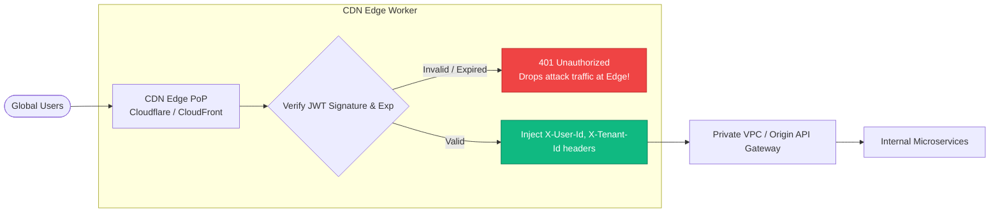

# 6.2 — Performance: Caching, Edge Auth, and Cost Optimization

> **Goal:** Slash authentication latency to sub-5ms p99 across the globe, terminate unauthenticated requests at the CDN edge before they reach internal microservices, and optimize your identity infrastructure to handle 100,000 requests per second at minimal cost.

> **Prerequisites:** [[01-ha-identity|Stage 6.1]].

---

## Table of Contents

1. [The Latency Breakdown of an API Call](#1-the-latency-breakdown-of-an-api-call)
2. [Multi-Tier Caching Architecture](#2-multi-tier-caching-architecture)
3. [Edge Authentication Architecture](#3-edge-authentication-architecture)
4. [Cloudflare Workers / Lambda@Edge Implementation](#4-cloudflare-workers--lambdaedge-implementation)
5. [Policy Enforcement at the Edge with OPA / Wasm](#5-policy-enforcement-at-the-edge-with-opa--wasm)
6. [Cost Optimization: Cost per Million Authentications](#6-cost-optimization-cost-per-million-authentications)
7. [Benchmarking & Profiling Auth Overhead](#7-benchmarking--profiling-auth-overhead)
8. [Exercises & Verification](#8-exercises--verification)
9. [Next Step](#9-next-step)

---

## 1. The Latency Breakdown of an API Call

When an API client makes a request to `https://api.company.com/v1/orders`, where does time get spent?

```
Traditional Architecture (Introspection / Non-Cached):
Client ──(40ms WAN)──> Gateway ──(35ms HTTP POST)──> IdP /introspect
                                        │
                       Gateway <──(35ms Response)───┘
Gateway ──(5ms RPC)───> Backend Order Service
Total Auth Overhead: ~70ms!
```

```
Optimized Architecture (Edge JWT Verification):
Client ──(15ms Edge)──> CDN Edge (Cloudflare / CloudFront)
                             │
                      Local Crypto Verify (0.8ms)
                      Cache Hit in Edge Memory (0.1ms)
                             │
                      Forward to Origin with Verified Claims
Total Auth Overhead: < 1ms!
```

---

## 2. Multi-Tier Caching Architecture

To achieve sub-millisecond local token validation without security drift, implement a three-tier caching hierarchy:

```
┌────────────────────────────────────────────────────────┐
│ Tier 1: In-Memory L1 LRU Cache (Per Process)           │
│   - Key: SHA256(token)                                 │
│   - Value: Parsed claims dict                          │
│   - TTL: min(token.exp - now, 30s)                     │
│   - Latency: ~50 nanoseconds (0 network I/O)           │
├────────────────────────────────────────────────────────┤
│ Tier 2: Local Redis L2 Cache (Per Availability Zone)   │
│   - Key: jwks:cache / user:revocation_timestamp        │
│   - Latency: ~0.5 milliseconds                         │
├────────────────────────────────────────────────────────┤
│ Tier 3: Edge CDN KV / Global Cache                     │
│   - Key: /.well-known/jwks.json                        │
│   - TTL: 24 hours (with stale-while-revalidate)        │
│   - Latency: ~5 milliseconds                           │
└────────────────────────────────────────────────────────┘
```

---

## 3. Edge Authentication Architecture

Rather than allowing unauthenticated traffic to penetrate your VPC, load balancers, and backend application servers, **terminate authentication at the CDN Edge Point of Presence (PoP)**:



### Advantages of Edge Auth:

1. **DDoS & Scraping Absorption:** Unauthenticated bots and credential-stuffing scripts are dropped at the edge, saving origin database connections and compute costs.
2. **Zero Origin Load for Auth:** Origin microservices do not need to verify RSA/ECDSA cryptography or fetch JWKS; they trust the headers injected by the authenticated edge worker.
3. **Global Sub-5ms p99 Latency:** Users hit the nearest PoP (often < 15ms round-trip away).

---

## 4. Cloudflare Workers / Lambda@Edge Implementation

Here is a production-grade Cloudflare Worker (JavaScript / WebCrypto) that verifies RS256/ES256 tokens at the edge in under 1 millisecond:

```javascript
import { jwtVerify, createRemoteJWKSet } from "jose";

const ISSUER = "https://auth.company.com/";
const AUDIENCE = "https://api.company.com/";
const JWKS = createRemoteJWKSet(new URL(`${ISSUER}.well-known/jwks.json`), {
  cacheMaxAge: 86400000, // 24 hours
  cooldownDuration: 30000, // 30s cooldown on cache-bust
});

export default {
  async fetch(request, env, ctx) {
    const authHeader = request.headers.get("Authorization");
    if (!authHeader || !authHeader.startsWith("Bearer ")) {
      return new Response(
        JSON.stringify({ error: "Missing or invalid Authorization header" }),
        {
          status: 401,
          headers: { "Content-Type": "application/json" },
        },
      );
    }

    const token = authHeader.substring(7);

    try {
      // High-speed crypto verification using V8 WebCrypto
      const { payload } = await jwtVerify(token, JWKS, {
        issuer: ISSUER,
        audience: AUDIENCE,
      });

      // Clone request and inject verified claims into upstream headers
      const modifiedRequest = new Request(request);
      modifiedRequest.headers.set("X-User-Sub", payload.sub);
      modifiedRequest.headers.set(
        "X-Tenant-Id",
        payload["https://company.com/tenant_id"] || "",
      );

      return await fetch(modifiedRequest);
    } catch (err) {
      return new Response(
        JSON.stringify({ error: "Unauthorized", detail: err.message }),
        {
          status: 401,
          headers: { "Content-Type": "application/json" },
        },
      );
    }
  },
};
```

---

## 5. Policy Enforcement at the Edge with OPA / Wasm

Can you enforce complex authorization policies (e.g. "Only engineers in the EMEA region can access European financial records") at the edge?

**Yes:** Compile **Open Policy Agent (OPA)** Rego policies into WebAssembly (`.wasm`) binaries:

- The compiled Wasm bundle is loaded into the Edge Worker memory (~50KB).
- The Edge Worker executes the policy locally:
  $$\text{Policy Result} = \text{RegoWasm}(\text{Token Claims}, \text{HTTP Method}, \text{URL Path})$$
- Policy execution latency: **< 100 microseconds**.

---

## 6. Cost Optimization: Cost per Million Authentications

```
Scenario: 50,000,000 API calls per month.

Option 1: Centralized SaaS IdP Introspection
  - Cost: ~$0.002 per introspection call
  - Total: 50M * $0.002 = $100,000 / month! (Financially ruined)

Option 2: Origin API Gateway (ALB + EC2) JWT Verification
  - Cost: Extra CPU on 20 EC2 instances to compute RSA signatures
  - Total: ~$1,200 / month

Option 3: Cloudflare Workers / Fastly Edge Verification
  - Cost: $0.15 per million edge requests
  - Total: 50 * $0.15 = $7.50 / month!
```

---

## 7. Benchmarking & Profiling Auth Overhead

Use `wrk` or `k6` to measure auth latency:

```bash
# Benchmark local JWT verification throughput
k6 run --vus 50 --duration 30s scripts/load_test_auth.js
```

### Metrics to Track:

- `http_req_duration`: p95 and p99 must remain under 5ms for edge responses.
- `auth_cache_hit_ratio`: Must exceed 98%.
- `jwks_fetch_count`: Should remain nearly flat (fetching once per key rotation).

---

## 8. Exercises & Verification

1. **Deploy Edge Auth Worker:** Deploy the Cloudflare Worker snippet using Wrangler or Cloudflare Playground. Test with a valid JWT and an expired JWT.
2. **Benchmark RSA vs ECDSA Verification:** Write a Node.js benchmark comparing `jwtVerify` throughput for RS256 vs ES256. Observe the ~3x verification speedup of EdDSA/ES256.
3. **Simulate Edge Cache Hit:** Verify that 10 consecutive requests to the Edge worker execute without triggering an outbound HTTP request to the IdP.

---

## 9. Next Step

We have mastered user and client identity at scale. But what about the microservices themselves? How do containers and serverless functions authenticate with each other without static API keys? Enter **Zero-Trust & Workload Identity with SPIFFE/SPIRE**.

→ [[03-zero-trust-spiffe|Stage 6.3 — Zero-Trust & Workload Identity: SPIFFE/SPIRE and Multi-Cloud Federation]]
