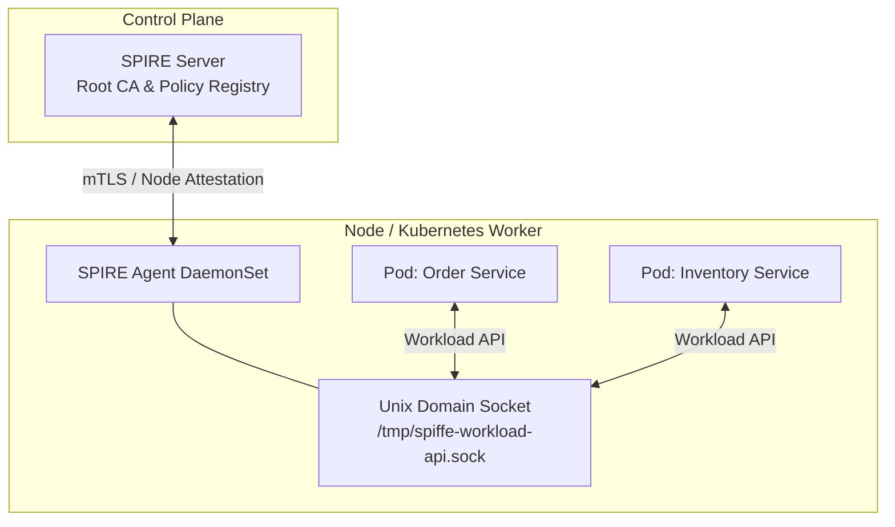
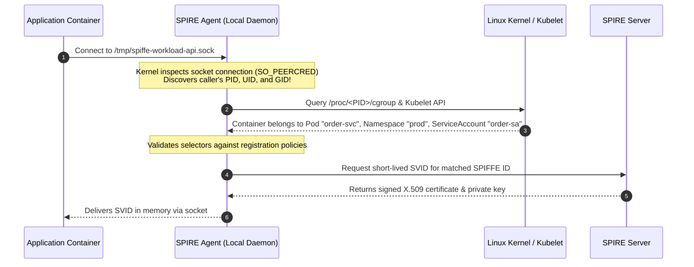
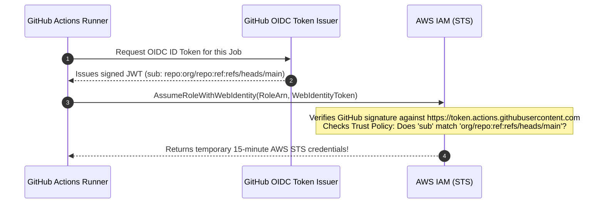

# 6.3 — Zero-Trust & Workload Identity: SPIFFE/SPIRE and Multi-Cloud Federation

> **Goal:** Eradicate long-lived static credentials, API keys, and database passwords from microservices and CI/CD pipelines. Master SPIFFE/SPIRE workload attestation, issue short-lived cryptographic X.509/JWT identities, and establish secretless cloud federation.

> **Prerequisites:** [[../stage0/03-http-tls-foundations|Stage 0.3]] (mTLS) and [[../stage3/01-oidc-fundamentals|Stage 3.1]] (OIDC).

---

## Table of Contents

1. [The Death of Perimeter Security & The BeyondCorp Shift](#1-the-death-of-perimeter-security--the-beyondcorp-shift)
2. [What is SPIFFE?](#2-what-is-spiffe)
3. [The SPIFFE Verifiable Identity Document (SVID)](#3-the-spiffe-verifiable-identity-document-svid)
4. [SPIRE Architecture: Server & Agent](#4-spire-architecture-server--agent)
5. [The Workload Attestation Pipeline](#5-the-workload-attestation-pipeline)
6. [Cross-Cloud OIDC Federation: The Secretless CI/CD Pipeline](#6-cross-cloud-oidc-federation-the-secretless-cicd-pipeline)
7. [Kubernetes Pod Identity: IRSA & GCP Workload Identity](#7-kubernetes-pod-identity-irsa--gcp-workload-identity)
8. [Production SPIRE Registration Entry Example](#8-production-spire-registration-entry-example)
9. [Exercises & Verification](#9-exercises--verification)
10. [Next Step](#10-next-step)

---

## 1. The Death of Perimeter Security & The BeyondCorp Shift

In legacy networks, security was defined by physical or virtual topology:

- "Inside the VPC / behind the firewall = Trusted."
- "Outside the firewall = Untrusted."

**The perimeter model is fundamentally broken:**

- If an attacker compromises a single container via an RCE vulnerability, they have unrestricted lateral movement across the entire flat private network.
- IP addresses are dynamic, ephemeral, and easily spoofed in containerized Kubernetes clusters.
- Microservices cannot rely on network location to determine trust.

**The Zero-Trust Principle:** _Never trust, always verify._ Every service, container, and background process must present cryptographically proven identity for every transaction.

---

## 2. What is SPIFFE?

The **Secure Production Identity Framework for Everyone (SPIFFE)** is a CNCF graduated standard defining how workloads acquire identity in heterogeneous environments.

### The SPIFFE ID:

A standardized URI formatted as:
$$\text{spiffe://}\langle\text{trust-domain}\rangle\text{/}\langle\text{workload-path}\rangle$$

Examples:

- `spiffe://cloudnative.wiki/ns/production/sa/payment-service`
- `spiffe://cloudnative.wiki/aws/123456789012/lambda/invoice-generator`
- `spiffe://partner.org/cluster/eu-1/ns/analytics/sa/collector`

---

## 3. The SPIFFE Verifiable Identity Document (SVID)

An SVID is the cryptographic credential that encodes a SPIFFE ID. Workloads present an SVID to prove who they are.

SPIFFE standardizes two SVID formats:

| Format         | Underlying Technology         | Primary Use Case                                | Transport                            |
| :------------- | :---------------------------- | :---------------------------------------------- | :----------------------------------- |
| **X.509-SVID** | Short-lived X.509 Certificate | **Service-to-Service mTLS**                     | TLS Handshake (SAN URI extension)    |
| **JWT-SVID**   | Signed JSON Web Token (JWT)   | **L7 HTTP API authorization / Layered Proxies** | HTTP `Authorization: Bearer <token>` |

```
X.509-SVID Subject Alternative Name (SAN):
  URI: spiffe://cloudnative.wiki/ns/prod/sa/order-processor

JWT-SVID Payload:
{
  "iss": "https://spire-server.cloudnative.wiki",
  "sub": "spiffe://cloudnative.wiki/ns/prod/sa/order-processor",
  "aud": ["spiffe://cloudnative.wiki/ns/prod/sa/payment-api"],
  "exp": 1781350400
}
```

---

## 4. SPIRE Architecture: Server & Agent

**SPIRE (SPIFFE Runtime Engine)** is the reference implementation of SPIFFE:



1. **SPIRE Server:** Manages the Certificate Authority (CA), stores workload registration policies, and validates node attestations.
2. **SPIRE Agent:** Runs as a DaemonSet on every worker node. Exposes the local **Workload API** via a Unix Domain Socket (`/tmp/spiffe-workload-api.sock`).

---

## 5. The Workload Attestation Pipeline

How does a container get an SVID without having a secret injected into it?



**Notice the magic:** The application container had **zero static credentials** or secrets in its image, environment variables, or config files. The identity was cryptographically proven by the kernel runtime!

---

## 6. Cross-Cloud OIDC Federation: The Secretless CI/CD Pipeline

The most notorious security vulnerability in DevOps is hardcoding cloud credentials inside CI/CD settings (`AWS_ACCESS_KEY_ID`, `AWS_SECRET_ACCESS_KEY`). If a repository is compromised or a malicious PR runs, the long-lived keys leak.

### The Secretless OIDC Federation Solution:

Modern CI/CD (GitHub Actions, GitLab CI) acts as an OpenID Provider. Clouds (AWS, GCP, Azure) trust the CI/CD OIDC tokens:



---

## 7. Kubernetes Pod Identity: IRSA & GCP Workload Identity

The same pattern eliminates static IAM credentials inside Kubernetes clusters:

- **AWS EKS Pod Identity / IRSA:** The Kubernetes API server acts as an OIDC issuer. Pod ServiceAccount tokens (`/var/run/secrets/kubernetes.io/serviceaccount/token`) are exchanged with AWS STS for temporary IAM role credentials.
- **GCP Workload Identity:** Maps Kubernetes Service Accounts directly to Google Cloud IAM Service Accounts via OIDC token federation.

---

## 8. Production SPIRE Registration Entry Example

```bash
# Register a workload in SPIRE
spire-server entry create \
    -spiffeID spiffe://cloudnative.wiki/ns/production/sa/payment-service \
    -parentID spiffe://cloudnative.wiki/spire/agent/k8s-node-1 \
    -selector k8s:ns:production \
    -selector k8s:sa:payment-service \
    -selector k8s:pod-label:app:payment \
    -ttl 3600
```

---

## 9. Exercises & Verification

1. **Verify GitHub OIDC Trust Policy:** Inspect an AWS IAM Role trust policy that grants access exclusively to the `main` branch of your repository using `token.actions.githubusercontent.com:sub`.
2. **Inspect Kubernetes SA Token:** View a projected ServiceAccount token in a running pod: `cat /var/run/secrets/kubernetes.io/serviceaccount/token | cut -d. -f2 | base64 -d | jq .`. Note the `iss`, `sub`, and `aud` claims.
3. **Simulate Selector Spoofing:** What happens if an attacker modifies their pod's label to `app: payment`? Why does SPIRE's multi-selector policy (`k8s:ns` AND `k8s:sa`) prevent unauthorized identity minting?

---

## 10. Next Step

We have mastered current production standards. In the final module of Stage 6, we examine the bleeding edge of the identity industry: **Emerging Standards — DPoP, PAR, RAR, FAPI 2.0, and Verifiable Credentials**.

→ [[04-emerging-standards|Stage 6.4 — Emerging Standards: DPoP, PAR, RAR, FAPI 2.0, and OID4VCI]]

## Across the wiki

- [[Security/zero-trust|Zero-Trust Architecture (NIST SP 800-207)]] — zero trust (Security)
- [[Security/assume-breach-principle|Assume Breach Principle]] — zero trust (Security)
- [[Security/application-security/README|Application Security]] — zero trust (Security)
