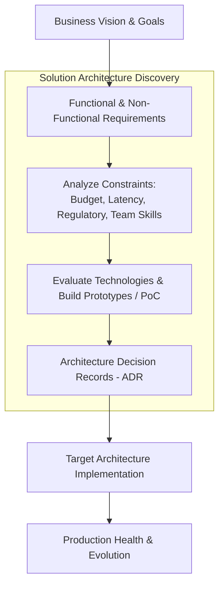
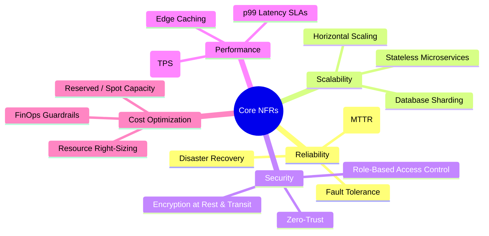

# Solution Architecture Foundations & Non-Functional Requirements

A **Solution Architect** bridges the gap between enterprise business problems and scalable, resilient technology implementations. They analyze functional business requirements, define and enforce non-functional requirements (NFRs), navigate organizational constraints, and produce Architecture Decision Records (ADRs).

---

## 1. Core Responsibilities of a Solution Architect

1. **Requirement Translation:** Deconstructing fuzzy business goals into concrete technical specifications.
2. **Constraint Navigation:** Balancing trade-offs across cost, timeline, team technical maturity, and compliance standards (HIPAA, GDPR, SOC 2).
3. **Build vs Buy Evaluation:** Deciding whether to adopt managed cloud SaaS, deploy open-source components, or develop proprietary internal systems.
4. **Risk De-risking:** Creating Proof-of-Concepts (PoCs) to discover scalability bottlenecks and integration friction early.

---

## 2. Non-Functional Requirements (NFRs) Architecture

While functional requirements describe _what_ a system does, non-functional requirements define _how well_ the system performs under load, stress, and operational failure.

| NFR Category                   | Core Architectural Strategy                                                   | Detailed Guide                                                                                                                                                                    |
| :----------------------------- | :---------------------------------------------------------------------------- | :-------------------------------------------------------------------------------------------------------------------------------------------------------------------------------- |
| **Availability & Reliability** | Multi-AZ redundancy, active-active failover, circuit breakers                 | [[non-functional-requirements/availability\|Availability]] & [[non-functional-requirements/reliability\|Reliability]]                                                             |
| **Scalability**                | Horizontal Pod Autoscaling (HPA), database read-replicas, asynchronous queues | [[non-functional-requirements/scalability\|Scalability]] & [[Architecture/solution-architecture-concepts/foundations/non-functional-requirements/scalability\|Scaling Patterns]]  |
| **Performance**                | In-memory caching (Redis), CDN edge termination, database indexing            | [[non-functional-requirements/performance\|Performance]] & [[Architecture/solution-architecture-concepts/foundations/non-functional-requirements/capacity-planning\|Estimations]] |
| **Security & Compliance**      | Defense-in-depth, TLS 1.3, least privilege IAM, audit telemetry               | [[non-functional-requirements/security\|Security Architecture]]                                                                                                                   |
| **Disaster Recovery**          | RTO/RPO tiering, automated backups, multi-region replication                  | [[non-functional-requirements/disaster-recovery\|Disaster Recovery]]                                                                                                              |
