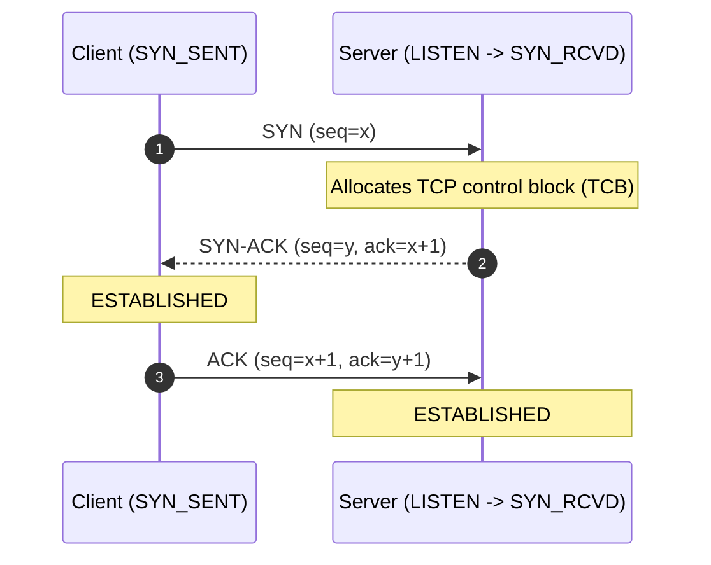
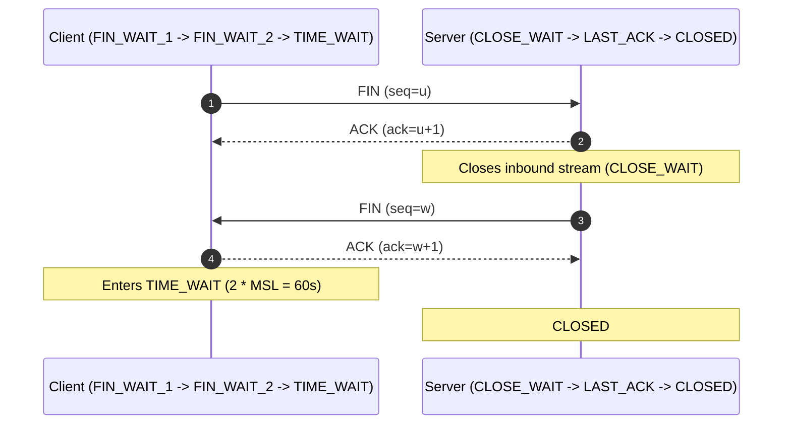

# TCP/IP Architecture, Handshakes & Congestion Control

The **TCP/IP model** (Internet Protocol Suite) is the pragmatic, 4-layer architectural foundation of the global internet. While the OSI model is a 7-layer theoretical standard, TCP/IP represents the software and hardware architecture actually running in operating system kernels and network switches.

```
OSI 7 Layers                      TCP/IP 4 Layers
┌─────────────────────────┐      ┌─────────────────────────┐
│ Application   (Layer 7) │      │                         │
│ Presentation  (Layer 6) │ ---> │ Application             │
│ Session       (Layer 5) │      │ (HTTP, gRPC, DNS, SSH)  │
├─────────────────────────┤      ├─────────────────────────┤
│ Transport     (Layer 4) │ ---> │ Transport (TCP / UDP)   │
├─────────────────────────┤      ├─────────────────────────┤
│ Network       (Layer 3) │ ---> │ Internet (IPv4 / IPv6)  │
├─────────────────────────┤      ├─────────────────────────┤
│ Data Link     (Layer 2) │ ---> │ Network Access /        │
│ Physical      (Layer 1) │      │ Link (Ethernet, Wi-Fi)  │
└─────────────────────────┘      └─────────────────────────┘
```

---

## 1. TCP 3-Way Handshake & Connection Teardown

### The 3-Way Handshake (Connection Establishment)

Before byte transfer can begin, client and server negotiate Initial Sequence Numbers (ISN):



### The 4-Way Handshake (Connection Teardown)

Because TCP is full-duplex, each direction must be terminated independently:



### The Notorious Kernel States:

- **`CLOSE_WAIT`:** The remote side initiated close, but your local application code has not called `socket.close()`. A buildup of `CLOSE_WAIT` sockets indicates an application file descriptor / socket leak bug.
- **`TIME_WAIT`:** The local initiator waits `2 * MSL` (Maximum Segment Lifetime, default 60s in Linux) to guarantee delayed stray packets in transit do not corrupt future connections reusing the same 4-tuple `(src_ip, src_port, dst_ip, dst_port)`.

---

## 2. Flow Control: The Sliding Window

Flow control prevents a fast sender from overwhelming a slow receiver's socket buffer.

- The receiver advertises its available buffer space via the **Receive Window (`rwnd`)** field in every TCP ACK packet.
- The sender cannot send more unacknowledged bytes than `rwnd`.
- If `rwnd = 0`, the sender halts transmission and sends periodic 1-byte **Zero Window Probes** until space opens up.

---

## 3. Congestion Control: CUBIC vs BBR

While flow control protects the _receiver_, congestion control protects the _network fabric_ between them.

| Metric                                      | CUBIC (Loss-Based)                                  | BBR (Bottleneck Bandwidth and RTT)                             |
| :------------------------------------------ | :-------------------------------------------------- | :------------------------------------------------------------- |
| **Model Type**                              | Loss-based congestion control                       | Model-based (measures bottleneck capacity & min RTT)           |
| **Congestion Signal**                       | Packet loss (drops CWND by 30-50%)                  | Estimated delivery rate and queue buildup                      |
| **Bufferbloat Behavior**                    | Fills intermediate router buffers until packet drop | Drains router queues, keeping latency low                      |
| **Throughput on High-Loss / Long-Haul WAN** | Drops sharply on 1% packet loss                     | **Maintains near wire-speed on transatlantic/satellite links** |
| **Linux Activation**                        | Default in most distributions                       | `sysctl -w net.ipv4.tcp_congestion_control=bbr`                |

---

## 4. MTU, MSS, and Path MTU Discovery (PMTUD)

- **Maximum Transmission Unit (MTU):** The largest L2 frame payload (Standard Ethernet = 1,500 bytes; Jumbo Frames = 9,000 bytes).
- **Maximum Segment Size (MSS):** The largest L4 TCP data payload:
  $$\text{MSS} = \text{MTU} - 20\text{ (IPv4 Header)} - 20\text{ (TCP Header)} = 1,460\text{ bytes}$$
- **Path MTU Discovery (PMTUD):** Packets set the `DF` (Don't Fragment) bit in the IP header. If an intermediate router has a smaller MTU, it drops the packet and sends back an ICMP Type 3 Code 4 (_Fragmentation Needed_). If firewalls block ICMP, connections experience a "PMTUD Blackhole" (small pings work, large HTTP transfers hang indefinitely).

## Across the wiki

- [[Linux/networking/routing|Routing]] — packet path (Linux)
- [[Kubernetes/concepts/L04-services-networking/01-networking|Networking (L04 Overview)]] — packet path (Kubernetes)
- [[Linux/networking/tcp-ip-model|TCP/IP Model]] — packet path (Linux)
- [[Kubernetes/concepts/L04-services-networking/07-k8s-networking-deep-dive|Kubernetes Networking — Deep Dive]] — packet path (Kubernetes)
