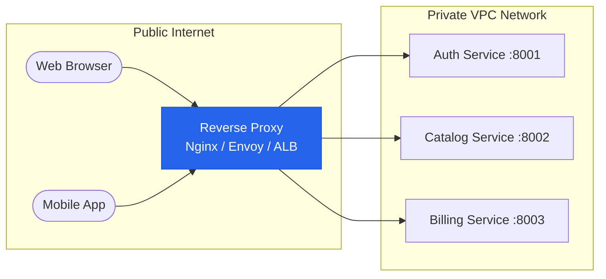

# Reverse Proxy Architecture: Functions, Headers & Proxies

A **Reverse Proxy** is an intermediary proxy server that sits between external clients and internal backend origin servers. To external clients, the reverse proxy appears as the origin server itself, intercepting all inbound requests before routing them to internal microservices.



---

## 1. Forward Proxy vs Reverse Proxy

| Dimension                        | Forward Proxy                                                          | Reverse Proxy                                             |
| :------------------------------- | :--------------------------------------------------------------------- | :-------------------------------------------------------- |
| **Who it protects / represents** | **The Client** (Hides client identity from internet)                   | **The Server** (Hides backend architecture from clients)  |
| **Location**                     | Client LAN / Corporate egress edge                                     | Datacenter / Cloud ingress edge                           |
| **Primary Use Cases**            | Corporate URL filtering, bypassing geoblocks, caching outbound traffic | TLS termination, load balancing, API routing, WAF defense |

---

## 2. Core Responsibilities of a Reverse Proxy

1. **TLS Termination (SSL Offloading):** Decrypts incoming HTTPS connections at the edge using high-performance hardware crypto, forwarding unencrypted (or lightweight mTLS) HTTP/1.1 traffic internally.
2. **Path-Based & Host-Based Routing:** Routes `/api/v1/users` to the User service and `/api/v1/payments` to the Payment service.
3. **Load Balancing:** Distributes requests using Round-Robin, Least Connections, or Consistent Hashing.
4. **Compression & Static Caching:** Compresses payloads with Gzip/Brotli and serves cached images/CSS without touching origin application servers.
5. **Security & WAF Shielding:** Rate limits abusive IPs and filters SQLi/XSS payloads.

---

## 3. The Critical Forwarded Headers

Because the backend server sees the reverse proxy's private IP as the TCP client address, the proxy must preserve client metadata using standard HTTP headers:

- **`X-Forwarded-For`:** A comma-separated list of IP addresses representing the client and intermediate proxies:
  ```http
  X-Forwarded-For: 203.0.113.195, 198.51.100.10
  ```
  _(Security Rule: Only trust the leftmost IP if your proxy is configured to strip or overwrite incoming client-provided `X-Forwarded-For` headers!)_
- **`X-Forwarded-Proto`:** Indicates whether the client connected via `http` or `https`.
- **`X-Forwarded-Host`:** The original `Host` header requested by the browser.
- **RFC 7239 `Forwarded`:** The consolidated IETF standard:
  ```http
  Forwarded: for=203.0.113.195;proto=https;host=cloudnative.wiki
  ```

---

## 4. Production Nginx Configuration Example

```nginx
events { worker_connections 10240; }

http {
    upstream backend_api {
        least_conn;
        server 10.0.1.10:8080 max_fails=3 fail_timeout=10s;
        server 10.0.1.11:8080 max_fails=3 fail_timeout=10s;
        keepalive 64;
    }

    server {
        listen 443 ssl http2;
        server_name api.cloudnative.wiki;

        ssl_certificate /etc/ssl/certs/fullchain.pem;
        ssl_certificate_key /etc/ssl/private/privkey.pem;
        ssl_protocols TLSv1.2 TLSv1.3;

        location / {
            proxy_pass http://backend_api;
            proxy_http_version 1.1;
            proxy_set_header Connection ""; # Enables upstream keepalive

            # Forward client identity
            proxy_set_header Host $host;
            proxy_set_header X-Real-IP $remote_addr;
            proxy_set_header X-Forwarded-For $proxy_add_x_forwarded_for;
            proxy_set_header X-Forwarded-Proto $scheme;

            # Timeouts
            proxy_connect_timeout 5s;
            proxy_read_timeout 30s;
        }
    }
}
```

## Further reading

- [Nginx (video)](https://www.youtube.com/watch?v=D5grhfkjjXE)

## Across the wiki

- [[Kubernetes/guides/networking/traefik|Traefik]] — proxies (Kubernetes)
- [[Kubernetes/guides/networking/envoy-gateway-internals|Envoy Gateway — Architecture & Operations Reference]] — proxies (Kubernetes)
- [[Kubernetes/guides/networking/comparison|Service Mesh Comparison]] — proxies (Kubernetes)
