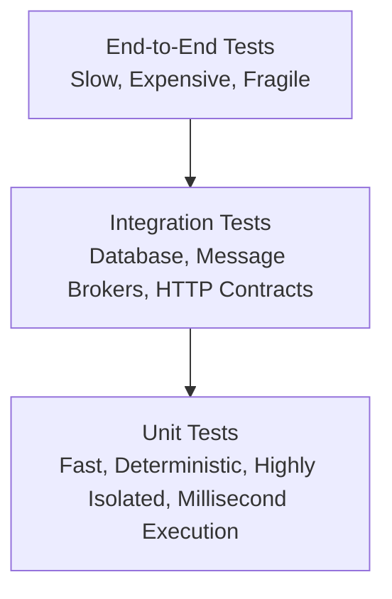

# Unit Testing Principles & Test-Driven Development (TDD)

A **Unit Test** is an automated test that exercises the smallest testable unit of software—typically an individual function, method, or class—in complete isolation from external infrastructure, databases, network connections, and third-party dependencies.



---

## 1. The F.I.R.S.T. Principles of Unit Testing

Robust test suites adhere to the **F.I.R.S.T.** acronym:

- **Fast:** A suite of 5,000 unit tests must execute in under 10 seconds. If tests are slow, developers skip running them locally.
- **Independent / Isolated:** Tests must never depend on the outcome or execution order of other tests. Zero shared mutable state.
- **Repeatable:** Tests must produce the exact same result whether run on a local Mac, Linux CI runner, or in an airplane without Wi-Fi.
- **Self-Validating:** Tests must report a binary pass/fail without requiring manual inspection of logs or print statements.
- **Timely:** Written alongside or immediately before production code (TDD).

---

## 2. The AAA (Arrange-Act-Assert) Pattern

Structure every unit test into three distinct phases:

```python
def test_calculate_order_discount():
    # 1. Arrange (Setup test inputs and preconditions)
    cart = ShoppingCart()
    cart.add_item(price=100.0, quantity=2)
    coupon = DiscountCoupon(percentage=15)

    # 2. Act (Invoke the unit under test)
    final_price = cart.apply_discount(coupon)

    # 3. Assert (Verify expected outcome)
    assert final_price == 170.0
```

---

## 3. Table-Driven Tests (Go Idiom)

In Go, table-driven tests eliminate duplicate test functions by looping over test cases:

```go
func TestValidateEmail(t *testing.T) {
	cases := []struct {
		name     string
		email    string
		expected bool
	}{
		{"valid standard", "user@example.com", true},
		{"valid subdomain", "user@mail.co.uk", true},
		{"missing domain", "user@", false},
		{"missing at symbol", "userexample.com", false},
		{"empty string", "", false},
	}

	for _, tc := range cases {
		t.Run(tc.name, func(t *testing.T) {
			actual := ValidateEmail(tc.email)
			if actual != tc.expected {
				t.Errorf("ValidateEmail(%q) = %v; want %v", tc.email, actual, tc.expected)
			}
		})
	}
}
```

---

## 4. Next Step

To test units in complete isolation, external dependencies (databases, payment gateways, file systems) must be replaced with **Test Doubles**.

→ [[Architecture/solution-architecture-concepts/software-engineering-concepts/testing/test-doubles-mocks-stubs-fakes|Test Doubles: Mocks, Stubs, Fakes, Spies, and Dummies]]

## Across the wiki

- [[AI/evals|Evaluating LLM Systems]] — testing (AI)
- [[Kubernetes/guides/delivery/templating-patching/helm/testing|Helm Chart Testing]] — testing (Kubernetes)
- [[DevOps/ci-cd/pipeline-design|Pipeline Design]] — testing (DevOps)
- [[AI/langchain/10-testing|LangChain — Testing]] — testing (AI)
