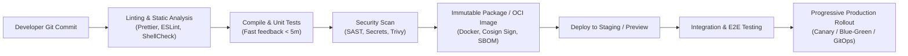

# Continuous Integration & Continuous Delivery (CI/CD) 🚀

Continuous Integration (CI) is the practice of merging all developer working copies to a shared mainline several times a day with automated build and test verification. Continuous Delivery (CD) ensures software can be reliably released to production at any time.

---

## 1. The Modern CI/CD Pipeline Architecture

---

## 2. Core Pillars of Production Pipelines

### 1. Build Once, Deploy Everywhere

Never rebuild an artifact or container image for different environments. Build a single, immutable container image or binary in the CI stage, sign it, and promote the exact same digest (`sha256:...`) through Dev, Staging, and Production by altering external configuration (ConfigMaps / Secrets).

### 2. Fast Feedback Loops (< 10 Minutes)

If a pipeline takes 45 minutes to run, developers stop waiting for results and context-switch:

- Cache dependencies (`node_modules`, Go module cache, Docker layer cache via GitHub Actions `type=gha`).
- Parallelize independent test suites (matrix strategies).
- Run fast unit tests first; defer heavy integration/E2E tests to staging promotion gates.

### 3. Ephemeral Environments & Preview Apps

Modern CI spins up isolated preview environments per Pull Request (e.g., using Kubernetes namespaces or Vercel/Cloudflare preview URLs) allowing full end-to-end testing before merging to `main`.

---

## 3. Topics & Guides

- ⚙️ **[[DevOps/ci-cd/github-actions|GitHub Actions Deep Dive]]** — Reusable workflows, composite actions, matrix builds, runner security, and OIDC federation
- 🌿 **[[DevOps/ci-cd/git|Git Strategy & Best Practices]]** — Trunk-based development, conventional commits, rebase workflows, and signing
- 🔐 **[[DevOps/devsecops/README|DevSecOps Curriculum]]** — 20-module end-to-end security pipeline from SAST to runtime defense
- ☸️ **[[Kubernetes/guides/delivery/gitops/argo-cd/README|GitOps with Argo CD]]** — Declarative deployment and automated sync on Kubernetes

---

## Related Knowledge Bases

- 🔐 **[[Security/devsecops/README|DevSecOps Security Controls]]** — Pipeline hardening and supply chain
- ☁️ **[[AWS/compute/ecs/README|AWS ECS Deployment]]** — Blue-green deployments via CodeDeploy
- 🐧 **[[Linux/shell-scripting/README|Shell Scripting]]** — Automation scripting for CI runners
