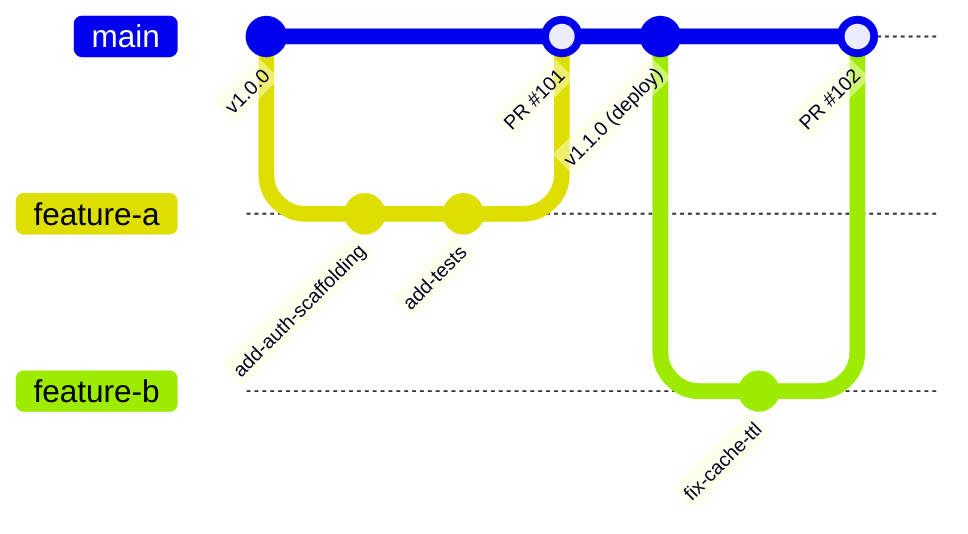

# Git Strategy & Production Workflows 🌿

A disciplined Git strategy is the foundation of high-velocity Continuous Integration and automated deployment.

---

## 1. Branching Models: Trunk-Based vs GitFlow

| Metric              | Trunk-Based Development (TBD)                    | GitFlow (Legacy)                                 |
| :------------------ | :----------------------------------------------- | :----------------------------------------------- |
| **Branch Lifetime** | Hours to 1–2 days max                            | Weeks to months                                  |
| **Main Branch**     | `main` is always deployable to production        | Code lives in `develop`, `release/*`, `hotfix/*` |
| **Feature Flags**   | Used to decouple deployment from feature release | Features hidden on long-lived branches           |
| **Merge Conflicts** | Small, continuous, resolved immediately          | Massive "merge hell" during release integration  |
| **Suitability**     | **Cloud-native, microservices, CI/CD**           | Traditional packaged monolithic releases         |



---

## 2. Conventional Commits Specification

Standardize commit messages to automate semantic versioning (`semver`) and changelog generation:

```
<type>[optional scope]: <description>

[optional body]

[optional footer(s)]
```

### Types:

- `feat:` A new feature (triggers MINOR version bump)
- `fix:` A bug fix (triggers PATCH version bump)
- `docs:` Documentation only changes
- `refactor:` Code change that neither fixes a bug nor adds a feature
- `perf:` A code change that improves performance
- `test:` Adding missing tests or correcting existing tests
- `chore:` Maintenance changes to build process or tooling
- `BREAKING CHANGE:` In footer or `feat!:` in header (triggers MAJOR version bump)

---

## 3. Recommended Production Git Configuration (`~/.gitconfig`)

```ini
[user]
    name = Your Name
    email = your.email@domain.com
    signingkey = ~/.ssh/id_ed25519.pub

[init]
    defaultBranch = main

[pull]
    rebase = true           # Prevent useless merge commits on pull

[rebase]
    autoStash = true        # Automatically stash and unstash dirty worktree

[push]
    default = current       # Push current branch to remote with same name
    autoSetupRemote = true  # Automatically set upstream on first push

[gpg]
    format = ssh            # Sign commits using modern SSH keys

[commit]
    gpgsign = true          # Sign all commits automatically

[core]
    autocrlf = input        # Convert CRLF to LF on commit
    pager = less -FRX
```

---

## 4. Rebase vs Merge in Pull Requests

In production CI/CD repositories:

- Prefer **Squash and Merge** for small bug fixes or PRs (keeps history linear and single-commit bisectable).
- Prefer **Rebase and Fast-Forward** for multi-step feature PRs with logical atomic commits.
- Avoid loose 3-way merge commits on feature branches to ensure clean `git bisect` automated debugging.

## Further reading

- [MonoRepos (video)](https://www.youtube.com/watch?v=rcmdyQL2DUM)

## Across the wiki

- [[Kubernetes/guides/delivery/gitops/basics|GitOps Basics]] — GitOps (Kubernetes)
- [[Kubernetes/guides/delivery/gitops/argo-cd/README|Argo CD]] — GitOps (Kubernetes)
- [[Kubernetes/eks/automation/gitops/argocd|Argo CD on EKS]] — GitOps (Kubernetes)
- [[Kubernetes/eks/automation/gitops/flux|Flux on EKS]] — GitOps (Kubernetes)
