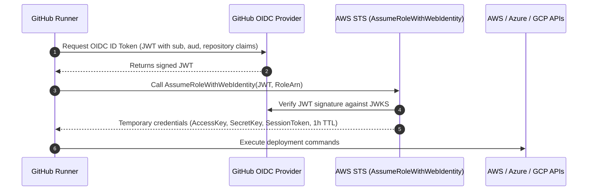

# GitHub Actions Architecture & Best Practices ⚡

GitHub Actions is the predominant CI/CD and automation engine for modern git-centric workflows. This guide covers production-grade pipeline architecture, performance optimizations, and security hardening.

---

## 1. Keyless Cloud Authentication via OIDC Federation

Never store long-term cloud credentials (`AWS_ACCESS_KEY_ID`, `AWS_SECRET_ACCESS_KEY`) in GitHub repository secrets. Use OpenID Connect (OIDC) federation to exchange short-lived GitHub tokens for cloud IAM role credentials:



### GitHub Actions OIDC Workflow Example (AWS)

```yaml
name: Deploy to Production
on:
  push:
    branches: [main]

permissions:
  id-token: write # Required to request OIDC JWT
  contents: read

jobs:
  deploy:
    runs-on: ubuntu-latest
    steps:
      - name: Checkout code
        uses: actions/checkout@v4

      - name: Configure AWS Credentials via OIDC
        uses: aws-actions/configure-aws-credentials@v4
        with:
          role-to-assume: arn:aws:iam::123456789012:role/GitHubDeployRole
          aws-region: us-east-1

      - name: Deploy Workload
        run: |
          aws sts get-caller-identity
          aws s3 sync ./dist s3://my-prod-bucket/ --delete
```

---

## 2. Reusable Workflows vs Composite Actions

| Feature            | Composite Actions (`action.yml`)                         | Reusable Workflows (`.github/workflows/*.yml`)              |
| :----------------- | :------------------------------------------------------- | :---------------------------------------------------------- |
| **Scope**          | Bundles multiple shell steps into a single reusable step | Bundles entire jobs, matrices, and triggers                 |
| **Secrets Access** | Must pass secrets explicitly via `inputs`                | Can use `secrets: inherit` or explicit passing              |
| **Job Execution**  | Runs inside caller's job on same runner                  | Spawns its own isolated jobs and runners                    |
| **Use Case**       | Reusable tool install, test setup, or build logic        | Standardized CI/CD release pipeline across 50+ repositories |

### Example: Calling a Reusable Workflow

```yaml
jobs:
  call-security-pipeline:
    uses: my-org/shared-workflows/.github/workflows/security-scan.yml@v2
    with:
      environment: production
    secrets: inherit
```

---

## 3. Performance Optimization Strategies

### 1. High-Performance Docker Caching

Use Docker Buildx with GitHub Actions cache backend (`type=gha`):

```yaml
- name: Set up Docker Buildx
  uses: docker/setup-buildx-action@v3

- name: Build and push container
  uses: docker/build-push-action@v6
  with:
    context: .
    push: true
    tags: ghcr.io/my-org/app:${{ github.sha }}
    cache-from: type=gha
    cache-to: type=gha,mode=max
```

### 2. Dependency Caching

Always cache language dependencies (`actions/setup-node`, `actions/setup-go`, `actions/setup-python` have built-in caching support):

```yaml
- uses: actions/setup-node@v4
  with:
    node-version: 22
    cache: "npm"
```

---

## 4. Security Hardening Guardrails

1. **Pin Actions by Full Commit SHA:** Third-party actions can be mutated if tags (`@v4`) are compromised. Pin to immutable SHAs:
   ```yaml
   uses: actions/checkout@b4ffde65f46336ab88eb53be808477a3936bae11 # v4.1.1
   ```
2. **Explicit Minimal Permissions:** Default to read-only permissions at top of file:
   ```yaml
   permissions:
     contents: read
   ```
3. **Never Interpolate Untrusted Inputs into Scripts:** Avoid `${{ github.event.issue.title }}` inside `run:` blocks (susceptible to script injection). Pass through environment variables instead:
   ```yaml
   env:
     TITLE: ${{ github.event.issue.title }}
   run: echo "$TITLE"
   ```

---

## Related Guides in Wiki

- [[DevOps/ci-cd/README|CI/CD Master Architecture]]
- [[DevOps/devsecops/stage2-build/11-cicd-pipeline-hardening|CI/CD Pipeline Hardening]]
- [[DevOps/devsecops/stage3-deploy/12-pipeline-identity-oidc|Pipeline Identity & OIDC Deep Dive]]
