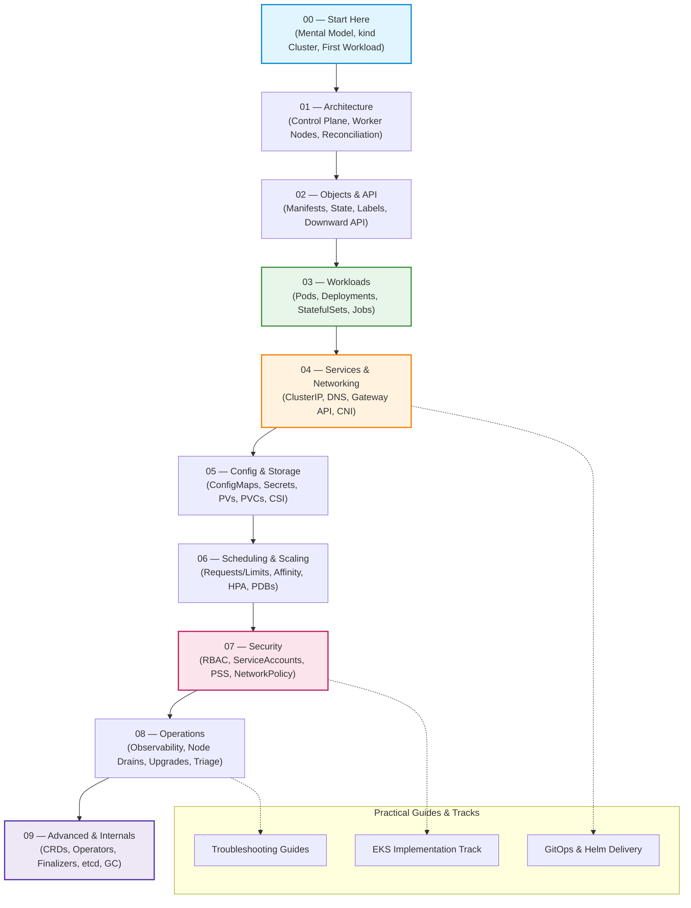

# Kubernetes ☸️

> [!NOTE] Current Baseline: Kubernetes 1.37 ("Garhwal", Released August 2026)
> This curriculum reflects the modern Kubernetes baseline:
> - **Gateway API** as the primary ingress standard following the community retirement of `ingress-nginx` in March 2026.
> - **nftables** as the primary `kube-proxy` direction alongside IPVS deprecation.
> - **EndpointSlices**, **cgroup v2**, **`metrics.k8s.io` GA**, and **DRA Extended Resources GA**.

---

## Choose Your Path

| Reader Intent | Where to Start | What You Will Get |
| :--- | :--- | :--- |
| **I am new to Kubernetes** | [[Kubernetes/concepts/L00-start-here/00-start-here\|00 — Start Here]] | Hands-on local cluster setup with `kind` and first workload deployment. |
| **I want a structured conceptual learning path** | [[Kubernetes/concepts/00-hub\|Concepts Hub (L00–L09)]] | 10-level sequential curriculum from primitives to controller internals. |
| **I need to fix a cluster or workload outage** | [[Kubernetes/guides/README#troubleshooting\|Troubleshooting Playbooks]] | Symptom-first diagnosis (`CrashLoopBackOff`, `Pod Pending`, DNS, PVC issues). |
| **I am hardening or preparing for production** | [[Kubernetes/concepts/L07-security/00-README\|L07 — Security]] & [[Kubernetes/guides/non-functional/security-baseline\|Security Baseline]] | Layered threat model, Pod Security Standards, NetworkPolicies, and admission control. |
| **I am running on AWS (EKS)** | [[Kubernetes/eks/README\|EKS Implementation Track]] | VPC CNI, IRSA, EKS Pod Identity, Karpenter, and EKS Auto Mode. |
| **I want tool & delivery walkthroughs** | [[Kubernetes/guides/README\|Guides Index]] | Helm, Kustomize, Argo CD, kubectl workflows, and k9s. |

---

## Curriculum Roadmap

---

## Core Sections

### 1. Conceptual Curriculum (`concepts/`)
Sequential, provider-neutral fundamentals building a single mental model:
- [[Kubernetes/concepts/00-hub|00 — Concepts Hub]]: Roadmap and reading order.
- [[Kubernetes/concepts/L00-start-here/00-start-here|L00 — Start Here]]: Prerequisites, local cluster setup, and first deployment.
- [[Kubernetes/concepts/L01-architecture/00-README|L01 — Architecture]]: Control plane components, kubelet, and reconciliation loops.
- [[Kubernetes/concepts/L02-objects/00-README|L02 — Objects & API]]: Declarative API model, `spec` vs `status`, and schema validation.
- [[Kubernetes/concepts/L03-workloads/00-README|L03 — Workloads]]: Controller hierarchy from Pods to Deployments, StatefulSets, and Jobs.
- [[Kubernetes/concepts/L04-services-networking/00-README|L04 — Services & Networking]]: Service VIPs, EndpointSlices, CoreDNS, and Gateway API.
- [[Kubernetes/concepts/L05-config-storage/00-README|L05 — Config & Storage]]: ConfigMaps, Secrets, dynamic PersistentVolumes, and CSI.
- [[Kubernetes/concepts/L06-scheduling-scaling/00-README|L06 — Scheduling & Scaling]]: Resource QoS, placement constraints, HPA, and capacity management.
- [[Kubernetes/concepts/L07-security/index|L07 — Security]]: Defense-in-depth model, RBAC, Pod Security Standards, and policy engines.
- [[Kubernetes/concepts/L08-operations/index|L08 — Operations]]: Systematic failure triage, observability hooks, node lifecycle, and day-2 ops.
- [[Kubernetes/concepts/L09-advanced/index|L09 — Advanced & Extensibility]]: CRDs, reconciliation loops, custom controllers, finalizers, and etcd.

### 2. Cumulative Hands-on Labs (`labs/`)
A 10-part progressive lab track in a reproducible multi-node `kind` cluster with `podinfo`:
- [[Kubernetes/labs/index|Labs Hub]]: Environment setup, architecture, and step-by-step progress.
- [[Kubernetes/labs/00-cluster-setup|Lab 00 — Cluster Setup]]: Multi-node `kind` with topology zones.
- [[Kubernetes/labs/01-deploy-workload|Lab 01 — Workload Deployment]]: Declarative `podinfo` deployment, probes, and resource limits.
- [[Kubernetes/labs/02-updates-and-rollbacks|Lab 02 — Updates & Rollbacks]]: Zero-downtime rollouts, rollback strategies, and maxSurge/maxUnavailable.
- [[Kubernetes/labs/03-configuration|Lab 03 — Config & Secrets]]: ConfigMaps, Secret injection, and immutable configuration.
- [[Kubernetes/labs/04-networking-and-services|Lab 04 — Networking & Services]]: ClusterIP, NodePort, LoadBalancer, and Gateway API routing.
- [[Kubernetes/labs/05-storage-and-persistence|Lab 05 — Storage & Persistence]]: Dynamic PV provisioning and stateful storage.
- [[Kubernetes/labs/06-scheduling-and-autoscaling|Lab 06 — Scheduling & Autoscaling]]: Affinity, taints, tolerations, and HPA metrics-driven autoscaling.
- [[Kubernetes/labs/07-security-hardening|Lab 07 — Workload Hardening]]: PSS `restricted`, non-root securityContext, and NetworkPolicies.
- [[Kubernetes/labs/08-observability-and-troubleshooting|Lab 08 — Observability & Triage]]: `kubectl debug`, Prometheus metrics, and crashloop analysis.
- [[Kubernetes/labs/09-gitops-and-lifecycle|Lab 09 — GitOps & Lifecycle]]: Kustomize overlays, drift correction, and disaster recovery drill.

### 3. Revision & Master Decision Tables (`review/`)
High-density references for experienced practitioners, technical interviews, and exam review:
- [[Kubernetes/review/index|Revision Hub]]: Central navigation for refreshers and decision frameworks.
- [[Kubernetes/review/decision-tables|Master Decision Tables]]: Multi-dimensional trade-off matrices (Workloads, Storage, Gateway API vs Ingress, Autoscaling, Governance).
- [[Kubernetes/review/scenarios|Production Incidents & Walkthroughs]]: Real-world post-mortems and diagnostic playbooks.
- **5-Minute Refreshers:** [[Kubernetes/review/architecture-refresher|Architecture]], [[Kubernetes/review/workloads-refresher|Workloads]], [[Kubernetes/review/networking-refresher|Networking]], [[Kubernetes/review/storage-refresher|Storage]], [[Kubernetes/review/scheduling-scaling-refresher|Scheduling & Scaling]], [[Kubernetes/review/security-refresher|Security]].

### 4. Practical Guides (`guides/`)
- [[Kubernetes/guides/README|Guides Hub]]: Real-world production guides and runbooks.
- **Troubleshooting:** [[Kubernetes/guides/troubleshooting/crashloop-backoff|CrashLoopBackOff]], [[Kubernetes/guides/troubleshooting/pod-pending|Pod Pending]], [[Kubernetes/guides/troubleshooting/service-unreachable|Service Unreachable]], [[Kubernetes/guides/troubleshooting/dns-resolution|DNS Resolution]], [[Kubernetes/guides/troubleshooting/pvc-stuck|PVC Stuck]], [[Kubernetes/guides/troubleshooting/node-not-ready|Node NotReady]].
- **Delivery & GitOps:** [[Kubernetes/guides/delivery/gitops/basics|GitOps Concepts]], [[Kubernetes/guides/delivery/gitops/argo-cd/README|Argo CD]], [[Kubernetes/guides/delivery/templating-patching/helm/README|Helm Series]], [[Kubernetes/guides/delivery/templating-patching/kustomize|Kustomize]].
- **Networking & Ingress:** [[Kubernetes/guides/networking/envoy-gateway|Envoy Gateway (Gateway API)]], [[Kubernetes/guides/networking/comparison|Service Mesh Comparison]], [[Kubernetes/guides/networking/istio|Istio]], [[Kubernetes/guides/networking/linkerd|Linkerd]].
- **Production Operations:** [[Kubernetes/guides/non-functional/high-availability|High Availability]], [[Kubernetes/guides/non-functional/auto-scaling|Autoscaling Strategy]], [[Kubernetes/guides/non-functional/security-baseline|Security Baseline]], [[Kubernetes/guides/non-functional/backup-restore|Backup & Restore]].

### 5. Provider Tracks & Deep Dives
- [[Kubernetes/eks/README|AWS EKS Implementation Track]]: Universal Concept to EKS Translation Matrix, Karpenter, VPC CNI, IAM Access Entries, and EKS Pod Identity.
- [[Kubernetes/client-go|client-go & Controller Architecture]]: Informers, DeltaFIFO, RateLimitingQueue, and reconciliation loops.
- [[Kubernetes/certifications/index|Certification Alignment Guide]]: CKA, CKAD, and CKS curriculum mapping.
- [[Kubernetes/MAINTENANCE|Curriculum Maintenance Playbook]]: Upstream release cadence, lab verification, and quality gates.

---

## Related Knowledge Bases

- [[Linux/virtualization/container-runtimes|Container Runtimes (CRI, containerd, runc)]]: The engine executing container processes.
- [[Linux]]: OS primitives powering containers (namespaces, cgroups v2, seccomp).
- [[Observability]]: Metrics, distributed tracing, and Prometheus/Grafana architecture.
- [[AWS]]: Cloud infrastructure, IAM, and VPC networking foundation.