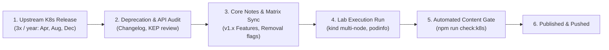

# Kubernetes Curriculum Maintenance & Upstream Sync Playbook

This document defines the recurring operational tasks, synchronization cadence, and automated validation gates that keep the Kubernetes curriculum technically current, verified, and free of broken links or obsolete recommendations.



---

## 1. Upstream Release Cadence

Kubernetes releases minor versions approximately three times per year:
- **Spring Release (x.y.0):** Typically mid-April
- **Summer Release (x.y.0):** Typically late August
- **Winter Release (x.y.0):** Typically early December

### Upstream Sync Checklist (Every Minor Release)

When upstream publishes a new minor version (e.g., v1.38):

1. **Review Upstream Release Notes & KEPs:**
   - Review the official [Kubernetes Changelog](https://github.com/kubernetes/kubernetes/blob/master/CHANGELOG/) and [Kubernetes Enhancements (KEP) Dashboard](https://github.com/kubernetes/enhancements).
   - Identify:
     - Promoted APIs (Alpha $\to$ Beta $\to$ GA).
     - Deprecated APIs and feature gates (scheduled for removal in 2-3 versions).
     - Removed flags, APIs, or metric endpoints.
2. **Update Version Tracking Notes:**
   - Update `[[Kubernetes/updates-along-the-versions|Updates Along the Versions]]` with the new version highlight section.
   - Update the active version baseline in `[[Kubernetes/concepts/00-hub|Concepts Hub]]` and `[[Kubernetes/README|Kubernetes Landing]]`.
3. **Deprecate or Remove Outdated Primitives:**
   - Verify that all notes warn readers when an API or proxy mode is scheduled for retirement.
   - Cross-check against the [[Kubernetes/review/decision-tables|Master Decision Tables]].
4. **Update the Canonical `kind` Baseline:**
   - In `content/Kubernetes/labs/kind-config.yaml`, update the node image tag to the newly certified `kindest/node:v1.x.y` image.
   - Verify that `podinfo:6.7.1` runs cleanly on the new node image.

---

## 2. Lab Verification Protocol

All hands-on labs in `content/Kubernetes/labs/` share a common multi-node cluster (`kind-k8s-labs`) and canonical workload (`podinfo`).

### Pre-Release Lab Sanity Run

Run the automated lab battery on any major changes to Kubernetes, `kind`, CNI, or policy engines:

```bash
# 1. Spin up the canonical multi-node kind cluster
kind create cluster --config content/Kubernetes/labs/kind-config.yaml --name kind-k8s-labs

# 2. Verify all 3 nodes (1 CP, 2 Workers) are Ready with proper zones
kubectl get nodes -L topology.kubernetes.io/zone

# 3. Step through Lab 00 to Lab 09 manifests
# Verify:
# - Podinfo starts with native sidecars and resource limits
# - In-place Pod resize works without container restarts
# - Gateway API / Ingress routes HTTP traffic properly
# - PVCs bind dynamically via local-path storage class
# - Pod Security Standards 'restricted' profile admits hardened manifests
# - Ephemeral debug containers attach via 'kubectl debug'
# - Kustomize base and overlays render without warnings

# 4. Clean up cluster
kind delete cluster --name kind-k8s-labs
```

### Pinned Artifacts & Versions Matrix

| Component | Pinned Version / Digest | Upstream Source |
| :--- | :--- | :--- |
| **Kubernetes Baseline** | `v1.32.x` – `v1.37.x` | `registry.k8s.io` |
| **kind** | `v0.27.0+` | `sigs.k8s.io/kind` |
| **Canonical Workload** | `ghcr.io/stefanprodan/podinfo:6.7.1` | Stefan Prodan / Podinfo |
| **Gateway API CRDs** | `v1.2.1+` (Standard channel) | `sigs.k8s.io/gateway-api` |
| **Metrics Server** | `v0.7.2+` | `sigs.k8s.io/metrics-server` |

---

## 3. Automated Quality Gates

To prevent drift, broken links, and malformed frontmatter, the repository includes an automated validation suite.

### Content Checker: `scripts/check-k8s-content.mjs`

Run the content checker via:
```bash
npm run check:k8s
```

The script executes three critical validations across every Markdown file in `content/Kubernetes/`:
1. **Broken Wikilink Verification:** Parses all `[[wikilinks]]` and validates that the target file exists or is registered in an `aliases` array. Prevents 404 dead ends in the Quartz site.
2. **Broken Markdown Tables:** Flags tables with unescaped pipes or double-pipe artifacts (`||`) that break GFM rendering.
3. **Ghost Files:** Flags 0-byte or corrupted empty Markdown files.
4. **Frontmatter Audit:** Tracks presence of YAML frontmatter (`title`, `tags`, `date`, `description`).

### Full Pre-Commit / Pre-Push Validation

Before committing and pushing changes to `origin/main`, always execute:

```bash
# Run unit tests and Kubernetes validation gate
npm test

# If tests pass, check git status and revert workspace state
git checkout -- content/.obsidian/workspace.json
```

---

## 4. Editorial Guidelines for New Content

When adding or revising lessons in the Kubernetes section:

1. **Follow the Two-Tier Page Contract:**
   - **Tier 1 (Core Lesson):** Concept in 60 seconds, why it exists, architecture & data-flow diagram (Mermaid), canonical YAML example (`podinfo`), production failure mode, and scenario knowledge check.
   - **Tier 2 (Deep Dive / Reference):** Low-level kernel interactions, protocol details, CRD schemas, and optimization benchmarks.
2. **Use Mermaid Extensively:**
   - Prefer sequence diagrams for API reconciliation traces (`kubectl apply` $\to$ controller $\to$ kubelet).
   - Prefer flowcharts for troubleshooting decision trees and component interaction models.
   - Ensure node labels with brackets/parentheses are quoted (`id["Label (info)"]`) to avoid syntax parse errors.
3. **Preserve Cloud-Neutral Primitives in Core Levels:**
   - Levels 00 through 09 must teach **upstream Kubernetes primitives**.
   - Cloud-specific implementations (e.g., AWS IAM, EKS Pod Identity, VPC CNI) belong in `[[Kubernetes/eks/README|EKS Track]]` and must be referenced via the [[Kubernetes/eks/README#universal-concept--eks-implementation-matrix|Translation Matrix]].
