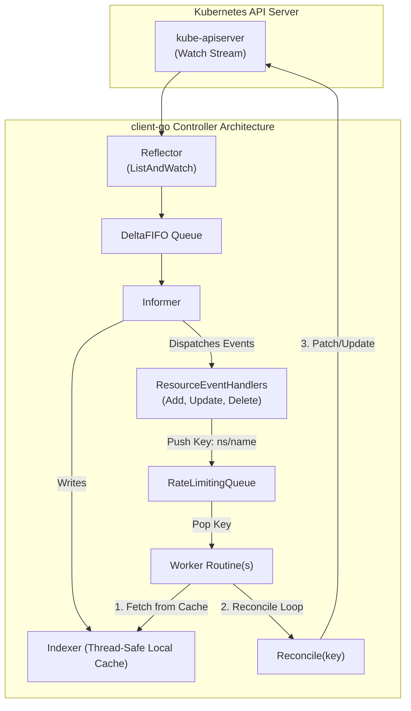

# client-go & Kubernetes Controller Engineering

The official Go client library for Kubernetes, **`client-go`** (`k8s.io/client-go`), is the bedrock of `kubectl`, the core control plane (`kube-controller-manager`), and all production operators (Kubebuilder, Operator SDK).



---

## 1. The Four Client Types

`client-go` provides four distinct clients depending on your type-safety and customization needs:

| Client Type | Import Package | Type Safety | Best Used For |
| :--- | :--- | :--- | :--- |
| **`Clientset`** | `k8s.io/client-go/kubernetes` | Strongly typed (Go structs) | Core built-in Kubernetes objects (`Pods`, `Deployments`, `Services`, `Nodes`). |
| **`DynamicClient`** | `k8s.io/client-go/dynamic` | Untyped (`unstructured.Unstructured`) | Custom Resources (CRDs) without needing pre-generated Go code. |
| **`MetadataClient`** | `k8s.io/client-go/metadata` | Metadata-only (`metav1.ObjectMeta`) | High-performance controllers doing garbage collection, labeling, or quota tracking without loading entire specs into RAM. |
| **`RESTClient`** | `k8s.io/client-go/rest` | Raw HTTP wrapper | Low-level subresource streaming (`exec`, `logs`, port-forwarding). |

---

## 2. Bootstrapping the Connection

Controllers must work both locally during development (reading `~/.kube/config`) and inside a cluster Pod (using projected service account tokens):

```go
package main

import (
	"os"
	"path/filepath"

	"k8s.io/client-go/kubernetes"
	"k8s.io/client-go/rest"
	"k8s.io/client-go/tools/clientcmd"
)

func GetKubernetesClient() (*kubernetes.Clientset, error) {
	// 1. Attempt in-cluster config (mounted ServiceAccount token)
	config, err := rest.InClusterConfig()
	if err != nil {
		// 2. Fall back to local kubeconfig ($HOME/.kube/config)
		home, _ := os.UserHomeDir()
		kubeconfig := filepath.Join(home, ".kube", "config")
		config, err = clientcmd.BuildConfigFromFlags("", kubeconfig)
		if err != nil {
			return nil, err
		}
	}

	// Set QPS and Burst to avoid client-side client-go rate limiting
	config.QPS = 50
	config.Burst = 100

	return kubernetes.NewForConfig(config)
}
```

---

## 3. Informers, Indexers & Listers

Never query `kube-apiserver` with `client.CoreV1().Pods("").List(...)` inside a reconcile loop! A polling loop against etcd will exhaust API server resources and bring down the cluster.

Instead, use **`SharedInformerFactory`**:
1. The **Reflector** establishes an HTTP chunked watch stream.
2. The **Indexer** caches all objects in memory as a local, indexed cache.
3. The **Lister** reads strictly from local RAM (`Get` / `List` have zero network overhead).

```go
package main

import (
	"time"

	"k8s.io/client-go/informers"
	"k8s.io/client-go/kubernetes"
	"k8s.io/client-go/tools/cache"
)

func SetupInformer(client *kubernetes.Clientset, stopCh <-chan struct{}) {
	// Resync interval controls periodic re-enqueueing to guarantee eventual consistency
	factory := informers.NewSharedInformerFactory(client, 10*time.Minute)
	podInformer := factory.Core().V1().Pods().Informer()

	// Register event handlers
	podInformer.AddEventHandler(cache.ResourceEventHandlerFuncs{
		AddFunc: func(obj interface{}) {
			key, _ := cache.MetaNamespaceKeyFunc(obj)
			// Push key ("namespace/name") to workqueue!
			_ = key
		},
		UpdateFunc: func(oldObj, newObj interface{}) {
			key, _ := cache.MetaNamespaceKeyFunc(newObj)
			_ = key
		},
		DeleteFunc: func(obj interface{}) {
			key, _ := cache.DeletionHandlingMetaNamespaceKeyFunc(obj)
			_ = key
		},
	})

	// Start informers and wait for initial list to populate the in-memory cache
	factory.Start(stopCh)
	cache.WaitForCacheSync(stopCh, podInformer.HasSynced)
}
```

---

## 4. The Workqueue & Reconcile Loop Pattern

Controllers process items using a **`RateLimitingQueue`**, which provides:
- **Deduplication:** Adding the same key multiple times while it is queued collapses into a single work item.
- **Exponential Backoff:** Retries failing reconciliations with increasing backoff intervals to prevent thrashing the API.
- **Fair Parallelism:** Multiple worker goroutines can pop items concurrently without race conditions on the same key.

```go
func (c *Controller) processNextWorkItem() bool {
	key, shutdown := c.queue.Get()
	if shutdown {
		return false
	}
	defer c.queue.Done(key)

	err := c.reconcile(key.(string))
	if err == nil {
		// Successful reconciliation; reset retry rate-limiting
		c.queue.Forget(key)
		return true
	}

	// Re-enqueue with exponential backoff if below maximum retries
	if c.queue.NumRequeues(key) < 5 {
		c.queue.AddRateLimited(key)
	} else {
		c.queue.Forget(key) // Give up after 5 retries; log error
	}
	return true
}
```

---

## 5. High Availability: Leader Election

Running multiple replicas of a custom controller ensures zero downtime during pod restarts. However, having two replicas actively mutating objects causes race conditions. Use client-go's **`leaderelection`** package (backed by a `coordination.k8s.io/v1` `Lease` object):

```go
import (
	"context"
	"time"

	metav1 "k8s.io/apimachinery/pkg/apis/meta/v1"
	"k8s.io/client-go/tools/leaderelection"
	"k8s.io/client-go/tools/leaderelection/resourcelock"
)

func RunWithLeaderElection(client kubernetes.Interface, id string, run func(ctx context.Context)) {
	lock := &resourcelock.LeaseLock{
		LeaseMeta: metav1.ObjectMeta{
			Name:      "my-controller-lease",
			Namespace: "default",
		},
		Client: client.CoordinationV1(),
		LockConfig: resourcelock.ResourceLockConfig{
			Identity: id,
		},
	}

	leaderelection.RunOrDie(context.Background(), leaderelection.LeaderElectionConfig{
		Lock:            lock,
		ReleaseOnCancel: true,
		LeaseDuration:   15 * time.Second,
		RenewDeadline:   10 * time.Second,
		RetryPeriod:     2 * time.Second,
		Callbacks: leaderelection.LeaderCallbacks{
			OnStartedLeading: func(ctx context.Context) {
				run(ctx) // Start controller workers when leader lock acquired
			},
			OnStoppedLeading: func() {
				os.Exit(0) // Step down gracefully if lease renewed fails
			},
		},
	})
}
```

---

## Related Deep References

- [[Kubernetes/concepts/L09-advanced/02-custom-controllers|L09 — Custom Controllers]]: Reconciler mechanics and design patterns.
- [[Kubernetes/concepts/L09-advanced/01-operators|L09 — Operators]]: High-level operator architecture.
- [[Kubernetes/concepts/L09-advanced/03-customresourcedefinitions|L09 — CustomResourceDefinitions (CRDs)]]: Extending API schemas.
- [[Kubernetes/concepts/L09-advanced/05-finalizers|L09 — Finalizers]]: Coordinating external resource deletion.
