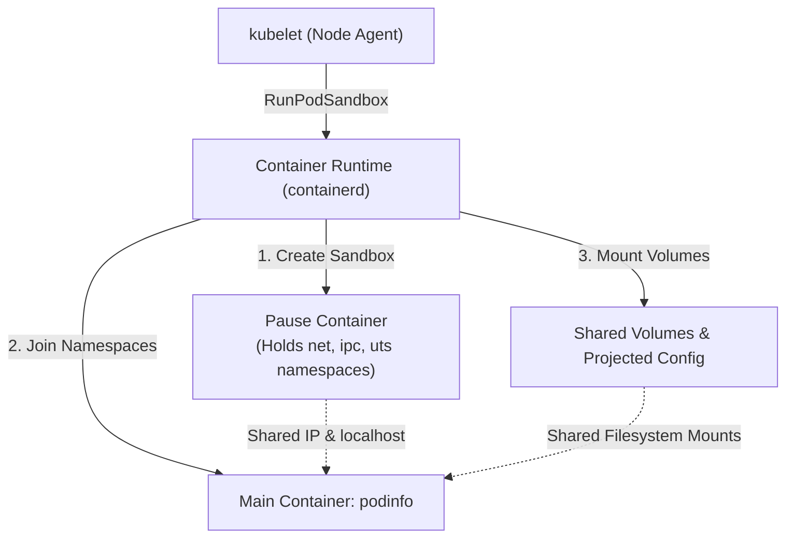

# Pods Deep Dive & Manifest Reference

This reference complements the core milestone lesson **[[Kubernetes/concepts/L03-workloads/01-pods|Pods — The Foundation of Kubernetes Workloads]]**. It provides exhaustive low-level details on Linux kernel namespace mappings, complete YAML field schemas, lifecycle hooks, and advanced operational recipes.

---

## 1. Linux Kernel Namespaces Under the Hood

When the kubelet schedules a Pod onto a worker node, the Container Runtime Interface (CRI — such as `containerd 2.x`) executes the following sequence:



### Namespace Sharing Matrix

| Kernel Namespace | Shared Across Pod Containers? | Mechanism / Flag | Purpose |
| :--- | :--- | :--- | :--- |
| **Network (`net`)** | **Yes (Always)** | Shared via pause container | All containers share the Pod IP, port space, and `localhost` loopback interface. |
| **IPC (`ipc`)** | **Yes (Always)** | Shared via pause container | POSIX shared memory (`/dev/shm`) and System V IPC queues are accessible across containers. |
| **UTS (`uts`)** | **Yes (Always)** | Shared hostname | All containers see the Pod's name as their hostname (`uname -n`). |
| **PID (`pid`)** | **Optional** | `shareProcessNamespace: true` | When enabled, containers can see each other's processes via `ps` and signal them (`kill`). |
| **Mount (`mnt`)** | **No (Isolated)** | Per-container rootfs + shared volumes | Each container has its own isolated filesystem layers. Shared files require explicit `volumes`. |
| **User (`user`)** | **Isolated (Optional)** | `UserNamespacesSupport` (GA in v1.30+) | Maps container root (UID 0) to unprivileged host UIDs for enhanced security. |
| **Cgroups** | **Shared & Scoped** | Pod-level cgroup + container cgroups | Enforces resource requests and limits across the Pod hierarchy. |

---

## 2. Complete Pod Manifest Schema Reference

The following manifest illustrates the full shape of the Pod specification (`v1.Pod`):

```yaml
apiVersion: v1
kind: Pod
metadata:
  name: podinfo-reference
  namespace: default
  labels:
    app.kubernetes.io/name: podinfo
    app.kubernetes.io/part-of: k8s-curriculum
  annotations:
    prometheus.io/scrape: "true"
    prometheus.io/port: "9898"
spec:
  # Pod-level networking & scheduling controls
  restartPolicy: Always          # Always | OnFailure | Never
  terminationGracePeriodSeconds: 30
  shareProcessNamespace: false
  serviceAccountName: default
  priorityClassName: system-cluster-critical  # Optional priority
  nodeSelector:
    topology.kubernetes.io/zone: "zone-a"

  # Container Definitions
  containers:
    - name: podinfo
      image: ghcr.io/stefanprodan/podinfo:6.7.1
      imagePullPolicy: IfNotPresent
      command:
        - ./podinfo
        - --port=9898
      ports:
        - name: http
          containerPort: 9898
          protocol: TCP
      env:
        - name: PODINFO_UI_COLOR
          value: "#4b7bec"
      envFrom:
        - configMapRef:
            name: podinfo-config
            optional: true
      resources:
        requests:
          cpu: 50m
          memory: 32Mi
        limits:
          cpu: 250m
          memory: 128Mi
      volumeMounts:
        - name: config-vol
          mountPath: /data/config
          readOnly: true
      livenessProbe:
        httpGet:
          path: /healthz
          port: http
        initialDelaySeconds: 2
        periodSeconds: 10
      readinessProbe:
        httpGet:
          path: /readyz
          port: http
        initialDelaySeconds: 2
        periodSeconds: 5
      startupProbe:
        httpGet:
          path: /healthz
          port: http
        failureThreshold: 30
        periodSeconds: 2
      lifecycle:
        preStop:
          exec:
            command: ["sleep", "10"]
      securityContext:
        runAsNonRoot: true
        runAsUser: 10001
        readOnlyRootFilesystem: true
        allowPrivilegeEscalation: false
        capabilities:
          drop: ["ALL"]

  # Storage Volumes
  volumes:
    - name: config-vol
      configMap:
        name: podinfo-config
        optional: true
```

---

## 3. Container Lifecycle Hooks: Deep Dive

Kubernetes provides two per-container lifecycle hooks: `postStart` and `preStop`.

### `preStop` Execution Contract
1. Sent **before** `SIGTERM` is delivered to the container entrypoint process.
2. Blocks the termination sequence until the hook finishes or `terminationGracePeriodSeconds` expires.
3. If the hook hangs, Kubernetes waits until the grace period elapses and sends `SIGKILL`.

```yaml
lifecycle:
  preStop:
    exec:
      command: ["/bin/sh", "-c", "sleep 15 && nginx -s quit"]
```

> [!WARNING]
> While `preStop` executes, the Pod is marked `Terminating` and removed from Service EndpointSlices in parallel. Adding a `sleep 5` or `sleep 10` in `preStop` gives CoreDNS and kube-proxy sufficient time to propagate endpoint deletions across the cluster, preventing TCP drops.

---

## 4. Operational Debugging Recipes

### Inspecting Pod Conditions
The coarse `status.phase` (e.g. `Running`) is insufficient for diagnosing subtle issues. Inspect `status.conditions`:

```bash
kubectl get pod <pod-name> -o jsonpath='{range .status.conditions[*]}{.type}{"="}{.status}{" ("}{.reason}{")\n"}{end}'
```

### Checking Termination Reason & Exit Code
When a container terminates unexpectedly:

```bash
kubectl get pod <pod-name> -o jsonpath='{.status.containerStatuses[*].lastState.terminated}' | jq .
```

- `exitCode: 0`: Successful exit (Job completed).
- `exitCode: 137` (`128 + 9`): Killed by SIGKILL (likely **OOMKilled** or grace period exceeded).
- `exitCode: 143` (`128 + 15`): Terminated cleanly by SIGTERM.

---

## 5. Related Deep-Dive References

- [[Kubernetes/concepts/L03-workloads/08-init-containers|Init Containers & Native Sidecars]]
- [[Kubernetes/concepts/L03-workloads/09-multi-container-pods|Multi-Container Pod Patterns]]
- [[Kubernetes/concepts/L03-workloads/10-probes|Health Probes: Liveness, Readiness & Startup]]
- [[Kubernetes/concepts/L05-config-storage/03-volumes|Volumes & Storage Types]]
- [[Kubernetes/concepts/L06-scheduling-scaling/01-resource-requests-limits|Resource Requests, Limits & In-Place Resize]]
- [[Kubernetes/concepts/L07-security/02-workload-sandboxing/05-security-context|Security Context & Pod Security Standards]]
