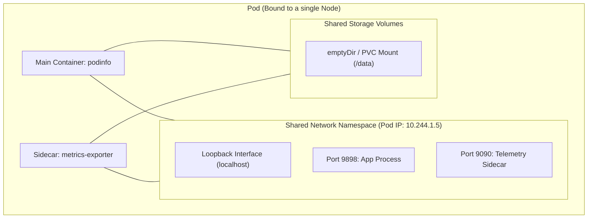
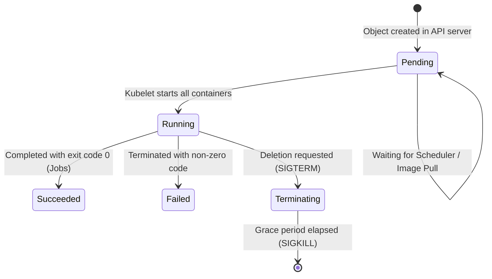
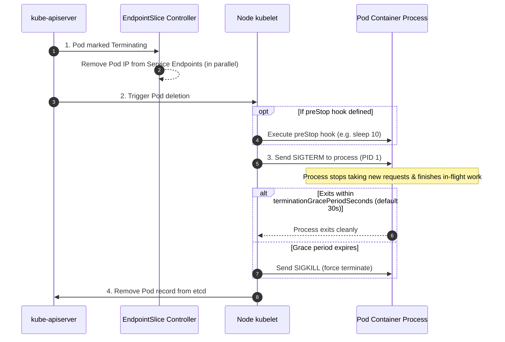

# Pods — The Foundation of Kubernetes Workloads

A **Pod** is the smallest and simplest deployable unit in Kubernetes. It represents a single instance of a running process in your cluster, wrapping one or more containers that share network, storage, and lifecycle boundaries.

---

## 1. Why This Matters

In Kubernetes, you never deploy standalone containers directly to worker nodes. The system schedules, routes traffic to, monitors, and terminates **Pods**.

Every workload controller—Deployments, StatefulSets, DaemonSets, Jobs, and CronJobs—is fundamentally an automated strategy for creating, updating, and deleting Pods. Every networking abstraction (Services, Ingress, Gateway API) and every security policy (NetworkPolicy, Pod Security Standards) evaluates and routes traffic at the Pod level. Understanding the Pod's lifecycle, shared namespaces, and failure modes is the bedrock of cluster operations.

---

## 2. Prerequisites

Before studying Pods, you should be familiar with:
- **Linux Containers:** Basic understanding of container images, runtimes, and processes.
- **Cluster Architecture:** How the API server, scheduler, and node kubelet interact ([[Kubernetes/concepts/L01-architecture/00-README|L01 — Architecture]]).
- **Kubernetes Object Anatomy:** Declarative manifests with `apiVersion`, `kind`, `metadata`, and `spec` ([[Kubernetes/concepts/L02-objects/00-README|L02 — Objects]]).

---

## 3. What You Will Understand or Do

- Explain why Kubernetes groups containers into Pods instead of running them individually.
- Inspect the anatomy of a Pod manifest and identify its core fields.
- Trace the Pod lifecycle state machine from `Pending` through `Running` to termination.
- Master the graceful termination timeline (`preStop` hooks, `SIGTERM`, and `SIGKILL`).
- Understand why deploying "bare" unmanaged Pods is an operational anti-pattern in production.

---

## 4. Five-Minute Refresher

| Concept | What it is | Key Rule / Behavior |
| :--- | :--- | :--- |
| **Pod** | Atomic unit of deployment | Wraps 1+ tightly-coupled containers scheduled together on the same node. |
| **Network Sharing** | Single network namespace | All containers in a Pod share one IP and communicate over `localhost`. |
| **Storage Sharing** | Shared volume mounts | Multiple containers in a Pod can mount the same Volume for shared file access. |
| **Lifecycle Phase** | High-level status | `Pending` → `Running` → `Succeeded` / `Failed`. |
| **Granular Conditions** | Precise readiness state | `PodScheduled`, `Initialized`, `ContainersReady`, `Ready`. |
| **Bare Pod** | Unmanaged Pod | **Never self-heals!** If a node dies, unmanaged Pods are deleted and never rescheduled. |

---

## 5. Mental Model

### The Pod Sandbox & Shared Resources

A Pod is a collection of Linux namespaces managed as a single sandbox. All containers inside the Pod share the network stack, IPC space, and volume mounts:



### Pod Lifecycle State Machine



---

## 6. Minimal Working Example

Here is a minimal, production-ready Pod manifest running our canonical application, `podinfo`:

```yaml
apiVersion: v1
kind: Pod
metadata:
  name: podinfo-demo
  namespace: default
  labels:
    app.kubernetes.io/name: podinfo
spec:
  containers:
    - name: podinfo
      image: ghcr.io/stefanprodan/podinfo:6.7.1
      ports:
        - name: http
          containerPort: 9898
      resources:
        requests:
          cpu: 50m
          memory: 32Mi
        limits:
          cpu: 200m
          memory: 128Mi
      livenessProbe:
        httpGet:
          path: /healthz
          port: http
        initialDelaySeconds: 2
        periodSeconds: 10
      readinessProbe:
        httpGet:
          path: /readyz
          port: http
        initialDelaySeconds: 2
        periodSeconds: 5
```

---

## 7. How It Works Under the Hood

### 1. The Pause Container & Shared Namespaces
When the kubelet receives a Pod assignment from `kube-scheduler`, it calls the Container Runtime (e.g., `containerd`) via the CRI to create a **Pod Sandbox**.
- The runtime spins up an internal **pause container** (`registry.k8s.io/pause`).
- The pause container holds the Linux `net`, `ipc`, and `uts` kernel namespaces open.
- Application containers are then launched, joining those existing namespaces. This is why containers in the same Pod can reach each other via `localhost` and share ports.
- For deep field-level schemas and namespace flags, see [[Kubernetes/concepts/L03-workloads/01-pods-deep-dive|01-pods-deep-dive]].

### 2. Pod Phases vs Pod Conditions
- **`status.phase`** is a coarse summary (`Pending`, `Running`, `Succeeded`, `Failed`, `Unknown`).
- **`status.conditions`** provide the exact operational truth:
  - `PodScheduled`: The scheduler successfully bound the Pod to a node.
  - `Initialized`: All `initContainers` completed successfully.
  - `ContainersReady`: All containers passed startup checks.
  - `Ready`: The Pod is healthy and ready to receive Service traffic.

### 3. Graceful Termination Timeline
When a Pod is deleted (`kubectl delete pod` or during rolling updates), Kubernetes initiates a zero-downtime termination sequence:



---

## 8. Production Considerations

### Why Bare Pods Are an Anti-Pattern
A **bare Pod** is a Pod created directly via `kind: Pod` without a controller.
- If a worker node crashes or is drained, Kubernetes **will not reschedule** a bare Pod.
- You cannot perform rolling updates or rollbacks.
- **Production Rule:** Always deploy Pods using controllers:
  - Use **Deployments** for stateless services ([[Kubernetes/concepts/L03-workloads/03-deployments|03-deployments]]).
  - Use **StatefulSets** for persistent workloads ([[Kubernetes/concepts/L03-workloads/04-statefulsets|04-statefulsets]]).
  - Use **DaemonSets** for node-level agents ([[Kubernetes/concepts/L03-workloads/05-daemonset|05-daemonset]]).
  - Use **Jobs / CronJobs** for batch tasks ([[Kubernetes/concepts/L03-workloads/06-job|06-job]]).

### Native Sidecar Containers (Kubernetes v1.29+ / v1.37 Baseline)
Historically, sidecars were ordinary containers with non-deterministic startup order. In modern Kubernetes, define helper sidecars inside `initContainers` with `restartPolicy: Always`:
- Starts **before** application containers.
- Kubelet waits for its startup probe before proceeding.
- Survives until the Pod terminates.
- Detailed reference: [[Kubernetes/concepts/L03-workloads/08-init-containers|08-init-containers]].

### In-Place Pod Resize (GA in Kubernetes v1.37)
Prior to recent versions, changing CPU or memory required restarting the Pod. With the `InPlacePodVerticalScaling` feature GA in v1.37, you can patch container resources without restarting the underlying container process.

---

## 9. Failure Modes and Debugging

| Symptom | Root Cause | Primary Diagnostic Command |
| :--- | :--- | :--- |
| **`ImagePullBackOff`** | Typo in image name, tag does not exist, or private registry credentials missing. | `kubectl describe pod <name>` (inspect `Events`) |
| **`CrashLoopBackOff`** | Container entrypoint exits with non-zero code shortly after starting. | `kubectl logs <name> --previous` |
| **`Pending`** | No node fits resource requests, node tainted, or required PVC unbound. | `kubectl describe pod <name>` (look at `FailedScheduling`) |
| **`OOMKilled`** (Exit 137) | Container exceeded its memory limit (`limits.memory`). Linux kernel killed the process. | `kubectl get pod <name> -o yaml \| grep -A 5 lastState` |
| **Stuck `Terminating`** | `preStop` hook hangs, or process ignores `SIGTERM` and storage unmount is delayed. | `kubectl describe pod <name>` (check unmount events) |

---

## 10. Hands-on Exercise

### Goal:
Deploy a standalone Pod with a graceful termination delay and observe the termination lifecycle in action.

### Step 1: Deploy a Pod with a `preStop` Hook

```bash
kubectl apply -f - <<EOF
apiVersion: v1
kind: Pod
metadata:
  name: podinfo-lifecycle-demo
  namespace: default
spec:
  terminationGracePeriodSeconds: 20
  containers:
    - name: podinfo
      image: ghcr.io/stefanprodan/podinfo:6.7.1
      ports:
        - containerPort: 9898
      lifecycle:
        preStop:
          exec:
            command: ["sh", "-c", "echo 'preStop started' >> /tmp/lifecycle.log && sleep 8"]
EOF
```

### Step 2: Verify Pod is Running

```bash
kubectl wait --for=condition=Ready pod/podinfo-lifecycle-demo --timeout=30s
```

### Step 3: Trigger Deletion and Measure Graceful Shutdown

Run `time kubectl delete pod podinfo-lifecycle-demo`:

```bash
time kubectl delete pod podinfo-lifecycle-demo
```

**Expected output:**
Notice the command takes ~8–10 seconds to finish. Kubelet executed the `preStop` hook, waited 8 seconds, and then sent `SIGTERM`, giving the process a clean shutdown window before removing the Pod from the cluster.

> [!TIP]
> For the complete multi-pod deployment workflow, proceed to **[[Kubernetes/labs/01-deploy-workload|Lab 01 — Deploying the Application]]**.

---

## 11. Knowledge Check

<details>
<summary><b>1. Why can two containers inside the same Pod communicate over <code>localhost</code>?</b></summary>
Because all containers within a Pod share the same Linux network namespace, created by the Pod sandbox pause container. They share the same IP address and loopback interface.
</details>

<details>
<summary><b>2. If a worker node's hardware completely fails, what happens to bare unmanaged Pods versus Pods managed by a Deployment?</b></summary>
Bare unmanaged Pods are marked <code>Unknown</code> / <code>NodeLost</code> and deleted after the eviction timeout; they are <b>never recreated</b>. Pods managed by a Deployment are recognized as missing by the ReplicaSet controller, which immediately schedules replacement Pods onto healthy worker nodes.
</details>

<details>
<summary><b>3. Why is it recommended to add a short <code>sleep</code> inside a <code>preStop</code> hook for public-facing web applications?</b></summary>
When a Pod is marked for deletion, EndpointSlice removal occurs in parallel with sending signals to the container. A brief sleep (e.g. 5–10s) gives cluster-wide CNI, kube-proxy, and ingress data planes time to update routing tables before the container process stops accepting incoming TCP connections, eliminating 502 Bad Gateway drops.
</details>

<details>
<summary><b>4. What is the difference between a Pod's <code>phase: Running</code> and condition <code>Ready: True</code>?</b></summary>
<code>phase: Running</code> means the Pod has been bound to a node and all containers have been created (at least one is currently running). <code>Ready: True</code> means all containers have also passed their readiness probes and the Pod is eligible to receive traffic from Services.
</details>

---

## 12. Key Takeaways

1. **The Pod is the unit of scheduling and networking:** Containers do not exist in isolation in Kubernetes.
2. **Shared boundaries:** Containers in a Pod share IP addresses, network ports, IPC, and volume mounts.
3. **Phases are coarse, conditions are precise:** Always inspect `status.conditions` (`Ready`, `ContainersReady`) when diagnosing traffic issues.
4. **Graceful shutdown matters:** Configure `preStop` hooks and `terminationGracePeriodSeconds` to ensure zero connection drops during rollouts.
5. **Never deploy bare Pods:** Always wrap Pods in a controller (Deployment, StatefulSet, DaemonSet, Job) for high availability and automated reconciliation.

---

## 13. Next Lesson and Related References

- **Next Lesson:** **[[Kubernetes/concepts/L03-workloads/02-replicaset|02 — ReplicaSets]]** & **[[Kubernetes/concepts/L03-workloads/03-deployments|03 — Deployments]]**
- **Deep Reference:** **[[Kubernetes/concepts/L03-workloads/01-pods-deep-dive|01-pods-deep-dive]]** (Full YAML schema and Linux namespaces)
- **Init & Sidecars:** **[[Kubernetes/concepts/L03-workloads/08-init-containers|08-init-containers]]**
- **Health Probes:** **[[Kubernetes/concepts/L03-workloads/10-probes|10-probes]]**
- **Hands-on Lab:** **[[Kubernetes/labs/01-deploy-workload|Lab 01 — Deploying the Application]]**

---

## 14. Official Sources

- [Kubernetes Official Documentation — Pods](https://kubernetes.io/docs/concepts/workloads/pods/)
- [Kubernetes Official Documentation — Pod Lifecycle](https://kubernetes.io/docs/concepts/workloads/pods/pod-lifecycle/)
- [Kubernetes Official Documentation — Container Lifecycle Hooks](https://kubernetes.io/docs/concepts/containers/container-lifecycle-hooks/)
