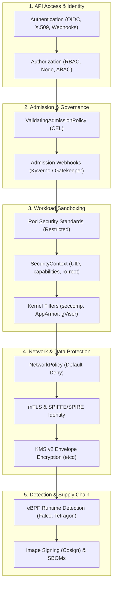

# L07 — Security

Kubernetes security is not a single feature or firewall setting; it is **defense-in-depth** across multiple concentric rings. An attacker who breaks through one layer must be stopped by the next.

---

## The Security Control Matrix

Every security decision in Kubernetes answers: *Where is the control enforced, and what fails if it is missing?*

| Defense Layer | Primary Mechanism | Enforcement Point | Bypassed If... | Production Baseline |
| :--- | :--- | :--- | :--- | :--- |
| **API Identity** | X.509, OIDC, ServiceAccount tokens | `kube-apiserver` | Anonymous authentication enabled; static tokens used | OIDC provider for humans; short-lived projected tokens for pods |
| **API Permissions** | RBAC (`Role`, `ClusterRole`) | `kube-apiserver` | Wildcard verbs (`*`) granted; `cluster-admin` given to apps | Least-privilege roles; no `bind`/`escalate` privileges |
| **Admission Gate** | ValidatingAdmissionPolicy, Kyverno | `kube-apiserver` admission chain | `ignore` failurePolicy on webhooks; controller crashes | Native in-tree CEL policies; fail-closed admission |
| **Workload Sandbox** | `securityContext`, PSS | Kubelet & Container Runtime | `privileged: true`, `CAP_SYS_ADMIN`, or host path mounts | PSS `restricted` profile; non-root UID; read-only rootfs |
| **Kernel Isolation** | Seccomp, AppArmor, User Namespaces | Linux Host Kernel | `unconfined` profiles; outdated host kernel | `RuntimeDefault` seccomp profile; user namespaces enabled |
| **Network Isolation** | `NetworkPolicy` | CNI Data Plane (eBPF / iptables) | CNI does not implement NetworkPolicy (e.g. basic Flannel) | Default-deny all ingress/egress; explicit allow rules |
| **Data at Rest** | KMS v2 Provider Plugin | `kube-apiserver` → `etcd` | Secrets stored as plaintext base64 in etcd | KMS v2 envelope encryption with external KMS (AWS KMS, Vault) |
| **Runtime Detection**| Falco, Tetragon | Linux Kernel eBPF probes | Kernel lacks eBPF support; logs uncollected | Alert on spawned shells, unexpected outbound connections |

---

## Notes in This Level

### 1. API Access & Identity
- [[Kubernetes/concepts/L07-security/01-api-access/01-authentication-authorization|01 — AuthN vs AuthZ]]: The request verification pipeline, OIDC integration, and anonymous auth risks.
- [[Kubernetes/concepts/L07-security/01-api-access/02-service-accounts|02 — ServiceAccounts]]: Workload identity, projected bound tokens, cloud IAM mapping (IRSA/Workload Identity).
- [[Kubernetes/concepts/L07-security/01-api-access/03-rbac|03 — Role-Based Access Control]]: Roles, ClusterRoles, bindings, subresources, and privilege escalation traps.
- [[Kubernetes/concepts/L07-security/01-api-access/04-certificates|04 — Certificates & PKI]]: Cluster CA, front-proxy CA, kubelet certificate rotation, and API access keys.

### 2. Workload Sandboxing & Node Protection
- [[Kubernetes/concepts/L07-security/02-workload-sandboxing/05-security-context|05 — SecurityContext]]: Container and Pod security contexts, non-root users, capability dropping, and read-only filesystems.
- [[Kubernetes/concepts/L07-security/02-workload-sandboxing/06-pod-security-standards|06 — Pod Security Standards]]: `privileged`, `baseline`, and `restricted` profiles; namespace enforcement labels.
- [[Kubernetes/concepts/L07-security/02-workload-sandboxing/16-seccomp-apparmor|16 — Seccomp & AppArmor]]: Restricting Linux system calls and mandatory access controls.
- [[Kubernetes/concepts/L07-security/02-workload-sandboxing/17-runtime-sandboxing|17 — Runtime Sandboxing]]: gVisor and Kata Containers via `RuntimeClass`.
- [[Kubernetes/concepts/L07-security/02-workload-sandboxing/18-runtime-detection|18 — Runtime Detection]]: eBPF-based behavioral monitoring with Falco and Tetragon.
- [[Kubernetes/concepts/L07-security/02-workload-sandboxing/19-image-hardening|19 — Image Hardening]]: Distroless base images, vulnerability scanning, and minimal attack surface.

### 3. Encryption & Workload Identity
- [[Kubernetes/concepts/L07-security/03-encryption-identity/08-tls-mtls|08 — TLS & mTLS]]: Securing data in transit, control plane mutual TLS, and service mesh transport encryption.
- [[Kubernetes/concepts/L07-security/03-encryption-identity/09-spiffe-spire|09 — SPIFFE / SPIRE]]: Cryptographic workload identity attestation and automated X.509 SVID rotation.
- [[Kubernetes/concepts/L07-security/03-encryption-identity/13-etcd-encryption|13 — etcd Encryption at Rest]]: Envelope encryption using KMS v2 provider plugins.
- [[Kubernetes/concepts/L07-security/03-encryption-identity/14-secret-encryption|14 — Secret Management]]: Secrets lifecycle, External Secrets Operator (ESO), Vault, and SOPS.

### 4. Admission Control & Policy Engines
- [[Kubernetes/concepts/L07-security/04-admission-policy/10-admission-controllers|10 — Admission Controllers]]: Mutating and validating webhook lifecycle, order of execution, and failure modes.
- [[Kubernetes/concepts/L07-security/04-admission-policy/11-opa-gatekeeper|11 — OPA / Gatekeeper]]: Declarative Rego constraint templates and cluster auditing.
- [[Kubernetes/concepts/L07-security/04-admission-policy/12-kyverno|12 — Kyverno]]: Native YAML policy engine for validation, mutation, image verification, and generation.
- [[Kubernetes/concepts/L07-security/04-admission-policy/23-sboms|23 — Software Bill of Materials (SBOM)]]: SPDX, CycloneDX, vulnerability scanning, and cryptographic supply chain assurance.

### 5. Audit, Operations & Compliance
- [[Kubernetes/concepts/L07-security/05-audit-ops-compliance/15-audit-logging|15 — Audit Logging]]: Recording cluster forensic events, policy stages, and log export.
- [[Kubernetes/concepts/L07-security/05-audit-ops-compliance/20-cluster-hardening|20 — Cluster Hardening]]: Securing control plane components and flags according to CIS benchmarks.
- [[Kubernetes/concepts/L07-security/05-audit-ops-compliance/21-node-hardening|21 — Node Hardening]]: Host OS parameters, containerd security, and SSH restriction.
- [[Kubernetes/concepts/L07-security/05-audit-ops-compliance/22-compliance-frameworks|22 — Compliance Frameworks]]: Mapping Kubernetes controls to CIS Benchmark, NIST SP 800-190, and SOC2.

---

## Hands-On Security Hardening Lab

Apply these principles in practice: walk through converting an insecure, privileged workload into a hardened production deployment in **[[Kubernetes/labs/07-security-hardening|Lab 07 — Workload Security Hardening]]**.
