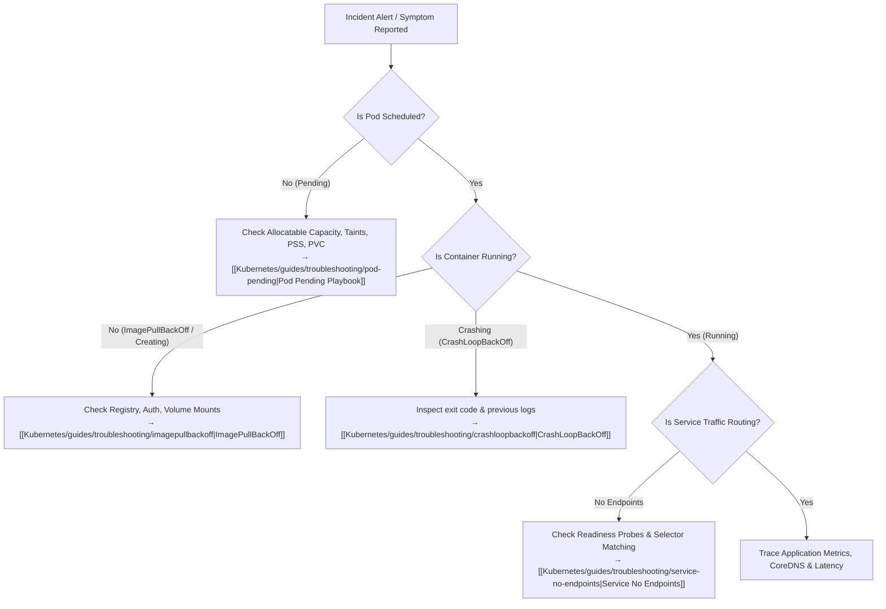

# L08 — Operations & Observability

Day-2 operations begins once workloads are deployed and the real world intervenes: network partitions, memory leaks, misconfigured probes, saturating disks, and control plane failures.

This level provides a **systematic triage methodology** and an architectural reference for Kubernetes observability data sources.



---

## Modern Cluster Health Verification

> [!WARNING]
> The legacy command `kubectl get componentstatuses` (`kubectl get cs`) was deprecated in Kubernetes v1.19 and removed from modern production stacks. Never use `kubectl get cs` for cluster diagnostics.

Instead, query the apiserver's modern health check endpoints directly:

```bash
# High-level cluster readiness check
kubectl get --raw='/readyz?verbose'

# Control plane liveness check
kubectl get --raw='/livez?verbose'
```

**Expected output:**
```
[+]ping ok
[+]log ok
[+]etcd ok
[+]poststarthook/start-kube-apiserver-admission-initializer ok
[+]poststarthook/apiservice-registration-controller ok
[+]poststarthook/apiservice-status-available-controller ok
readyz check passed
```

---

## Observability Architecture

Kubernetes separates telemetry into **metrics**, **logs**, **events**, and **traces**:

| Signal Type | In-Cluster Source | Aggregator | Primary Consumer | Long-Term Storage |
| :--- | :--- | :--- | :--- | :--- |
| **Resource Metrics** | cAdvisor (inside kubelet) | `metrics-server` | HPA, `kubectl top` | Prometheus / Mimir |
| **Object State** | `kube-apiserver` watch stream | `kube-state-metrics` | Platform alerting | Prometheus / VictoriaMetrics |
| **Container Logs** | `/var/log/pods/` (CRI JSON logs) | Fluent Bit / Promtail | Developers, SREs | Loki / OpenSearch / CloudWatch |
| **Cluster Events** | `kube-apiserver` event records | `eventrouter` / exporter | SRE triage | Elasticsearch / Loki |
| **Audit Logs** | `kube-apiserver` audit backend | File / Webhook sink | Security & Compliance | SIEM / S3 Archive |

---

## Notes in This Level

- [[Kubernetes/concepts/L08-operations/01-troubleshooting|01 — Troubleshooting Flow]]: The step-by-step mental decision tree for any broken workload.
- [[Kubernetes/concepts/L08-operations/02-kubectl-debug|02 — kubectl Debug Toolkit]]: The essential commands: `describe`, `logs -p`, `exec`, and ephemeral debug containers (`kubectl debug`).
- [[Kubernetes/concepts/L08-operations/03-common-failure-modes|03 — Common Failure Modes]]: Detailed breakdown of exit codes (137 OOMKilled, 143 SIGTERM), probe timeouts, and network isolation traps.
- [[Kubernetes/concepts/L08-operations/04-metrics-sources|04 — Metrics Sources]]: Complete guide to cAdvisor, Kubelet metrics, metrics-server, and Prometheus scraping.

---

## Hands-On Incident Simulation

Practice your triage reflexes in a controlled environment: inject application crashes, stream container traces, inspect events, and use ephemeral debug containers in **[[Kubernetes/labs/08-observability-and-troubleshooting|Lab 08 — Observability & Troubleshooting]]**.
