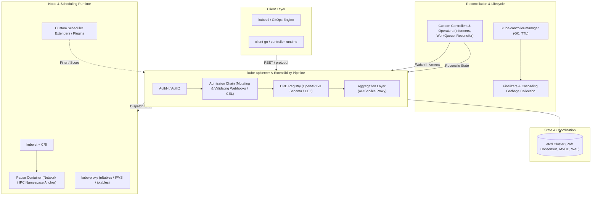

# L09 — Advanced & Extensibility

Kubernetes is not just an application orchestrator; it is an **extensible platform framework**. Almost every subsystem—from the API surface to the storage engine, network proxy, and pod sandboxing—exposes formal extension points.

This level dives deep into the control plane machinery, controller reconciliation loops, custom resource definitions, and low-level runtime components that turn Kubernetes from a container manager into an operating system for the cloud.

---

## Architectural Pillars

### 1. The Declarative Reconciliation Pattern
Every Kubernetes controller operates on a continuous feedback loop:
$$\text{Observe (Informer Cache)} \longrightarrow \text{Analyze (Diff Desired vs Actual)} \longrightarrow \text{Act (Mutate Cluster / External APIs)}$$
Building robust operators requires understanding informers, listers, rate-limiting work queues, exponential backoff, and level-triggered reconciliation.

### 2. Extending the API Surface
You have two distinct methods to add new API endpoints to Kubernetes:
- **Custom Resource Definitions (CRDs):** Declarative, stored in core etcd, validated with OpenAPI v3 and Common Expression Language (CEL). Ideal for 95% of use cases.
- **API Aggregation Layer (`APIService`):** Out-of-process auxiliary API servers with custom storage backends and custom business logic, proxied transparently through `kube-apiserver`.

### 3. Lifecycle Safety & Cleanup
Deleting a resource is rarely instantaneous. Production controllers rely on **Finalizers** to prevent premature etcd deletion until external resources (DNS records, cloud load balancers, database instances) are deprovisioned, while the **Garbage Collector** guarantees clean hierarchical tear-down via owner references.

---

## Complete Guide Directory

| Topic | Focus & Key Concepts | Document Link |
| :--- | :--- | :--- |
| **Operators** | Operator pattern, level-triggered design, Operator SDK, Kubebuilder | [[Kubernetes/concepts/L09-advanced/01-operators\|01 — Operators]] |
| **Custom Controllers** | `client-go` informers, listers, rate-limiting workqueue, reconcile loop | [[Kubernetes/concepts/L09-advanced/02-custom-controllers\|02 — Custom Controllers]] |
| **CRDs** | Schema validation, CEL rules, subresources (`/status`, `/scale`), versions | [[Kubernetes/concepts/L09-advanced/03-customresourcedefinitions\|03 — Custom Resource Definitions]] |
| **Admission Controllers** | Mutating/Validating webhooks, admission chain, fail-open vs fail-closed | [[Kubernetes/concepts/L09-advanced/04-admission-controllers\|04 — Admission Controllers & Webhooks]] |
| **Finalizers** | Asynchronous cleanup, deletion timestamps, deadlock prevention | [[Kubernetes/concepts/L09-advanced/05-finalizers\|05 — Finalizers]] |
| **Garbage Collection** | `ownerReferences`, Foreground vs Background vs Orphan cascading deletion | [[Kubernetes/concepts/L09-advanced/06-garbage-collection\|06 — Garbage Collection]] |
| **Aggregation Layer** | `APIService`, extension API servers, mutual TLS delegation, Metrics Server | [[Kubernetes/concepts/L09-advanced/07-aggregation-layer\|07 — Aggregation Layer]] |
| **IPVS Mode** | L4 IPVS proxying, hash tables, v1.35+ deprecation, migration to `nftables` | [[Kubernetes/concepts/L09-advanced/08-ipvs\|08 — IPVS Mode (Deprecated)]] |
| **Pause Container** | `/pause` binary, Linux namespace anchoring, PID 1 zombie reaping | [[Kubernetes/concepts/L09-advanced/09-pause-container\|09 — The Pause Container]] |
| **etcd Deep Dive** | Raft consensus, compaction, defragmentation, TLS, snapshots, DR | [[Kubernetes/concepts/L09-advanced/10-etcd\|10 — etcd in Kubernetes]] |
| **Scheduler Extenders** | HTTP filter/prioritize/preempt webhooks, Scheduling Framework plugins | [[Kubernetes/concepts/L09-advanced/11-scheduler-extenders\|11 — Scheduler Extenders]] |
| **`client-go` Framework** | Informers, DeltaFIFO, SharedIndexInformer, Leader Election, RateLimiter | [[Kubernetes/client-go\|client-go Architecture Guide]] |

---

## Where to Go Next

- **Incident Response:** Practice failure isolation and recovery playbooks in [[Kubernetes/concepts/L08-operations/index\|L08 — Operations & Troubleshooting]].
- **Cloud Implementations:** See how these universal concepts translate into AWS infrastructure in [[Kubernetes/eks/README\|Amazon EKS Architecture Guide]].
- **Master Decision Matrix:** Review workload and architectural trade-offs in [[Kubernetes/review/decision-tables\|Master Decision Tables]].
