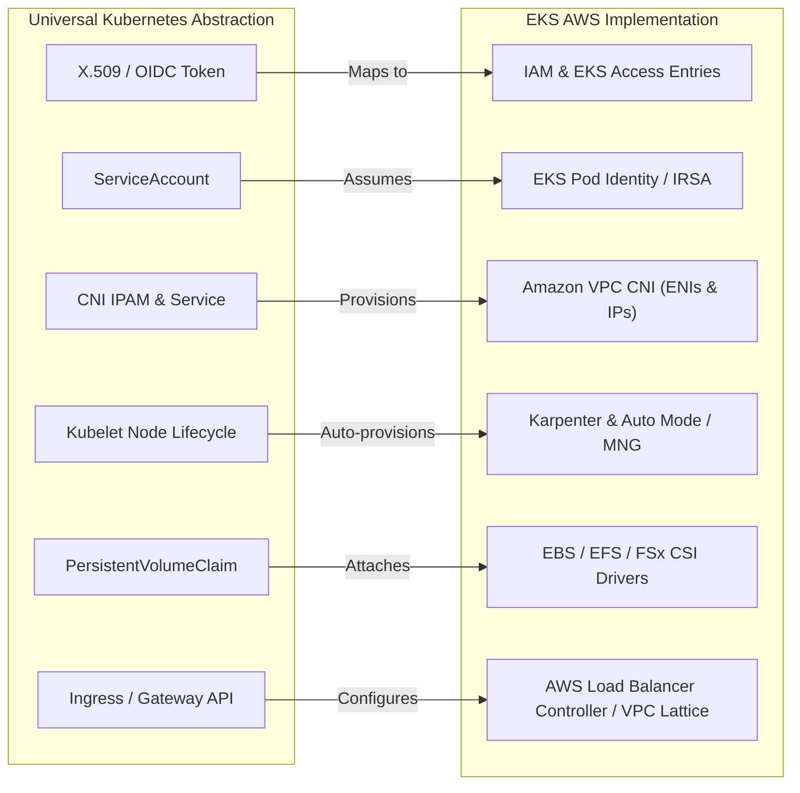

# Amazon EKS

[Amazon Elastic Kubernetes Service (EKS)](https://docs.aws.amazon.com/eks/latest/userguide/what-is-eks.html) is a certified conformant Kubernetes managed service that runs upstream Kubernetes on AWS.

While the Kubernetes API contracts, resource definitions (`Pod`, `Deployment`, `Service`, `StatefulSet`), and scheduling mechanisms remain 100% universal, EKS delegates infrastructure primitives—such as networking, identity, storage, and node lifecycle—to dedicated AWS cloud services.



---

## Universal Concept → EKS Implementation Matrix

Use this matrix to translate core upstream Kubernetes primitives (taught in Levels 01–09) to their production AWS counterparts:

| Domain | Universal Kubernetes Concept | AWS / EKS Implementation | Core Concept Link | EKS Track Link |
| :--- | :--- | :--- | :--- | :--- |
| **Cluster AuthN** | X.509 Client Certificates, Webhook Token | AWS IAM (`sts:GetCallerIdentity`) + EKS Access Entries | [[Kubernetes/concepts/L07-security/index\|L07 — Security]] | [[Kubernetes/eks/security/README\|EKS Security]] |
| **Cluster AuthZ** | RBAC (`Role`, `ClusterRoleBinding`) | Kubernetes RBAC combined with IAM Access Policies | [[Kubernetes/concepts/L07-security/01-api-access/03-rbac\|03 — RBAC]] | [[Kubernetes/eks/security/README\|EKS Security]] |
| **Workload Identity** | Projected ServiceAccount Tokens | EKS Pod Identity (Modern) & IRSA (IAM Roles for Service Accounts) | [[Kubernetes/concepts/L07-security/01-api-access/02-service-accounts\|02 — Service Accounts]] | [[Kubernetes/eks/security/README\|EKS Security]] |
| **Pod Networking** | Overlay CNI (Calico, Flannel, Cilium) | Amazon VPC CNI (Direct AWS VPC IP per Pod via ENIs) | [[Kubernetes/concepts/L04-services-networking/00-README\|L04 — Networking]] | [[Kubernetes/eks/networking/README\|EKS Networking]] |
| **Network Isolation** | `NetworkPolicy` resource | VPC CNI Network Policy Engine (eBPF) or Cilium | [[Kubernetes/concepts/L04-services-networking/05-network-policy\|05 — Network Policy]] | [[Kubernetes/eks/networking/README\|EKS Networking]] |
| **Node Autoscaling** | Cluster Autoscaler (ASG polling) | **Karpenter** (Just-in-time NodePool provisioning) or EKS Auto Mode | [[Kubernetes/concepts/L06-scheduling-scaling/09-cluster-autoscaler\|09 — Cluster Autoscaler]] | [[Kubernetes/eks/compute/README\|EKS Compute]] |
| **Compute Pools** | Bare-metal / Static VM Kubelets | Managed Node Groups (MNG), AWS Fargate, or Self-Managed Nodes | [[Kubernetes/concepts/L01-architecture/00-README\|L01 — Architecture]] | [[Kubernetes/eks/compute/README\|EKS Compute]] |
| **Block Storage** | `ReadWriteOnce` Volumes (HostPath / Ceph) | Amazon EBS CSI Driver (`gp3`, `io2`) | [[Kubernetes/concepts/L05-config-storage/00-README\|L05 — Storage]] | [[Kubernetes/eks/storage/README\|EKS Storage]] |
| **Shared Storage** | `ReadWriteMany` Volumes (NFS) | Amazon EFS CSI Driver or FSx for NetApp ONTAP | [[Kubernetes/concepts/L05-config-storage/00-README\|L05 — Storage]] | [[Kubernetes/eks/storage/README\|EKS Storage]] |
| **Object Storage** | S3 API client libraries in container | Mountpoint for Amazon S3 CSI Driver | [[Kubernetes/concepts/L05-config-storage/00-README\|L05 — Storage]] | [[Kubernetes/eks/storage/README\|EKS Storage]] |
| **L4 Load Balancing** | Service `type: LoadBalancer` | AWS Network Load Balancer (NLB) via AWS Load Balancer Controller | [[Kubernetes/concepts/L04-services-networking/02-services\|02 — Services]] | [[Kubernetes/eks/networking/README\|EKS Networking]] |
| **L7 Routing** | Ingress & Gateway API (`HTTPRoute`) | Application Load Balancer (ALB) & Amazon VPC Lattice Gateway Controller | [[Kubernetes/concepts/L04-services-networking/04-ingress\|04 — Ingress]] | [[Kubernetes/eks/networking/README\|EKS Networking]] |
| **Secret Management** | Kubernetes `Secret` resource (Base64) | AWS Secrets Manager / Parameter Store via Secrets Store CSI Driver (ASO) | [[Kubernetes/concepts/L05-config-storage/02-secrets\|02 — Secrets]] | [[Kubernetes/eks/security/README\|EKS Security]] |
| **Control Plane Metrics** | Prometheus `/metrics` scraping | Amazon CloudWatch Container Insights & Amazon Managed Prometheus (AMP) | [[Kubernetes/concepts/L08-operations/04-metrics-sources\|04 — Metrics Sources]] | [[Kubernetes/eks/observability/README\|EKS Observability]] |

---

## EKS Architecture Categories

### [[Kubernetes/eks/getting-started/README|1. Getting Started]]
Tools, prerequisites, cluster creation with `eksctl`/Terraform, and first application deployment.

### [[Kubernetes/eks/compute/README|2. Compute]]
Managed Node Groups, Fargate profiles, Karpenter high-velocity autoscaling, EKS Auto Mode, and Hybrid Nodes.

### [[Kubernetes/eks/networking/README|3. Networking]]
Amazon VPC CNI, Secondary CIDRs, Security Groups for Pods, eBPF Network Policies, and VPC Lattice service networks.

### [[Kubernetes/eks/storage/README|4. Storage]]
EBS CSI Driver, EFS CSI Driver, FSx for NetApp ONTAP, FSx for OpenZFS, and Mountpoint for Amazon S3.

### [[Kubernetes/eks/security/README|5. Security]]
EKS Access Entries (replacing legacy `aws-auth`), EKS Pod Identity, IRSA, Secrets Management, GuardDuty runtime monitoring, and Pod Security Standards.

### [[Kubernetes/eks/observability/README|6. Observability]]
Control plane logging, CloudWatch Container Insights, AWS Distro for OpenTelemetry (ADOT), Prometheus, and Kubecost.

### [[Kubernetes/eks/cluster-upgrades/README|7. Cluster Upgrades]]
Zero-downtime control plane updates, node group rolling upgrades, addon compatibility matrices, and disaster recovery.

### [[Kubernetes/eks/automation/README|8. Automation]]
GitOps with Argo CD & Flux, AWS Controllers for Kubernetes (ACK), Crossplane, and CI/CD pipelines.

### [[Kubernetes/eks/advanced/README|9. Advanced]]
Event-driven autoscaling with KEDA, HPA/VPA tuning, advanced multi-tenant networking, and FinOps cost optimization.

### [[Kubernetes/eks/troubleshooting/README|10. Troubleshooting]]
Common EKS failure modes (VPC CNI IP exhaustion, Node NotReady, CoreDNS degradation), diagnostic playbooks, and AWS Support tools.

---

## Quick Reference

### Common CLI Commands

```bash
# Provision cluster via eksctl
eksctl create cluster --name production-cluster --region us-east-1 --version 1.32

# Update local kubeconfig context
aws eks update-kubeconfig --region us-east-1 --name production-cluster

# List active nodegroups
aws eks list-nodegroups --cluster-name production-cluster

# Query EKS Access Entries (Modern AuthN/AuthZ)
aws eks list-access-entries --cluster-name production-cluster
```

### Key Managed Addons

| Addon | Upstream Equivalent | Purpose |
| :--- | :--- | :--- |
| `vpc-cni` | Upstream CNI Plugin | Allocates real VPC IPv4/IPv6 addresses directly to Pods |
| `coredns` | CoreDNS | Cluster-internal DNS service discovery |
| `kube-proxy` | kube-proxy | Implements Kubernetes Service ClusterIP packet routing |
| `aws-ebs-csi-driver` | CSI Node Driver | Attaches and mounts Amazon EBS block volumes dynamically |
| `aws-efs-csi-driver` | CSI Node Driver | Mounts scalable NFS file shares across multiple Availability Zones |

## External Resources

- [AWS EKS Best Practices Guide](https://aws.github.io/aws-eks-best-practices/)
- [EKS Official Documentation](https://docs.aws.amazon.com/eks/latest/userguide/)
- [EKS Workshop](https://www.eksworkshop.com/)
- [Karpenter Official Documentation](https://karpenter.sh/)