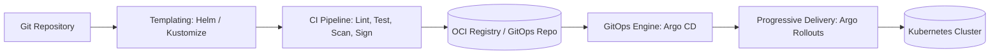

# Application Delivery & GitOps

Workflows and best practices for shipping code into Kubernetes reliably, from local templating to automated GitOps reconciliation and progressive rollouts.

## Delivery Pipeline

## Section Directory

### 1. Templating & Patching
- [[Kubernetes/guides/delivery/templating-patching/helm/README|Helm Chart Masterclass]]: 10-part comprehensive guide covering chart creation, templating, lifecycle hooks, dependencies, OCI distribution, and testing.
- [[Kubernetes/guides/delivery/templating-patching/kustomize|Kustomize]]: Native declarative overlay and patch management without template engines.

### 2. GitOps Continuous Delivery
- [[Kubernetes/guides/delivery/gitops/basics|GitOps Fundamentals]]: Principles of GitOps, push vs pull reconcilers, drift detection, and state reconciliation.
- [[Kubernetes/guides/delivery/gitops/argo-cd/README|Argo CD Guide]]: Production Argo CD patterns, ApplicationSets, multi-tenancy, and sync policies.

### 3. Progressive Delivery & Workflows
- [[Kubernetes/guides/delivery/progressive-delivery/argo-rollouts|Argo Rollouts]]: Canary deployments, blue/green switching, automated analysis, and metric-based rollbacks.
- [[Kubernetes/guides/delivery/pipeline-workflows/argo-workflows|Argo Workflows]]: Kubernetes-native batch and workflow engine for CI/CD tasks.
- [[Kubernetes/guides/delivery/ci-cd-integration|CI/CD Integration]]: Connecting GitHub Actions, GitLab CI, BuildKit, Kaniko, and image signing into Kubernetes pipelines.
