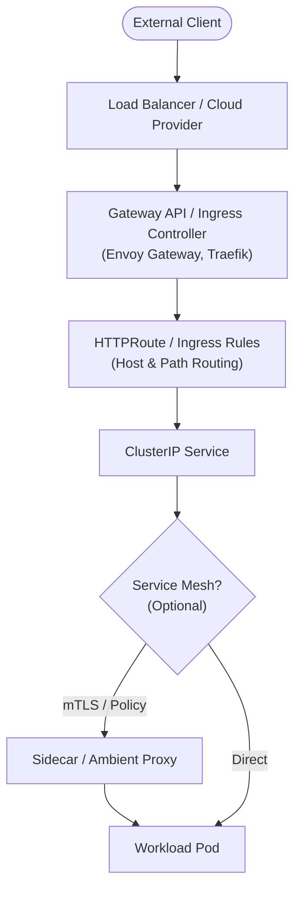

# Networking, Gateways & Service Mesh

Practical guides for routing external traffic into clusters and managing secure, observable communication between internal workloads.

> [!IMPORTANT] Modern Ingress & Gateway Shift (2026)
> Following the official retirement of the community `ingress-nginx` controller project in March 2026, new cluster deployments should adopt **Gateway API** (e.g. via Envoy Gateway or Cilium) or actively maintained Ingress controllers such as Traefik or commercial NGINX distributions.

## Ingress & Gateway Architecture

## Implementation Guides

### 1. Ingress & Gateway API
- [[Kubernetes/guides/networking/envoy-gateway|Envoy Gateway]]: Implementing the Gateway API standard using Envoy Proxy for L4/L7 routing, traffic splitting, and TLS termination.
- [[Kubernetes/guides/networking/traefik|Traefik]]: Cloud-native reverse proxy and Ingress controller with automatic TLS and middleware support.

### 2. Service Mesh & In-Cluster Connectivity
- [[Kubernetes/guides/networking/comparison|Service Mesh & Ingress Comparison]]: Architectural comparison between Envoy Gateway, Traefik, Istio, Linkerd, and Cilium Service Mesh.
- [[Kubernetes/guides/networking/istio|Istio]]: Enterprise service mesh for mTLS, traffic management, telemetry, and authorization policies.
- [[Kubernetes/guides/networking/linkerd|Linkerd]]: Ultra-lightweight, zero-config Rust-based service mesh focusing on security and operational simplicity.
