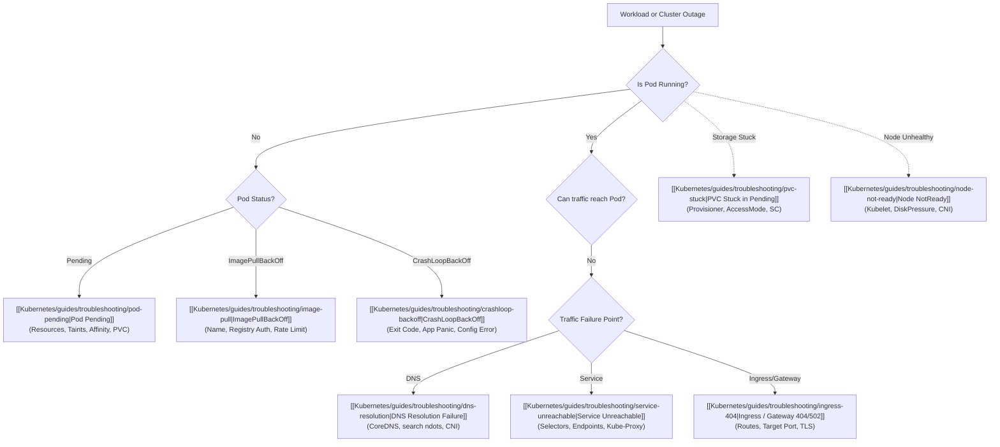

# Kubernetes Troubleshooting Playbooks

Systematic, symptom-first playbooks for diagnosing and recovering from production cluster failures. Each playbook follows a standard diagnostic structure: **symptom → scope → evidence → diagnosis → correction → verification → prevention**.

## Triage Flowchart

## Playbook Directory

| Symptom | Primary Diagnostic Commands | Playbook |
| :--- | :--- | :--- |
| **Pod stuck in Pending** | `kubectl describe pod <pod>`, events, scheduler reasons | [[Kubernetes/guides/troubleshooting/pod-pending\|Pod Pending]] |
| **CrashLoopBackOff** | `kubectl logs <pod> --previous`, exit code, OOMKilled | [[Kubernetes/guides/troubleshooting/crashloop-backoff\|CrashLoopBackOff]] |
| **ImagePullBackOff / ErrImagePull** | `kubectl describe pod <pod>`, image pull secrets, registry reachability | [[Kubernetes/guides/troubleshooting/image-pull\|ImagePullBackOff]] |
| **Service unreachable** | `kubectl get endpointslices`, labels, selector match, port mapping | [[Kubernetes/guides/troubleshooting/service-unreachable\|Service Unreachable]] |
| **DNS resolution failure** | `kubectl logs -n kube-system -l k8s-app=kube-dns`, `resolv.conf` | [[Kubernetes/guides/troubleshooting/dns-resolution\|DNS Resolution]] |
| **Ingress 404 / 502 Bad Gateway** | Ingress controller logs, Gateway HTTPRoute, service port match | [[Kubernetes/guides/troubleshooting/ingress-404\|Ingress 404 / 502]] |
| **PVC stuck in Pending** | `kubectl describe pvc <pvc>`, StorageClass provisioner, CSI driver | [[Kubernetes/guides/troubleshooting/pvc-stuck\|PVC Stuck]] |
| **Node NotReady** | `kubectl describe node <node>`, kubelet systemd logs, disk/memory pressure | [[Kubernetes/guides/troubleshooting/node-not-ready\|Node NotReady]] |
