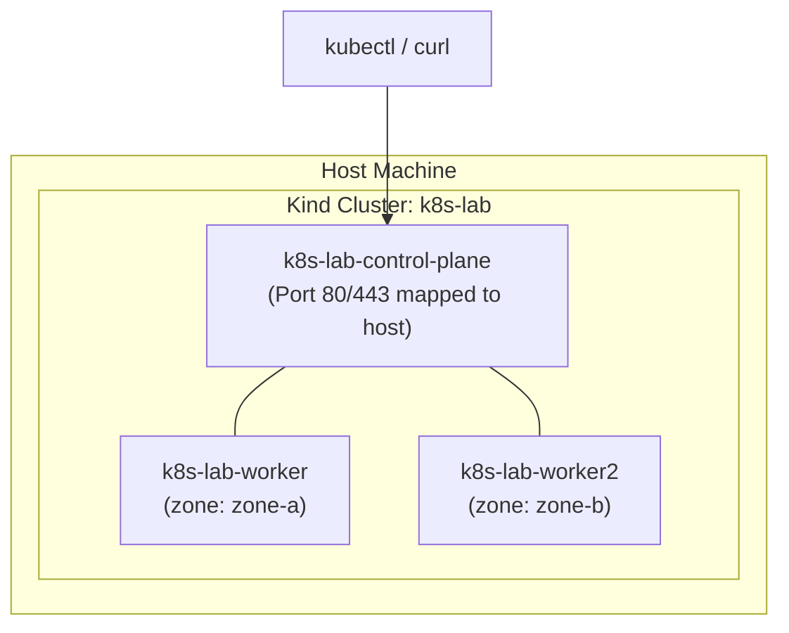

# Lab 00 — Cluster Setup & Orientation

The goal of this lab is to establish our local laboratory environment: a multi-node Kubernetes cluster running inside Docker via `kind` (Kubernetes in Docker). You will verify the separation between the **control plane** and **worker nodes**, inspect system namespaces, and practice failure diagnosis on node health.



---

## 1. Prerequisites & Starting State

Ensure you have the following installed locally:
- **Docker Engine** (v24.0+) or compatible OCI runtime
- **kind** (v0.27+): `kind version`
- **kubectl** (v1.35 – v1.37): `kubectl version --client`

Check that your Docker daemon is active:

```bash
docker info > /dev/null 2>&1 && echo "Docker is running ✅" || echo "Docker is NOT running ❌"
```

---

## 2. Cluster Configuration

Create a file named `kind-config.yaml` (or reference [`kind-config.yaml`](file:///home/darshan/projects/cloudnative-wiki/content/Kubernetes/labs/kind-config.yaml)):

```yaml
kind: Cluster
apiVersion: kind.x-k8s.io/v1alpha4
name: k8s-lab
nodes:
  - role: control-plane
    kubeadmConfigPatches:
      - |
        kind: InitConfiguration
        nodeRegistration:
          kubeletExtraArgs:
            node-labels: "ingress-ready=true"
    extraPortMappings:
      - containerPort: 80
        hostPort: 80
        protocol: TCP
      - containerPort: 443
        hostPort: 443
        protocol: TCP
  - role: worker
    labels:
      topology.kubernetes.io/zone: "zone-a"
  - role: worker
    labels:
      topology.kubernetes.io/zone: "zone-b"
```

### Why this configuration matters:
1. **Multi-node topology:** With 1 control-plane and 2 worker nodes, you can test realistic pod scheduling, anti-affinity, and node drain scenarios.
2. **Zone labels:** Simulates a multi-zone cloud environment (`zone-a` and `zone-b`) to explore `topologySpreadConstraints`.
3. **Host port mappings:** Binds host ports 80 and 443 to the control-plane container, enabling you to access Gateway API and Ingress routes directly from `localhost`.

---

## 3. Step-by-Step Execution

### Step 1: Bootstrap the cluster

```bash
kind create cluster --config kind-config.yaml
```

**Expected output:**
```
Creating cluster "k8s-lab" ...
 • Ensuring node image (kindest/node:v1.37.0) 🖼
 • Preparing nodes 📦 📦 📦  
 • Writing configuration 📜 
 • Starting control-plane 🕹️ 
 • Installing CNI 🔌 
 • Installing StorageClass 💾 
 • Joining worker nodes 🚜 
Set kubectl context to "kind-k8s-lab"
```

### Step 2: Verify current context and API connectivity

```bash
kubectl cluster-info
kubectl config current-context
```

**Expected output:**
```
Kubernetes control plane is running at https://127.0.0.1:<PORT>
CoreDNS is running at https://127.0.0.1:<PORT>/api/v1/namespaces/kube-system/services/kube-dns:dns/proxy
kind-k8s-lab
```

### Step 3: Inspect node topology and labels

```bash
kubectl get nodes -L topology.kubernetes.io/zone,ingress-ready
```

**Expected output:**
```
NAME                  STATUS   ROLES           AGE   VERSION   ZONE     INGRESS-READY
k8s-lab-control-plane Ready    control-plane   2m    v1.37.0            true
k8s-lab-worker        Ready    <none>          90s   v1.37.0   zone-a   
k8s-lab-worker2       Ready    <none>          90s   v1.37.0   zone-b   
```

### Step 4: Inspect core control plane and system pods

```bash
kubectl get pods -n kube-system -o wide
```

Notice the static pods running the control plane (`etcd`, `kube-apiserver`, `kube-controller-manager`, `kube-scheduler`), along with the cluster daemonset (`kube-proxy`) and DNS pods (`coredns`).

---

## 4. Controlled Failure Scenario: Node Failure & Kubelet Disconnect

What happens to a cluster when a worker node stops communicating with the control plane?

### Trigger the failure:
Simulate a catastrophic hardware loss by stopping the worker container:

```bash
docker stop k8s-lab-worker
```

### Observe the symptom:
Watch the node status:

```bash
kubectl get nodes
```

Initially, the node remains `Ready` because the kubelet lease has not expired yet. Within ~40 seconds (kubelet node lease renewal threshold), run:

```bash
kubectl describe node k8s-lab-worker | grep -A 5 "Conditions:"
```

**Observed behavior:**
`Ready` condition transitions from `True` to `Unknown`:
```
  Type                 Status  Reason
  ----                 ------  ------
  Ready                Unknown KubeletStopped (The Kubelet stopped posting node status.)
```

The node controller marks the node `NotReady` / `Unknown`. If any workloads were running on `k8s-lab-worker`, the controller would eventually begin pod eviction after `node.kubernetes.io/not-ready` toleration seconds expire.

### Recovery:
Restart the worker container:

```bash
docker start k8s-lab-worker
kubectl wait --for=condition=Ready node/k8s-lab-worker --timeout=60s
```

Verify that all three nodes return to `Ready`.

---

## 5. Teardown & Verification

Keep this cluster running for subsequent labs. If you ever need to reset the environment from scratch, run:

```bash
kind delete cluster --name k8s-lab
```

---

## Next Lab

Now that your cluster is operational, proceed to **[[Kubernetes/labs/01-deploy-workload|Lab 01 — Deploying the Application]]** to deploy our canonical application: `podinfo`.
