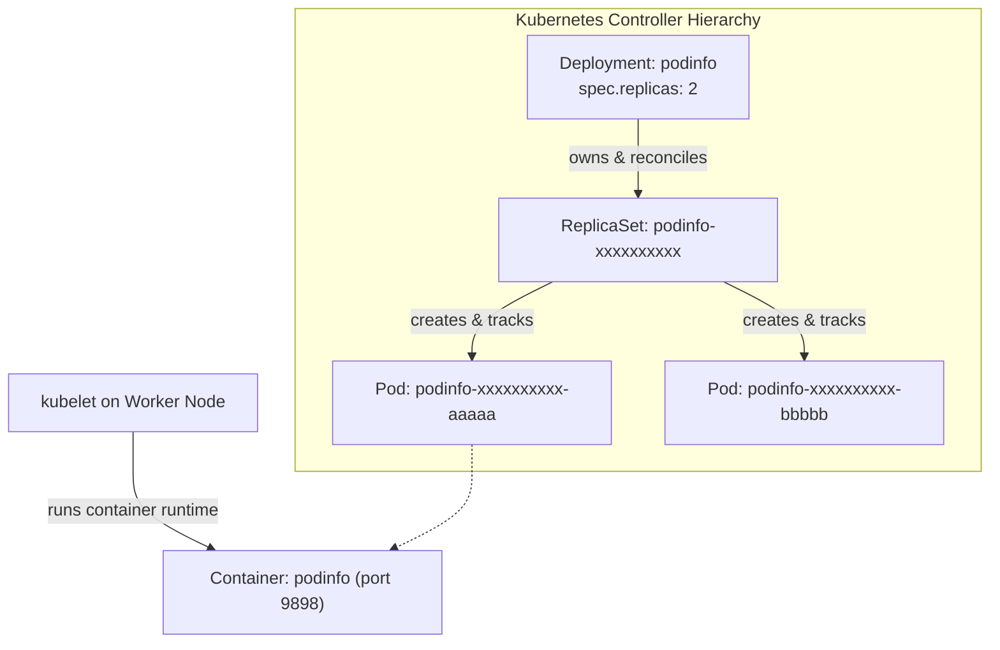

# Lab 01 — Deploying the Application

In this lab, you deploy the canonical application used throughout this curriculum: **`podinfo`** (`ghcr.io/stefanprodan/podinfo:6.7.1`). You will trace the controller hierarchy from Deployment to ReplicaSet to Pod, verify declarative state reconciliation, and diagnose a label selector mismatch.



---

## 1. Prerequisites & Starting State

- Working `k8s-lab` cluster from **[[Kubernetes/labs/00-cluster-setup|Lab 00]]**.
- Current context verified: `kubectl config current-context` (`kind-k8s-lab`).

---

## 2. The Application Manifest

Save the following YAML as `podinfo-deployment.yaml`:

```yaml
apiVersion: apps/v1
kind: Deployment
metadata:
  name: podinfo
  namespace: default
  labels:
    app.kubernetes.io/name: podinfo
    app.kubernetes.io/part-of: k8s-curriculum
spec:
  replicas: 2
  revisionHistoryLimit: 5
  selector:
    matchLabels:
      app.kubernetes.io/name: podinfo
  template:
    metadata:
      labels:
        app.kubernetes.io/name: podinfo
    spec:
      containers:
        - name: podinfo
          image: ghcr.io/stefanprodan/podinfo:6.7.1
          imagePullPolicy: IfNotPresent
          ports:
            - name: http
              containerPort: 9898
              protocol: TCP
            - name: grpc
              containerPort: 9999
              protocol: TCP
          command:
            - ./podinfo
            - --port=9898
            - --level=info
          livenessProbe:
            httpGet:
              path: /healthz
              port: http
            initialDelaySeconds: 2
            periodSeconds: 10
          readinessProbe:
            httpGet:
              path: /readyz
              port: http
            initialDelaySeconds: 2
            periodSeconds: 5
          resources:
            requests:
              cpu: 50m
              memory: 32Mi
            limits:
              cpu: 250m
              memory: 128Mi
```

---

## 3. Step-by-Step Execution

### Step 1: Apply the manifest

```bash
kubectl apply -f podinfo-deployment.yaml
```

**Expected output:**
```
deployment.apps/podinfo created
```

### Step 2: Track the rollout until complete

```bash
kubectl rollout status deployment/podinfo
```

**Expected output:**
```
Waiting for deployment "podinfo" rollout to finish: 0 of 2 updated replicas are available...
Waiting for deployment "podinfo" rollout to finish: 1 of 2 updated replicas are available...
deployment "podinfo" successfully rolled out
```

### Step 3: Inspect the controller ownership chain

Verify the Deployment, the generated ReplicaSet, and the Pods:

```bash
kubectl get deployment,rs,pods -l app.kubernetes.io/name=podinfo -o wide
```

Notice the naming pattern:
1. `deployment.apps/podinfo`
2. `replicaset.apps/podinfo-<pod-template-hash>`
3. `pod/podinfo-<pod-template-hash>-<random-5-chars>`

Now inspect the `ownerReferences` on one of the created Pods:

```bash
POD_NAME=$(kubectl get pods -l app.kubernetes.io/name=podinfo -o jsonpath='{.items[0].metadata.name}')
kubectl get pod "$POD_NAME" -o jsonpath='{.metadata.ownerReferences}' | jq .
```

**Observed JSON:**
```json
[
  {
    "apiVersion": "apps/v1",
    "blockOwnerDeletion": true,
    "controller": true,
    "kind": "ReplicaSet",
    "name": "podinfo-76575fc4c",
    "uid": "..."
  }
]
```
The Pod is owned by the ReplicaSet, not directly by the Deployment. The Deployment manages the ReplicaSet, and the ReplicaSet manages the individual Pods.

### Step 4: Stream logs and verify HTTP response

Stream logs from all Pods matching the selector:

```bash
kubectl logs -l app.kubernetes.io/name=podinfo --tail=10
```

Forward local port 9898 to the Deployment:

```bash
kubectl port-forward deployment/podinfo 9898:9898 &
PORT_FORWARD_PID=$!
sleep 2

curl -s http://127.0.0.1:9898/api/info | jq .
```

**Expected output:**
```json
{
  "hostname": "podinfo-...",
  "version": "6.7.1",
  "revision": "...",
  "color": "#34577c",
  "message": "greetings from podinfo",
  "goos": "linux",
  "goarch": "amd64"
}
```

Stop the port-forward process:
```bash
kill $PORT_FORWARD_PID
```

---

## 4. Controlled Failure Scenario: Reconciliation in Action

What happens when an extraneous Pod is labeled with the ReplicaSet's selector?

### Trigger the scenario:
Launch a standalone, unmanaged Pod that shares the selector `app.kubernetes.io/name=podinfo`:

```bash
kubectl run rogue-pod \
  --image=busybox \
  --labels="app.kubernetes.io/name=podinfo" \
  -- sleep 3600
```

### Observe the symptom:
Quickly list the pods:

```bash
kubectl get pods -l app.kubernetes.io/name=podinfo
```

### Observed behavior & Explanation:
Within milliseconds, `rogue-pod` is terminated or one of the existing Pods is terminated!
```
NAME                       READY   STATUS        RESTARTS   AGE
podinfo-76575fc4c-42x8j    1/1     Running       0          3m
podinfo-76575fc4c-m9qpl    1/1     Running       0          3m
rogue-pod                  0/1     Terminating   0          1s
```

Check the ReplicaSet events:

```bash
RS_NAME=$(kubectl get rs -l app.kubernetes.io/name=podinfo -o jsonpath='{.items[0].metadata.name}')
kubectl describe rs "$RS_NAME" | grep -A 5 "Events:"
```

**Why this happens:**
The ReplicaSet controller is a **reconciliation loop**. Its contract states: *At all times, exactly `replicas: 2` pods matching label `app.kubernetes.io/name=podinfo` must exist.* When `rogue-pod` appeared with that label, the count became 3. The controller immediately deleted one pod to restore observed state to desired state (2).

---

## 5. Teardown / Keep State

Keep the `podinfo` deployment running for **[[Kubernetes/labs/02-updates-and-rollbacks|Lab 02]]**, where we will perform zero-downtime rolling updates and rollbacks.
