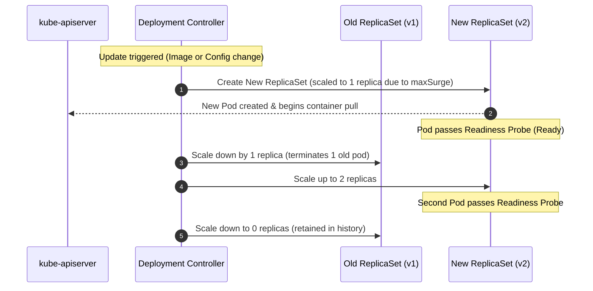

# Lab 02 — Updates & Rollbacks

In this lab, you manage the live update lifecycle of `podinfo`. You will configure the `RollingUpdate` strategy parameters (`maxSurge` and `maxUnavailable`), observe how Kubernetes orchestrates dual ReplicaSets to achieve zero-downtime deployments, diagnose a stuck rollout caused by `ImagePullBackOff`, and safely restore service using `kubectl rollout undo`.



---

## 1. Prerequisites & Starting State

- Working `k8s-lab` cluster.
- `podinfo` deployment running from **[[Kubernetes/labs/01-deploy-workload|Lab 01]]**.
- Check current state:
  ```bash
  kubectl get deployment podinfo
  ```

---

## 2. Configuring the RollingUpdate Strategy

To prevent downtime during updates, configure explicit surge parameters in `podinfo`:
- `maxSurge: 1`: Kubernetes may create 1 additional Pod above desired replicas during the rollout.
- `maxUnavailable: 0`: No existing healthy Pods may be terminated until a new Pod is fully `Ready`.

Patch the deployment strategy:

```bash
kubectl patch deployment podinfo -p '{"spec":{"strategy":{"type":"RollingUpdate","rollingUpdate":{"maxSurge":1,"maxUnavailable":0}}}}'
```

---

## 3. Step-by-Step Execution: Zero-Downtime Update

### Step 1: Trigger an application configuration update

Let's customize the UI theme color and greeting message using CLI arguments:

```bash
kubectl set env deployment/podinfo \
  PODINFO_UI_COLOR="#16a085" \
  PODINFO_UI_MESSAGE="v2 rollout successful!"
```

### Step 2: Observe the dual-ReplicaSet handoff

In a separate terminal (or run immediately):

```bash
kubectl get rs -l app.kubernetes.io/name=podinfo
```

**Expected output:**
```
NAME                 DESIRED   CURRENT   READY   AGE
podinfo-76575fc4c    2         2         2       8m
podinfo-5b5c97bd5c   1         1         0       2s
```

Watch the rollout complete:

```bash
kubectl rollout status deployment/podinfo
```

Notice that the old ReplicaSet is **not deleted**; its replica count is reduced to `0`. Kubernetes preserves inactive ReplicaSets so you can instantly roll back if needed.

### Step 3: Check rollout history

```bash
kubectl rollout history deployment/podinfo
```

**Expected output:**
```
deployment.apps/podinfo 
REVISION  CHANGE-CAUSE
1         <none>
2         <none>
```

---

## 4. Controlled Failure Scenario: Diagnosing a Stuck Rollout

What happens when an engineer deploys an image tag that does not exist in the container registry?

### Trigger the failure:
Set an invalid image tag:

```bash
kubectl set image deployment/podinfo podinfo=ghcr.io/stefanprodan/podinfo:v9.9.99-nonexistent
```

### Observe the symptom:
Check the rollout status:

```bash
kubectl rollout status deployment/podinfo
```

Notice that the command hangs indefinitely with:
```
Waiting for deployment "podinfo" rollout to finish: 1 out of 2 new replicas have been updated...
```

Inspect the Pods in the cluster:

```bash
kubectl get pods -l app.kubernetes.io/name=podinfo
```

**Observed output:**
```
NAME                       READY   STATUS             RESTARTS   AGE
podinfo-76575fc4c-42x8j    1/1     Running            0          12m
podinfo-76575fc4c-m9qpl    1/1     Running            0          12m
podinfo-66d48c8b6b-k8f9p   0/1     ImagePullBackOff   0          45s
```

### Key Diagnostic Takeaway:
Notice that the two old `podinfo-76575fc4c` Pods are **still Running and serving traffic!**
Because we configured `maxUnavailable: 0`, the Deployment controller refused to terminate any old Pods until the new Pod became `Ready`. Because the new container cannot pull its image, the rollout was safely paused, protecting production users from an outage.

### Root Cause Inspection:
Inspect the failed Pod's event log:

```bash
FAILED_POD=$(kubectl get pods -l app.kubernetes.io/name=podinfo --field-selector=status.phase=Pending -o jsonpath='{.items[0].metadata.name}')
kubectl describe pod "$FAILED_POD" | grep -A 8 "Events:"
```

**Expected events:**
```
Events:
  Type     Reason     Age                From               Message
  ----     ------     ----               ----               -------
  Normal   Scheduled  1m                 default-scheduler  Successfully assigned default/... to k8s-lab-worker
  Normal   Pulling    25s (x3 over 1m)   kubelet            Pulling image "ghcr.io/stefanprodan/podinfo:v9.9.99-nonexistent"
  Warning  Failed     24s (x3 over 1m)   kubelet            Failed to pull image "...": manifest unknown
  Warning  Failed     24s (x3 over 1m)   kubelet            Error: ErrImagePull
  Normal   BackOff    10s (x4 over 1m)   kubelet            Back-off pulling image "..."
  Warning  Failed     10s (x4 over 1m)   kubelet            Error: ImagePullBackOff
```

---

## 5. Recovery: Executing a Rollback

To restore cluster health, cancel the failed update and roll back to the previous known-good revision:

```bash
kubectl rollout undo deployment/podinfo
```

**Expected output:**
```
deployment.apps/podinfo rolled back
```

Verify that the cluster stabilizes:

```bash
kubectl rollout status deployment/podinfo
kubectl get pods -l app.kubernetes.io/name=podinfo
```

All Pods are once again healthy `Running 1/1`, and the broken replica was cleaned up automatically.

---

## Next Lab

Proceed to **[[Kubernetes/labs/03-configuration|Lab 03 — Workload Configuration & Secrets]]** to decouple configuration and credentials from container images.
