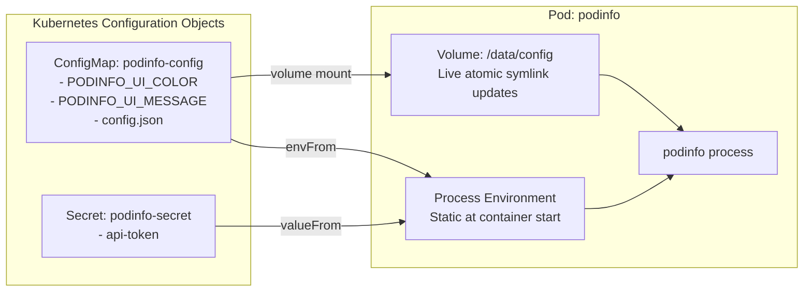

# Lab 03 — Workload Configuration & Secrets

In this lab, you configure `podinfo` dynamically using **ConfigMaps** and **Secrets**. You will explore the two primary ways containers consume external configuration: **environment variables** and **mounted configuration files**. You will witness how mounted files update automatically without Pod restarts, and diagnose a classic container startup failure: `CreateContainerConfigError`.



---

## 1. Prerequisites & Starting State

- Working `k8s-lab` cluster.
- `podinfo` deployment running from **[[Kubernetes/labs/02-updates-and-rollbacks|Lab 02]]**.

---

## 2. Configuration & Secret Manifests

Create a file named `podinfo-config.yaml`:

```yaml
apiVersion: v1
kind: ConfigMap
metadata:
  name: podinfo-config
  namespace: default
data:
  PODINFO_UI_COLOR: "#4b7bec"
  PODINFO_UI_MESSAGE: "Configured via ConfigMap!"
  config.json: |
    {
      "environment": "laboratory",
      "features": {
        "cache": true,
        "telemetry": true
      }
    }
---
apiVersion: v1
kind: Secret
metadata:
  name: podinfo-secret
  namespace: default
type: Opaque
stringData:
  api-token: "k8s-lab-secret-auth-token"
```

Apply both objects to your cluster:

```bash
kubectl apply -f podinfo-config.yaml
```

Verify creation:

```bash
kubectl get cm podinfo-config
kubectl get secret podinfo-secret
```

---

## 3. Step-by-Step Execution: Consuming Config in Workloads

### Step 1: Update Deployment to consume configuration and files

Save the updated deployment as `podinfo-with-config.yaml`:

```yaml
apiVersion: apps/v1
kind: Deployment
metadata:
  name: podinfo
  namespace: default
spec:
  replicas: 2
  selector:
    matchLabels:
      app.kubernetes.io/name: podinfo
  template:
    metadata:
      labels:
        app.kubernetes.io/name: podinfo
    spec:
      containers:
        - name: podinfo
          image: ghcr.io/stefanprodan/podinfo:6.7.1
          imagePullPolicy: IfNotPresent
          ports:
            - name: http
              containerPort: 9898
          env:
            # 1. Individual key reference from Secret
            - name: PODINFO_TOKEN
              valueFrom:
                secretKeyRef:
                  name: podinfo-secret
                  key: api-token
          # 2. Bulk environment variables from ConfigMap
          envFrom:
            - configMapRef:
                name: podinfo-config
          # 3. Mount files into container filesystem
          volumeMounts:
            - name: config-volume
              mountPath: /data/config
              readOnly: true
          resources:
            requests:
              cpu: 50m
              memory: 32Mi
            limits:
              cpu: 250m
              memory: 128Mi
      volumes:
        - name: config-volume
          configMap:
            name: podinfo-config
            items:
              - key: config.json
                path: config.json
```

Apply the updated deployment:

```bash
kubectl apply -f podinfo-with-config.yaml
kubectl rollout status deployment/podinfo
```

### Step 2: Verify environment variables and mounted files

Inspect the injected environment variables inside a running Pod:

```bash
POD_NAME=$(kubectl get pods -l app.kubernetes.io/name=podinfo -o jsonpath='{.items[0].metadata.name}')
kubectl exec "$POD_NAME" -- env | grep -E "PODINFO_UI_|PODINFO_TOKEN"
```

**Expected output:**
```
PODINFO_UI_COLOR=#4b7bec
PODINFO_UI_MESSAGE=Configured via ConfigMap!
PODINFO_TOKEN=k8s-lab-secret-auth-token
```

Now verify that `config.json` was projected into the container filesystem:

```bash
kubectl exec "$POD_NAME" -- cat /data/config/config.json
```

### Step 3: Observe Live Volume Reload vs Static Env Vars

How do updates propagate to running pods?
- **Environment variables:** Written to the Linux process environment at process creation time (`execve`). They **never** update in a running container without recreating the Pod.
- **Projected Volumes:** Kubelet periodically reconciles mounted ConfigMaps using atomic symlink rotation (`..data_tmp` -> `..data`). The mounted file updates in-place without restarting the Pod!

Let's test this in-place update:

```bash
kubectl patch configmap podinfo-config --type merge \
  -p '{"data":{"config.json":"{\n  \"environment\": \"production-simulated\"\n}"}}'
```

Watch the file inside the container:

```bash
# Kubelet sync period typically takes 10-60 seconds to rotate the volume
sleep 15
kubectl exec "$POD_NAME" -- cat /data/config/config.json
```

Notice that the file content changed **without the Pod restarting** (`RESTARTS` count remains `0`)!

---

## 4. Controlled Failure Scenario: Diagnosing `CreateContainerConfigError`

What happens when a manifest references a configuration key that does not exist?

### Trigger the failure:
Patch the Deployment to require a nonexistent key from the secret:

```bash
kubectl patch deployment podinfo --type json -p='[
  {"op": "add", "path": "/spec/template/spec/containers/0/env/-", "value": {
    "name": "DB_PASSWORD",
    "valueFrom": {
      "secretKeyRef": {
        "name": "podinfo-secret",
        "key": "missing-password-key"
      }
    }
  }}
]'
```

### Observe the symptom:
Check the Pod status:

```bash
kubectl get pods -l app.kubernetes.io/name=podinfo
```

**Observed output:**
```
NAME                       READY   STATUS                       RESTARTS   AGE
podinfo-5b5c97bd5c-2p8xm   1/1     Running                      0          5m
podinfo-5b5c97bd5c-v9lks   1/1     Running                      0          5m
podinfo-84fd954546-k4m2d   0/1     CreateContainerConfigError   0          12s
```

### Root Cause Diagnosis:
Inspect the failed Pod:

```bash
FAILED_POD=$(kubectl get pods -l app.kubernetes.io/name=podinfo --field-selector=status.phase=Pending -o jsonpath='{.items[0].metadata.name}')
kubectl describe pod "$FAILED_POD" | grep -A 5 "Events:"
```

**Diagnostic event:**
```
Warning  Failed     3s (x3 over 15s)  kubelet  Error: couldn't find key missing-password-key in Secret default/podinfo-secret
```

**Key Takeaway:**
By default, `secretKeyRef` and `configMapKeyRef` are strict. If the object or key is missing, kubelet fails to start the container. To make a configuration key optional, set `optional: true` in the key reference:

```yaml
valueFrom:
  secretKeyRef:
    name: podinfo-secret
    key: missing-password-key
    optional: true
```

### Recovery:
Re-apply `podinfo-with-config.yaml` to remove the invalid reference:

```bash
kubectl apply -f podinfo-with-config.yaml
kubectl rollout status deployment/podinfo
```

---

## Next Lab

Now that our application is configured, proceed to **[[Kubernetes/labs/04-networking-and-services|Lab 04 — Services, DNS & Gateway Routing]]** to expose `podinfo` across the cluster and to external clients.
