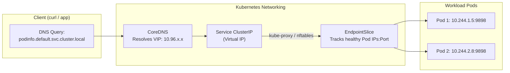

# Lab 04 — Services, DNS & Gateway Routing

In this lab, you make `podinfo` discoverable and accessible across the cluster. You will create a **ClusterIP Service**, trace how the kube-proxy and **EndpointSlice** controller map virtual service IPs to real pod IPs, verify intra-cluster DNS resolution, diagnose a zero-endpoint selector mismatch, and expose the service to your host machine.



---

## 1. Prerequisites & Starting State

- Working `k8s-lab` cluster.
- `podinfo` deployment running from **[[Kubernetes/labs/03-configuration|Lab 03]]**.

---

## 2. Service Manifest

Save the following YAML as `podinfo-service.yaml`:

```yaml
apiVersion: v1
kind: Service
metadata:
  name: podinfo
  namespace: default
  labels:
    app.kubernetes.io/name: podinfo
spec:
  type: ClusterIP
  selector:
    app.kubernetes.io/name: podinfo
  ports:
    - name: http
      port: 9898
      targetPort: http
      protocol: TCP
```

Apply the service:

```bash
kubectl apply -f podinfo-service.yaml
```

---

## 3. Step-by-Step Execution

### Step 1: Inspect the Virtual IP (ClusterIP)

```bash
kubectl get service podinfo -o wide
```

**Expected output:**
```
NAME      TYPE        CLUSTER-IP     EXTERNAL-IP   PORT(S)    AGE   SELECTOR
podinfo   ClusterIP   10.96.140.85   <none>        9898/TCP   10s   app.kubernetes.io/name=podinfo
```

Notice:
- `10.96.140.85` is a **virtual IP (VIP)** managed by `kube-proxy` (via `nftables` or `iptables`).
- It does **not** belong to any physical or virtual network interface on any node. You cannot ping it with ICMP; it only responds to TCP connections on the specified port.

### Step 2: Inspect EndpointSlices

In modern Kubernetes (v1.35–v1.37), the **EndpointSlice** controller handles backend endpoint scaling:

```bash
kubectl get endpointslices -l kubernetes.io/service-name=podinfo -o wide
```

**Expected output:**
```
NAME            ADDRESSTYPE   PORTS   ENDPOINTS                     AGE
podinfo-xxxxx   IPv4          9898    10.244.1.5,10.244.2.8         30s
```

Check the individual Pod IPs and compare:

```bash
kubectl get pods -l app.kubernetes.io/name=podinfo -o custom-columns=NAME:.metadata.name,IP:.status.podIP,NODE:.spec.nodeName
```

The IPs in the EndpointSlice match the healthy Pod IPs exactly!

### Step 3: Test DNS Resolution and Service Routing

Spawn a temporary debug container to test cluster DNS and HTTP routing:

```bash
kubectl run curl-client --image=curlimages/curl:8.10.1 --rm -it --restart=Never -- sh
```

From inside the container shell, test DNS lookup:

```sh
nslookup podinfo
```

**Expected output:**
```
Server:    10.96.0.10
Address:   10.96.0.10#53

Name:      podinfo.default.svc.cluster.local
Address:   10.96.140.85
```

Now send several HTTP requests to verify load balancing across both Pods:

```sh
for i in $(seq 1 6); do
  curl -s http://podinfo:9898/api/info | grep -o '"hostname":"[^"]*"'
done
```

**Expected output:**
Notice the requests alternating between the two pod hostnames:
```
"hostname":"podinfo-5b5c97bd5c-2p8xm"
"hostname":"podinfo-5b5c97bd5c-v9lks"
"hostname":"podinfo-5b5c97bd5c-2p8xm"
"hostname":"podinfo-5b5c97bd5c-v9lks"
```

Type `exit` to exit and automatically delete the `curl-client` pod.

---

## 4. Controlled Failure Scenario: Diagnosing the "Zero Endpoints" Trap

What happens when a typo enters a Service's `spec.selector`?

### Trigger the failure:
Patch the Service with an incorrect selector label:

```bash
kubectl patch service podinfo -p '{"spec":{"selector":{"app.kubernetes.io/name":"podinfo-typo"}}}'
```

### Observe the symptom:
Launch our debug curl client again:

```bash
kubectl run curl-test --image=curlimages/curl:8.10.1 --rm -it --restart=Never -- curl -m 3 http://podinfo:9898/
```

**Observed error:**
```
curl: (28) Failed to connect to podinfo port 9898 after 3001 ms: Couldn't connect to server
```

The request times out completely! Why? DNS resolved the Service IP successfully, but the connection was dropped.

### Root Cause Diagnosis:
Whenever a Service times out or rejects connections, **always check its endpoints first**:

```bash
kubectl get endpointslices -l kubernetes.io/service-name=podinfo
```

**Observed output:**
```
NAME            ADDRESSTYPE   PORTS   ENDPOINTS   AGE
podinfo-xxxxx   IPv4          9898    <unset>     3m
```

Inspect the Service details:

```bash
kubectl describe service podinfo
```

```
Name:              podinfo
Namespace:         default
Labels:            app.kubernetes.io/name=podinfo
Selector:          app.kubernetes.io/name=podinfo-typo   <-- MISMATCH!
Type:              ClusterIP
IP:                10.96.140.85
Port:              http  9898/TCP
Endpoints:         <none>                                 <-- NO PODS MATCH!
```

**Key Diagnostic Rule:**
The Service controller performs a loose label match. If no Pods match the selector, or if matching Pods are not `Ready` (failing readiness probes), the Service will have **0 endpoints**. Kube-proxy installs no routing rules for it, and packets are dropped.

### Recovery:
Re-apply the correct selector:

```bash
kubectl apply -f podinfo-service.yaml
kubectl describe service podinfo | grep "Endpoints:"
```

Endpoints are restored immediately.

---

## 5. Exposing to the Host via HostPort / NodePort

In Lab 00, we mapped host port `80` to the control plane container with label `ingress-ready=true`.
Let's expose `podinfo` through NodePort / hostPort routing:

```yaml
# podinfo-nodeport.yaml
apiVersion: v1
kind: Service
metadata:
  name: podinfo-nodeport
  namespace: default
spec:
  type: NodePort
  selector:
    app.kubernetes.io/name: podinfo
  ports:
    - name: http
      port: 9898
      targetPort: http
      nodePort: 30080
```

Apply and test:

```bash
kubectl apply -f - <<EOF
apiVersion: v1
kind: Service
metadata:
  name: podinfo-nodeport
  namespace: default
spec:
  type: NodePort
  selector:
    app.kubernetes.io/name: podinfo
  ports:
    - name: http
      port: 9898
      targetPort: http
      nodePort: 30080
EOF
```

Forward host port 80 to port 9898 or test direct node access:

```bash
curl -s http://127.0.0.1:30080/api/info 2>/dev/null || curl -s "http://$(docker inspect k8s-lab-control-plane -f '{{range .NetworkSettings.Networks}}{{.IPAddress}}{{end}}'):30080/api/info" | jq .
```

---

## Next Lab

Now that `podinfo` is fully reachable over the network, proceed to **[[Kubernetes/labs/05-storage-and-persistence|Lab 05 — Stateful Persistence & PVCs]]** to attach durable storage.
