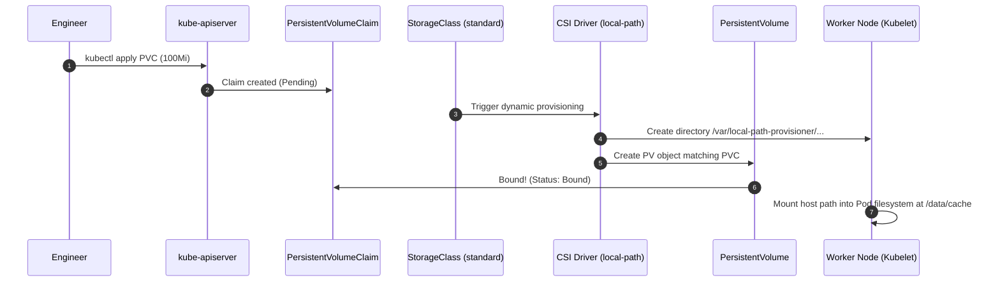

# Lab 05 — Stateful Persistence & PVCs

In this lab, you transition `podinfo` from a purely ephemeral workload to one backed by durable state. You will configure a **PersistentVolumeClaim (PVC)** using Kubernetes dynamic storage provisioning, mount the volume to `/data/cache` inside `podinfo`, write persistent cache entries, deliberately terminate the Pod, verify that the replacement Pod retains the data, and diagnose a classic storage failure: a PVC stuck in `Pending`.



---

## 1. Prerequisites & Starting State

- Working `k8s-lab` cluster.
- Check default `StorageClass` provided by `kind`:
  ```bash
  kubectl get storageclass
  ```
  Expected output shows `standard (default)` using provisioner `rancher.io/local-path` with `volumeBindingMode: WaitForFirstConsumer`.

---

## 2. Storage Manifests

Create a file named `podinfo-storage.yaml`:

```yaml
apiVersion: v1
kind: PersistentVolumeClaim
metadata:
  name: podinfo-cache-pvc
  namespace: default
spec:
  accessModes:
    - ReadWriteOnce
  resources:
    requests:
      storage: 100Mi
```

---

## 3. Step-by-Step Execution: Attaching Durable Storage

### Step 1: Apply the PVC

```bash
kubectl apply -f podinfo-storage.yaml
```

Check the PVC status:

```bash
kubectl get pvc podinfo-cache-pvc
```

**Observed status:**
```
NAME                STATUS    VOLUME   CAPACITY   ACCESS MODES   STORAGECLASS   AGE
podinfo-cache-pvc   Pending                                      standard       5s
```

Notice the status is **`Pending`**. Is this broken? **No!**
Because the default StorageClass uses `volumeBindingMode: WaitForFirstConsumer`, the CSI provisioner intentionally delays volume creation until a Pod referencing the PVC is scheduled. This guarantees the volume is provisioned on the specific node where the Pod lands.

### Step 2: Mount the PVC into `podinfo`

Update the `podinfo` deployment to mount the PVC at `/data/cache`. Save as `podinfo-stateful.yaml`:

```yaml
apiVersion: apps/v1
kind: Deployment
metadata:
  name: podinfo
  namespace: default
spec:
  replicas: 1  # ReadWriteOnce volumes can only be mounted by one node at a time
  selector:
    matchLabels:
      app.kubernetes.io/name: podinfo
  template:
    metadata:
      labels:
        app.kubernetes.io/name: podinfo
    spec:
      containers:
        - name: podinfo
          image: ghcr.io/stefanprodan/podinfo:6.7.1
          imagePullPolicy: IfNotPresent
          command:
            - ./podinfo
            - --port=9898
            - --level=info
          ports:
            - name: http
              containerPort: 9898
          volumeMounts:
            - name: cache-storage
              mountPath: /data/cache
      volumes:
        - name: cache-storage
          persistentVolumeClaim:
            claimName: podinfo-cache-pvc
```

Apply the stateful deployment:

```bash
kubectl apply -f podinfo-stateful.yaml
kubectl rollout status deployment/podinfo
```

Now re-check the PVC and PV:

```bash
kubectl get pvc,pv
```

**Expected output:**
Both are now **`Bound`**! The CSI provisioner dynamically created a PersistentVolume on the node running the Pod.

### Step 3: Write Persistent Data via the Cache API

Let's test writing data into `podinfo`'s persistent cache.
Forward local port 9898:

```bash
kubectl port-forward deployment/podinfo 9898:9898 &
PORT_FORWARD_PID=$!
sleep 2

# Write a cache entry
curl -s -X POST http://127.0.0.1:9898/cache/k8s-curriculum \
  -H "Content-Type: text/plain" \
  -d "Persistent data survives Pod recreation!"

# Read the cache entry back
curl -s http://127.0.0.1:9898/cache/k8s-curriculum
```

**Expected output:**
```
Persistent data survives Pod recreation!
```

Stop the port-forward process:
```bash
kill $PORT_FORWARD_PID
```

### Step 4: Verify Persistence Across Pod Deletion

Simulate a catastrophic pod crash or node re-scheduling by deleting the Pod:

```bash
DELETED_POD=$(kubectl get pods -l app.kubernetes.io/name=podinfo -o jsonpath='{.items[0].metadata.name}')
kubectl delete pod "$DELETED_POD"
```

Watch the Deployment controller immediately spin up a replacement Pod:

```bash
kubectl wait --for=condition=Ready pod -l app.kubernetes.io/name=podinfo --timeout=30s
NEW_POD=$(kubectl get pods -l app.kubernetes.io/name=podinfo -o jsonpath='{.items[0].metadata.name}')
echo "Old pod was $DELETED_POD; New pod is $NEW_POD"
```

Verify that the new Pod has retained our cached data:

```bash
kubectl exec "$NEW_POD" -- cat /data/cache/k8s-curriculum
```

**Output:**
```
Persistent data survives Pod recreation!
```
The data survived! The container filesystem was completely destroyed, but the PersistentVolume was re-attached seamlessly to the replacement container.

---

## 4. Controlled Failure Scenario: Diagnosing a Pending PVC

What happens when a manifest requests a non-existent StorageClass?

### Trigger the failure:
Create a PVC requesting an imaginary StorageClass:

```bash
kubectl apply -f - <<EOF
apiVersion: v1
kind: PersistentVolumeClaim
metadata:
  name: broken-pvc
  namespace: default
spec:
  storageClassName: non-existent-nvme
  accessModes:
    - ReadWriteOnce
  resources:
    requests:
      storage: 50Gi
EOF
```

### Observe the symptom:
Check the claim status:

```bash
kubectl get pvc broken-pvc
```

```
NAME         STATUS    VOLUME   CAPACITY   ACCESS MODES   STORAGECLASS         AGE
broken-pvc   Pending                                      non-existent-nvme    20s
```

### Root Cause Diagnosis:
Inspect the claim's events:

```bash
kubectl describe pvc broken-pvc | grep -A 5 "Events:"
```

**Diagnostic event:**
```
Events:
  Type     Reason              Age               From                         Message
  ----     ------              ----              ----                         -------
  Warning  ProvisioningFailed  10s (x3 over 30s) persistentvolume-controller  storageclass.storage.k8s.io "non-existent-nvme" not found
```

The error is explicit: the requested storage class does not exist. Kubernetes cannot dynamically provision a disk without a provisioner plugin registered to that StorageClass.

### Cleanup the broken PVC:

```bash
kubectl delete pvc broken-pvc
```

---

## Next Lab

Now that storage is configured, proceed to **[[Kubernetes/labs/06-scheduling-and-autoscaling|Lab 06 — Scheduling, QoS & Autoscaling]]** to manage resource requests, limits, horizontal pod autoscaling, and pod disruption budgets.
