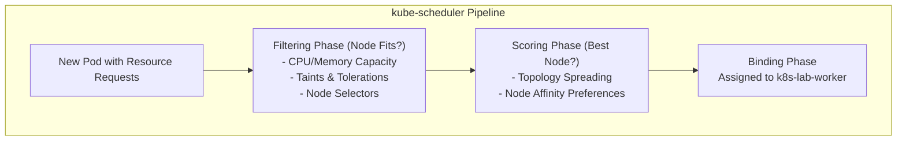

# Lab 06 — Scheduling, QoS & Autoscaling

In this lab, you control how and where Kubernetes places your workloads. You will define compute requests and limits, inspect **Quality of Service (QoS)** classes, enforce high-availability spreading across worker nodes using **`topologySpreadConstraints`**, protect application availability during maintenance using a **PodDisruptionBudget (PDB)**, simulate a node drain, and diagnose an unschedulable `Pending` Pod.



---

## 1. Prerequisites & Starting State

- Working `k8s-lab` cluster with 2 worker nodes (`zone-a` and `zone-b`).
- Check node allocatable resources:
  ```bash
  kubectl get nodes -o custom-columns=NAME:.metadata.name,CPU:.status.allocatable.cpu,MEM:.status.allocatable.memory
  ```

---

## 2. QoS Classes & Topology Spread Manifest

Create `podinfo-scaled.yaml`:

```yaml
apiVersion: policy/v1
kind: PodDisruptionBudget
metadata:
  name: podinfo-pdb
  namespace: default
spec:
  minAvailable: 1
  selector:
    matchLabels:
      app.kubernetes.io/name: podinfo
---
apiVersion: apps/v1
kind: Deployment
metadata:
  name: podinfo
  namespace: default
spec:
  replicas: 4
  selector:
    matchLabels:
      app.kubernetes.io/name: podinfo
  template:
    metadata:
      labels:
        app.kubernetes.io/name: podinfo
    spec:
      # Spread replicas evenly across our two worker nodes
      topologySpreadConstraints:
        - maxSkew: 1
          topologyKey: topology.kubernetes.io/zone
          whenUnsatisfiable: DoNotSchedule
          labelSelector:
            matchLabels:
              app.kubernetes.io/name: podinfo
      containers:
        - name: podinfo
          image: ghcr.io/stefanprodan/podinfo:6.7.1
          imagePullPolicy: IfNotPresent
          ports:
            - name: http
              containerPort: 9898
          resources:
            requests:
              cpu: 50m
              memory: 64Mi
            limits:
              cpu: 200m
              memory: 128Mi
```

Apply the manifests:

```bash
kubectl apply -f podinfo-scaled.yaml
kubectl rollout status deployment/podinfo
```

---

## 3. Step-by-Step Execution

### Step 1: Inspect Pod Quality of Service (QoS)

Kubernetes assigns every Pod one of three QoS classes based on its resource definitions:
- **`Guaranteed`**: Requests == Limits for both CPU and Memory across all containers.
- **`Burstable`**: Requests < Limits, or at least one container has requests specified.
- **`BestEffort`**: No requests or limits specified at all (first to be evicted under node pressure).

Inspect our Pods:

```bash
kubectl get pods -l app.kubernetes.io/name=podinfo -o custom-columns=NAME:.metadata.name,QOS:.status.qosClass,NODE:.spec.nodeName
```

**Expected output:**
QoS is **`Burstable`** because `requests < limits`. Under node memory pressure, `BestEffort` pods are killed first, followed by `Burstable` pods exceeding their requests, while `Guaranteed` pods are protected until last.

### Step 2: Verify Multi-Zone Topology Spreading

Check which nodes are running our 4 replicas:

```bash
kubectl get pods -l app.kubernetes.io/name=podinfo -o custom-columns=NAME:.metadata.name,NODE:.spec.nodeName,ZONE:.spec.affinity
```

You will see exactly 2 pods on `k8s-lab-worker` (`zone-a`) and 2 pods on `k8s-lab-worker2` (`zone-b`). The `maxSkew: 1` constraint prevented the scheduler from packing all pods onto a single node!

### Step 3: Test PodDisruptionBudget with a Node Drain

A **PodDisruptionBudget (PDB)** prevents voluntary evictions (e.g. cluster upgrades, node draining) from violating minimum application availability.

Let's drain `k8s-lab-worker`:

```bash
kubectl drain k8s-lab-worker --ignore-daemonsets --delete-emptydir-data
```

**Expected output:**
```
node/k8s-lab-worker cordoned
evicting pod default/podinfo-...
pod/podinfo-... evicted
node/k8s-lab-worker drained
```

Because our PDB specified `minAvailable: 1`, the eviction controller ensured at least one Pod remained `Ready` at all times while evicting and rescheduling the pods onto `k8s-lab-worker2`.

Uncordon the node to restore it to service:

```bash
kubectl uncordon k8s-lab-worker
```

---

## 4. Controlled Failure Scenario: Diagnosing a Pending Pod

What happens when a Pod requests more compute capacity than any node can provide?

### Trigger the failure:
Attempt to run a pod requesting 100 CPU cores (impossible on our local machine):

```bash
kubectl run monster-pod \
  --image=busybox \
  --restart=Never \
  --requests='cpu=100,memory=256Gi' \
  -- sleep 3600
```

### Observe the symptom:
Check the pod status:

```bash
kubectl get pod monster-pod
```

```
NAME          READY   STATUS    RESTARTS   AGE
monster-pod   0/1     Pending   0          10s
```

The Pod remains permanently stuck in **`Pending`**.

### Root Cause Diagnosis:
Inspect the scheduler events:

```bash
kubectl describe pod monster-pod | grep -A 5 "Events:"
```

**Diagnostic event:**
```
Events:
  Type     Reason            Age   From               Message
  ----     ------            ----  ----               -------
  Warning  FailedScheduling  12s   default-scheduler  0/3 nodes are available: 3 Insufficient cpu, 3 Insufficient memory. preemption: 0/3 nodes are available: 3 No preemption victims found for incoming pod.
```

**Key Diagnostic Breakdown:**
1. **Filtering phase:** `kube-scheduler` ran all registered filter plugins (`NodeResourcesFit`). Every node failed because its allocatable CPU was lower than the requested `100`.
2. **Preemption phase:** The scheduler checked if it could evict lower-priority pods to make room (`PostFilter`). Because even an entirely empty node lacks 100 CPUs, preemption failed.
3. The Pod remains in the scheduler queue until a node with sufficient capacity joins the cluster (e.g., via Karpenter or Cluster Autoscaler in cloud environments).

### Cleanup:

```bash
kubectl delete pod monster-pod
```

---

## 5. Lab Track Completion & Summary

Congratulations! Over Labs 00 through 06, you have successfully:
1. **Bootstrapped** a multi-node local cluster with host port bindings.
2. **Deployed** a production microservice (`podinfo`) across a declarative controller chain.
3. **Executed** zero-downtime rolling updates and safe rollbacks.
4. **Decoupled** configuration via ConfigMaps, Secrets, and live volume mounts.
5. **Exposed** the service through ClusterIPs, EndpointSlices, and CoreDNS.
6. **Persisted** stateful application cache data across container crashes with PVCs.
7. **Controlled** scheduling placement, QoS eviction tiers, and disruption budgets.

To destroy the lab cluster:

```bash
kind delete cluster --name k8s-lab
```
