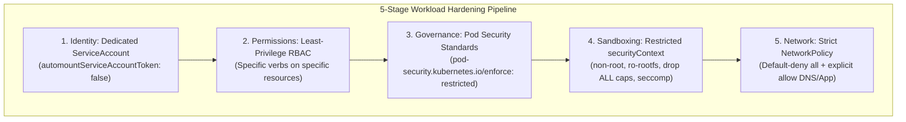

# Lab 07 — Workload Security Hardening

In this lab, you assume the role of a Platform Security Engineer tasked with auditing and securing an insecure workload. Starting with an over-privileged `podinfo` deployment running as root on the default ServiceAccount, you will systematically harden it across five distinct layers: **Identity**, **RBAC**, **Admission Standards**, **Linux Sandboxing**, and **Network Isolation**.



---

## 1. Prerequisites & Starting State

- Working `k8s-lab` cluster from **[[Kubernetes/labs/00-cluster-setup|Lab 00]]**.
- Create an isolated namespace for our security laboratory:

```bash
kubectl create namespace sec-lab
```

---

## 2. The Vulnerable Workload Baseline

Inspect this intentionally insecure manifest (`insecure-podinfo.yaml`):

```yaml
apiVersion: apps/v1
kind: Deployment
metadata:
  name: podinfo-insecure
  namespace: sec-lab
spec:
  replicas: 1
  selector:
    matchLabels:
      app: podinfo-insecure
  template:
    metadata:
      labels:
        app: podinfo-insecure
    spec:
      # Flaw 1: Uses default ServiceAccount with API token automatically mounted
      containers:
        - name: podinfo
          image: ghcr.io/stefanprodan/podinfo:6.7.1
          # Flaw 2: No securityContext! Runs as root (UID 0) with all capabilities
          ports:
            - containerPort: 9898
```

Apply the vulnerable workload:

```bash
kubectl apply -f - <<EOF
apiVersion: apps/v1
kind: Deployment
metadata:
  name: podinfo-insecure
  namespace: sec-lab
spec:
  replicas: 1
  selector:
    matchLabels:
      app: podinfo-insecure
  template:
    metadata:
      labels:
        app: podinfo-insecure
    spec:
      containers:
        - name: podinfo
          image: ghcr.io/stefanprodan/podinfo:6.7.1
          ports:
            - containerPort: 9898
EOF
```

### Security Audit Findings:
1. **Root execution:** The container runs as root (`UID 0`). If an attacker escapes via a container runtime vulnerability, they have root access to the host kernel.
2. **Mounted API token:** The default ServiceAccount token is mounted at `/var/run/secrets/kubernetes.io/serviceaccount/token`, enabling an attacker to probe the Kubernetes API server from inside the container.
3. **Writable root filesystem:** Attackers can download malware or modify binaries inside the container.
4. **Open network:** The Pod can reach any IP in the cluster and any external internet destination.

---

## 3. Step-by-Step Hardening Execution

### Layer 1: Dedicated Identity & Least-Privilege RBAC

Never run application workloads with the `default` ServiceAccount. If the application does not need to query the Kubernetes API, disable automatic token mounting:

```yaml
# 1-identity.yaml
apiVersion: v1
kind: ServiceAccount
metadata:
  name: podinfo-sa
  namespace: sec-lab
automountServiceAccountToken: false
```

Apply and verify:

```bash
kubectl apply -f - <<EOF
apiVersion: v1
kind: ServiceAccount
metadata:
  name: podinfo-sa
  namespace: sec-lab
automountServiceAccountToken: false
EOF
```

Test authorization permissions from the perspective of this ServiceAccount:

```bash
kubectl auth can-i list pods --namespace sec-lab --as=system:serviceaccount:sec-lab:podinfo-sa
```

**Expected output:** `no`. The identity has zero permissions in the cluster.

---

### Layer 2: Pod Security Standards (PSS) Admission Enforcement

Enforce the Kubernetes **`restricted`** Pod Security Standard on the `sec-lab` namespace. This blocks any pod that does not comply with security best practices:

```bash
kubectl label namespace sec-lab \
  pod-security.kubernetes.io/enforce=restricted \
  pod-security.kubernetes.io/enforce-version=latest \
  pod-security.kubernetes.io/warn=restricted \
  --overwrite
```

---

### Layer 3: Hardened `securityContext` & Linux Sandboxing

Now, rewrite the workload manifest with a hardened security context satisfying the `restricted` profile:

```yaml
# podinfo-hardened.yaml
apiVersion: apps/v1
kind: Deployment
metadata:
  name: podinfo-hardened
  namespace: sec-lab
spec:
  replicas: 2
  selector:
    matchLabels:
      app: podinfo-hardened
  template:
    metadata:
      labels:
        app: podinfo-hardened
    spec:
      serviceAccountName: podinfo-sa
      automountServiceAccountToken: false
      securityContext:
        # Pod-level isolation
        runAsNonRoot: true
        runAsUser: 10001
        runAsGroup: 10001
        fsGroup: 10001
        seccompProfile:
          type: RuntimeDefault
      containers:
        - name: podinfo
          image: ghcr.io/stefanprodan/podinfo:6.7.1
          imagePullPolicy: IfNotPresent
          command:
            - ./podinfo
            - --port=9898
          ports:
            - name: http
              containerPort: 9898
          securityContext:
            # Container-level hardening
            allowPrivilegeEscalation: false
            readOnlyRootFilesystem: true
            capabilities:
              drop:
                - ALL
          # Provide writable scratch space in memory
          volumeMounts:
            - name: tmp-dir
              mountPath: /tmp
          resources:
            requests:
              cpu: 50m
              memory: 32Mi
            limits:
              cpu: 200m
              memory: 128Mi
      volumes:
        - name: tmp-dir
          emptyDir: {}
```

Apply the hardened deployment:

```bash
kubectl apply -f podinfo-hardened.yaml
kubectl rollout status deployment/podinfo-hardened -n sec-lab
```

Verify that the process runs under unprivileged UID `10001`:

```bash
POD=$(kubectl get pods -n sec-lab -l app=podinfo-hardened -o jsonpath='{.items[0].metadata.name}')
kubectl exec -n sec-lab "$POD" -- id
```

**Expected output:**
```
uid=10001(podinfo) gid=10001(podinfo) groups=10001(podinfo)
```

---

### Layer 4: Network Isolation with Default-Deny NetworkPolicy

Lock down all lateral movement using two NetworkPolicies:

1. **Default Deny:** Drops all incoming and outgoing traffic by default.
2. **Explicit Allow:** Permits inbound HTTP on port 9898 and outbound DNS to CoreDNS.

```yaml
# network-policy.yaml
apiVersion: networking.k8s.io/v1
kind: NetworkPolicy
metadata:
  name: default-deny-all
  namespace: sec-lab
spec:
  podSelector: {}
  policyTypes:
    - Ingress
    - Egress
---
apiVersion: networking.k8s.io/v1
kind: NetworkPolicy
metadata:
  name: allow-podinfo-traffic
  namespace: sec-lab
spec:
  podSelector:
    matchLabels:
      app: podinfo-hardened
  policyTypes:
    - Ingress
    - Egress
  ingress:
    - from:
        - namespaceSelector: {}
      ports:
        - protocol: TCP
          port: 9898
  egress:
    # Allow DNS lookup to CoreDNS in kube-system
    - to:
        - namespaceSelector:
            matchLabels:
              kubernetes.io/metadata.name: kube-system
          podSelector:
            matchLabels:
              k8s-app: kube-dns
      ports:
        - protocol: UDP
          port: 53
        - protocol: TCP
          port: 53
```

Apply the policies:

```bash
kubectl apply -f network-policy.yaml
```

---

## 4. Controlled Failure Scenario: Testing Admission Rejection

What happens when a developer attempts to deploy an unhardened, privileged container into our secured namespace?

### Trigger the failure:
Attempt to run a container as root (`UID 0`) with privilege escalation enabled:

```bash
kubectl run evil-root-pod -n sec-lab \
  --image=busybox \
  --restart=Never \
  --overrides='{"spec":{"containers":[{"name":"root-test","image":"busybox","securityContext":{"runAsUser":0,"allowPrivilegeEscalation":true}}]}}' \
  -- sleep 60
```

### Observe the symptom:
The `kube-apiserver` immediately **rejects the request**:

```
Error from server (Forbidden): pods "evil-root-pod" is forbidden: violates PodSecurity "restricted:latest": 
allowPrivilegeEscalation != false (container "root-test" must set securityContext.allowPrivilegeEscalation=false), 
runAsNonRoot != true (pod or container "root-test" must set securityContext.runAsNonRoot=true), 
runAsUser=0 (container "root-test" must not set runAsUser=0), 
seccompProfile (pod or container "root-test" must set securityContext.seccompProfile.type to "RuntimeDefault" or "Localhost")
```

### Key Diagnostic Breakdown:
1. The Pod **was never scheduled** and was never written to etcd.
2. The built-in `PodSecurity` admission controller intercepted the API request during the validation phase.
3. Because the namespace was labeled with `pod-security.kubernetes.io/enforce=restricted`, the admission webhook failed closed, preventing the insecure workload from running on the cluster.

---

## 5. Cleanup

Delete the temporary security lab namespace:

```bash
kubectl delete namespace sec-lab
```

---

## Next Lab

Proceed to **[[Kubernetes/labs/08-observability-and-troubleshooting|Lab 08 — Observability & Troubleshooting]]** to instrument cluster metrics, stream logs, and diagnose crash-loop incidents.
