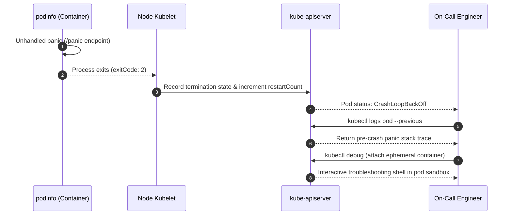

# Lab 08 — Observability & Troubleshooting

In this lab, you master live incident diagnosis on Kubernetes. You will inspect Prometheus application metrics, query container logs and post-crash historical logs (`--previous`), attach an **ephemeral debug container** to a running pod via `kubectl debug`, inject a deliberate panic into `podinfo`, and trace exit codes from crash to recovery.



---

## 1. Prerequisites & Starting State

- Working `k8s-lab` cluster.
- `podinfo` deployment and ClusterIP service running from **[[Kubernetes/labs/04-networking-and-services|Lab 04]]**.
- Verify workload:
  ```bash
  kubectl get deployment,svc podinfo
  ```

---

## 2. Telemetry Inspection

### Step 1: Query Application Prometheus Metrics

`podinfo` exposes built-in Prometheus metrics at `/metrics`. Forward local port 9898:

```bash
kubectl port-forward svc/podinfo 9898:9898 &
PF_PID=$!
sleep 2

# Query Prometheus metrics endpoint
curl -s http://127.0.0.1:9898/metrics | grep -E "http_requests_total|process_cpu_seconds_total" | head -n 10
```

Notice:
- `http_requests_total`: Counts incoming requests partitioned by HTTP method, status code, and path.
- `process_cpu_seconds_total`: Real-time CPU time consumed by the Go runtime.

### Step 2: Query Cluster Resource Metrics (`metrics.k8s.io`)

Inspect node and pod resource consumption:

```bash
kubectl top nodes 2>/dev/null || echo "metrics-server optional in local kind"
kubectl top pods -l app.kubernetes.io/name=podinfo 2>/dev/null || echo "metrics-server optional in local kind"
```

---

## 3. Ephemeral Debug Containers with `kubectl debug`

When a production container image is minimal (e.g. distroless or scratch), it lacks `sh`, `curl`, `nslookup`, and `ping`. In modern Kubernetes, use **ephemeral debug containers** (`kubectl debug`) to inject diagnostic tools into the Pod's running sandbox without restarting it.

### Step 1: Launch an Ephemeral Container Sharing the Pod Namespace

```bash
POD_NAME=$(kubectl get pods -l app.kubernetes.io/name=podinfo -o jsonpath='{.items[0].metadata.name}')

kubectl debug -it "$POD_NAME" \
  --image=busybox:1.36 \
  --target=podinfo \
  -- sh
```

### Step 2: Inspect the Target Container from the Debug Shell

Inside the debug shell, verify you share the process and network namespace:

```sh
# View processes running in the pod (including the main Go binary)
ps aux

# Test local process socket connectivity
netstat -tuln

# Exit the debug shell
exit
```

Notice that the original container **never restarted or dropped connections** while you inspected it.

---

## 4. Controlled Failure Scenario: Diagnosing `CrashLoopBackOff`

What happens when an application panics and crashes repeatedly?

### Trigger the failure:
`podinfo` includes a fault-injection endpoint (`POST /panic`) that triggers an unhandled Go runtime panic.

Send the panic trigger:

```bash
curl -s -X POST http://127.0.0.1:9898/panic
```

Stop the port-forward process:
```bash
kill $PF_PID
```

### Observe the symptom:
Watch the Pod status:

```bash
kubectl get pods -l app.kubernetes.io/name=podinfo
```

**Observed output:**
```
NAME                       READY   STATUS             RESTARTS      AGE
podinfo-5b5c97bd5c-2p8xm   1/1     Running            0             25m
podinfo-5b5c97bd5c-v9lks   0/1     CrashLoopBackOff   1 (10s ago)   25m
```

The Pod entered **`CrashLoopBackOff`** and its `RESTARTS` count increased.

---

## 5. Root Cause Investigation Flow

When facing a `CrashLoopBackOff`, apply the **Three-Step Incident Triage Rule**:

### Step 1: Read the PREVIOUS container logs
Running `kubectl logs <pod>` often shows nothing or shows the new container trying to start. Always append **`--previous`** to read the logs from the container that crashed:

```bash
CRASHED_POD=$(kubectl get pods -l app.kubernetes.io/name=podinfo --field-selector=status.phase=Running -o jsonpath='{range .items[?(@.status.containerStatuses[0].restartCount>0)]}{.metadata.name}{end}')
[ -z "$CRASHED_POD" ] && CRASHED_POD=$(kubectl get pods -l app.kubernetes.io/name=podinfo -o jsonpath='{.items[0].metadata.name}')

kubectl logs "$CRASHED_POD" --previous
```

**Diagnostic log output:**
```
panic: panic command received

goroutine 19 [running]:
main.panicHandler(...)
	/workspace/cmd/podinfo/main.go:214
net/http.HandlerFunc.ServeHTTP(...)
```

The root cause is immediately obvious: an unhandled panic was triggered in `panicHandler`.

### Step 2: Check the Exit Code and Termination Reason

Inspect the container's exact exit code in `status.containerStatuses`:

```bash
kubectl get pod "$CRASHED_POD" -o jsonpath='{.status.containerStatuses[0].lastState.terminated}' | jq .
```

**Expected JSON:**
```json
{
  "exitCode": 2,
  "finishedAt": "2026-09-06T...",
  "reason": "Error",
  "startedAt": "2026-09-06T..."
}
```

### Exit Code Cheat Sheet:
- **Exit Code `0`**: Clean exit. If in a Deployment, the container exited when it should have run forever.
- **Exit Code `1` or `2`**: Application error / unhandled exception / panic.
- **Exit Code `137` (`128 + 9`)**: Terminated by `SIGKILL`. Look for **`OOMKilled: true`** indicating the container hit its memory limit, or an expired `terminationGracePeriodSeconds`.
- **Exit Code `143` (`128 + 15`)**: Terminated cleanly by `SIGTERM` (normal during scaling down or rolling updates).

---

## 6. Recovery & Verification

Because Kubernetes enforces `restartPolicy: Always` on Deployments, the kubelet will automatically back off and restart the container until it stabilizes:

```bash
kubectl rollout status deployment/podinfo
kubectl get pods -l app.kubernetes.io/name=podinfo
```

All replicas return to healthy `Running 1/1` status.

---

## Next Lab

Proceed to **[[Kubernetes/labs/09-gitops-and-lifecycle|Lab 09 — GitOps Delivery & Lifecycle]]** to package `podinfo` with Kustomize and automate progressive delivery.
