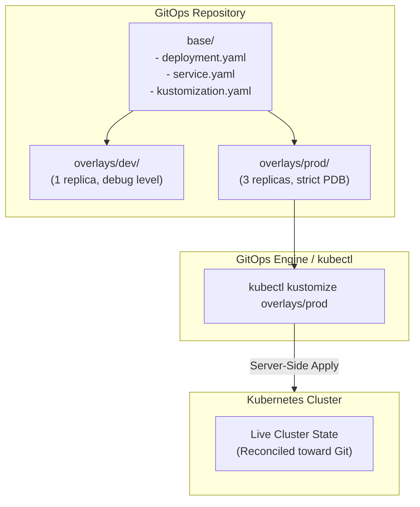

# Lab 09 — GitOps Delivery & Lifecycle

In this final lab of the cumulative spine, you automate the application lifecycle. You will package `podinfo` using **Kustomize** (`base` and `overlays`), manage multi-environment configuration (Development vs Production), simulate declarative **GitOps drift reconciliation**, check for API deprecations before cluster upgrades, and execute a namespace disaster recovery drill.



---

## 1. Prerequisites & Starting State

- Working `k8s-lab` cluster from **[[Kubernetes/labs/00-cluster-setup|Lab 00]]**.
- Create a temporary working directory for our manifests:

```bash
mkdir -p /tmp/k8s-gitops/{base,overlays/dev,overlays/prod}
```

---

## 2. Declarative Packaging with Kustomize

Unlike template-based tools that interpolate strings, **Kustomize** is a template-free configuration customizer built directly into `kubectl` (`kubectl apply -k`).

### Step 1: Define the Base Application

Create `/tmp/k8s-gitops/base/deployment.yaml`:

```yaml
apiVersion: apps/v1
kind: Deployment
metadata:
  name: podinfo
spec:
  replicas: 1
  selector:
    matchLabels:
      app.kubernetes.io/name: podinfo
  template:
    metadata:
      labels:
        app.kubernetes.io/name: podinfo
    spec:
      containers:
        - name: podinfo
          image: ghcr.io/stefanprodan/podinfo:6.7.1
          ports:
            - name: http
              containerPort: 9898
          resources:
            requests:
              cpu: 50m
              memory: 32Mi
            limits:
              cpu: 200m
              memory: 128Mi
```

Create `/tmp/k8s-gitops/base/service.yaml`:

```yaml
apiVersion: v1
kind: Service
metadata:
  name: podinfo
spec:
  type: ClusterIP
  selector:
    app.kubernetes.io/name: podinfo
  ports:
    - name: http
      port: 9898
      targetPort: http
```

Create `/tmp/k8s-gitops/base/kustomization.yaml`:

```yaml
apiVersion: kustomize.config.k8s.io/v1beta1
kind: Kustomization
resources:
  - deployment.yaml
  - service.yaml
commonLabels:
  app.kubernetes.io/managed-by: gitops
```

---

### Step 2: Define the Development & Production Overlays

#### Development Overlay (`overlays/dev/kustomization.yaml`):
For development, we route to a dedicated `podinfo-dev` namespace and inject custom environment variables:

```yaml
apiVersion: kustomize.config.k8s.io/v1beta1
kind: Kustomization
resources:
  - ../../base
namespace: podinfo-dev
namePrefix: dev-
patches:
  - target:
      kind: Deployment
      name: podinfo
    patch: |-
      - op: add
        path: /spec/template/spec/containers/0/env
        value:
          - name: PODINFO_UI_COLOR
            value: "#3498db"
          - name: PODINFO_UI_MESSAGE
            value: "Development Environment"
```

#### Production Overlay (`overlays/prod/kustomization.yaml`):
For production, we scale to 3 replicas, add high-availability resources, and enforce resource limits:

```yaml
apiVersion: kustomize.config.k8s.io/v1beta1
kind: Kustomization
resources:
  - ../../base
namespace: podinfo-prod
namePrefix: prod-
replicas:
  - name: podinfo
    count: 3
patches:
  - target:
      kind: Deployment
      name: podinfo
    patch: |-
      - op: add
        path: /spec/template/spec/containers/0/env
        value:
          - name: PODINFO_UI_COLOR
            value: "#2ecc71"
          - name: PODINFO_UI_MESSAGE
            value: "Production Environment"
```

Save both files into their respective directories:

```bash
cat << 'EOF' > /tmp/k8s-gitops/base/deployment.yaml
apiVersion: apps/v1
kind: Deployment
metadata:
  name: podinfo
spec:
  replicas: 1
  selector:
    matchLabels:
      app.kubernetes.io/name: podinfo
  template:
    metadata:
      labels:
        app.kubernetes.io/name: podinfo
    spec:
      containers:
        - name: podinfo
          image: ghcr.io/stefanprodan/podinfo:6.7.1
          ports:
            - name: http
              containerPort: 9898
          resources:
            requests:
              cpu: 50m
              memory: 32Mi
            limits:
              cpu: 200m
              memory: 128Mi
EOF

cat << 'EOF' > /tmp/k8s-gitops/base/service.yaml
apiVersion: v1
kind: Service
metadata:
  name: podinfo
spec:
  type: ClusterIP
  selector:
    app.kubernetes.io/name: podinfo
  ports:
    - name: http
      port: 9898
      targetPort: http
EOF

cat << 'EOF' > /tmp/k8s-gitops/base/kustomization.yaml
apiVersion: kustomize.config.k8s.io/v1beta1
kind: Kustomization
resources:
  - deployment.yaml
  - service.yaml
commonLabels:
  app.kubernetes.io/managed-by: gitops
EOF

cat << 'EOF' > /tmp/k8s-gitops/overlays/dev/kustomization.yaml
apiVersion: kustomize.config.k8s.io/v1beta1
kind: Kustomization
resources:
  - ../../base
namespace: podinfo-dev
namePrefix: dev-
patches:
  - target:
      kind: Deployment
      name: podinfo
    patch: |-
      - op: add
        path: /spec/template/spec/containers/0/env
        value:
          - name: PODINFO_UI_COLOR
            value: "#3498db"
          - name: PODINFO_UI_MESSAGE
            value: "Development Environment"
EOF

cat << 'EOF' > /tmp/k8s-gitops/overlays/prod/kustomization.yaml
apiVersion: kustomize.config.k8s.io/v1beta1
kind: Kustomization
resources:
  - ../../base
namespace: podinfo-prod
namePrefix: prod-
replicas:
  - name: podinfo
    count: 3
patches:
  - target:
      kind: Deployment
      name: podinfo
    patch: |-
      - op: add
        path: /spec/template/spec/containers/0/env
        value:
          - name: PODINFO_UI_COLOR
            value: "#2ecc71"
          - name: PODINFO_UI_MESSAGE
            value: "Production Environment"
EOF
```

---

## 3. Step-by-Step Execution: Multi-Environment Deployment

### Step 1: Inspect Generated YAML Without Applying

Verify the output of the production overlay:

```bash
kubectl kustomize /tmp/k8s-gitops/overlays/prod | grep -E "name:|namespace:|replicas:|PODINFO_UI_"
```

Notice that Kustomize automatically prefixed resource names (`prod-podinfo`), assigned the namespace (`podinfo-prod`), and scaled `replicas: 3`.

### Step 2: Deploy Dev and Production Environments

Create the target namespaces:

```bash
kubectl create namespace podinfo-dev --dry-run=client -o yaml | kubectl apply -f -
kubectl create namespace podinfo-prod --dry-run=client -o yaml | kubectl apply -f -
```

Apply both overlays using Server-Side Apply:

```bash
kubectl apply -k /tmp/k8s-gitops/overlays/dev --server-side
kubectl apply -k /tmp/k8s-gitops/overlays/prod --server-side
```

Verify deployment statuses:

```bash
kubectl get deployment,svc -n podinfo-dev
kubectl get deployment,svc -n podinfo-prod
```

**Expected output:**
- `podinfo-dev`: 1 replica (`dev-podinfo`).
- `podinfo-prod`: 3 replicas (`prod-podinfo`).

---

## 4. Controlled Scenario: GitOps Drift Detection & Auto-Reconciliation

What happens when an engineer makes an ad-hoc, manual change directly to the cluster (manual configuration drift)?

### Step 1: Simulate Configuration Drift
Manually scale the production deployment down to 1 replica and change its image:

```bash
kubectl scale deployment/prod-podinfo -n podinfo-prod --replicas=1
kubectl set image deployment/prod-podinfo -n podinfo-prod podinfo=nginx:alpine
```

Check the drifted state:

```bash
kubectl get deployment prod-podinfo -n podinfo-prod
```

The cluster has now **drifted** from the declared Git repository intent (`replicas: 3`, `image: podinfo`).

### Step 2: Reconcile Drift with Declarative GitOps
In a GitOps architecture (e.g. Argo CD or Flux), the reconciliation loop periodically applies the Git source of truth. Re-run Kustomize apply:

```bash
kubectl apply -k /tmp/k8s-gitops/overlays/prod --server-side
```

**Output:**
```
deployment.apps/prod-podinfo serverside-applied
service/prod-podinfo serverside-applied
```

Verify the cluster:

```bash
kubectl get deployment prod-podinfo -n podinfo-prod
```

Replicas immediately returned to `3`, and the image was restored to `ghcr.io/stefanprodan/podinfo:6.7.1`. The manual tampering was completely healed!

---

## 5. API Deprecation Discovery Before Upgrades

Before upgrading a Kubernetes cluster (e.g., from v1.35 to v1.37), platform teams must detect deprecated or removed API versions.

Query the cluster's supported API versions:

```bash
# Check available API versions
kubectl api-versions | grep -E "networking.k8s.io|apps|storage"

# Verify resources supported in the current cluster
kubectl api-resources --api-group=networking.k8s.io
```

Notice that `Ingress` is at `networking.k8s.io/v1` (stable), and `Gateway` is at `gateway.networking.k8s.io/v1` (standard channel). Legacy `networking.k8s.io/v1beta1` is removed.

---

## 6. Disaster Recovery Drill: Backup & Restore

Simulate a catastrophic disaster: an entire namespace is accidentally deleted.

### Step 1: Declarative Backup
Because our infrastructure is defined as code in Kustomize, our "backup" is already stored in Git! For dynamic resources, export current manifests:

```bash
kubectl get configmap,secrets -n podinfo-prod -o yaml > /tmp/prod-data-backup.yaml
```

### Step 2: Simulate Disaster
Accidentally delete the production namespace:

```bash
kubectl delete namespace podinfo-prod
```

All production pods and services are obliterated.

### Step 3: Restore Service from Declarative Manifests

Recreate the namespace and re-apply the Kustomize overlay:

```bash
kubectl create namespace podinfo-prod
kubectl apply -k /tmp/k8s-gitops/overlays/prod --server-side
kubectl rollout status deployment/prod-podinfo -n podinfo-prod
```

Within seconds, the complete production application is fully restored with all 3 replicas healthy and serving traffic.

---

## 7. Curriculum Lab Teardown

To clean up all resources created throughout the hands-on lab spine:

```bash
# Delete all lab namespaces
kubectl delete namespace podinfo-dev podinfo-prod sec-lab 2>/dev/null || true

# Delete local kind cluster
kind delete cluster --name k8s-lab

# Clean up local temp files
rm -rf /tmp/k8s-gitops /tmp/prod-data-backup.yaml
```

**Congratulations!** You have completed the full hands-on curriculum lab track, covering architecture, workloads, configuration, networking, storage, scheduling, security hardening, observability, and GitOps lifecycle management.
